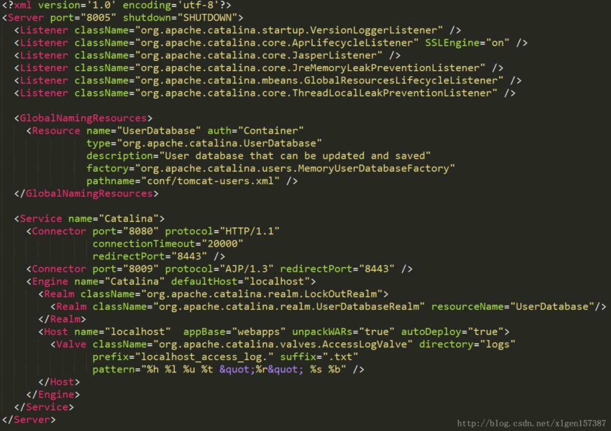
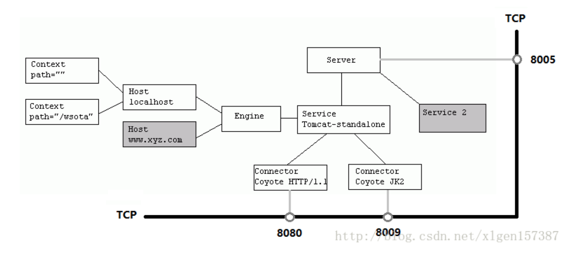
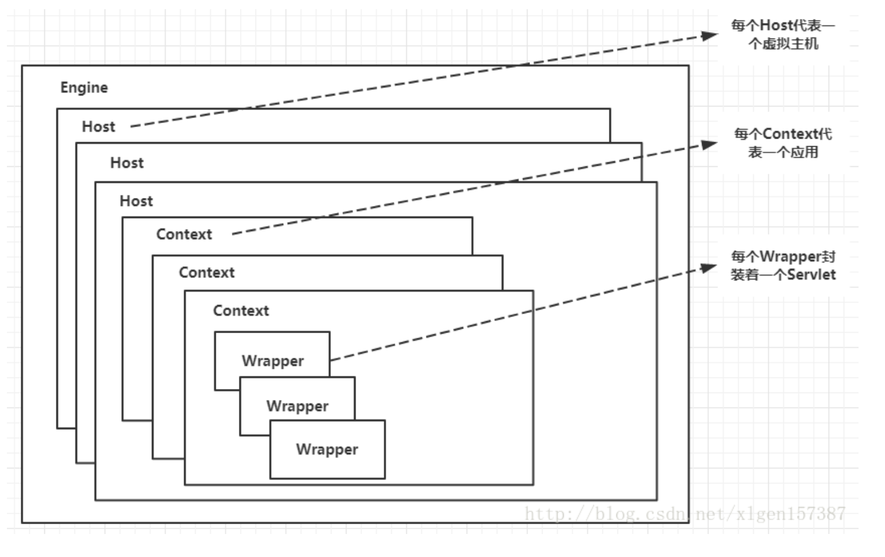

# Tomcat系统架构

## 1. 学习目的

1. Server、Service、Connector、Container四大组件之间的关系和联系，以及他们的主要功能点
2. Tomcat执行的整体架构、请求是如何被一步步处理的
3. Engine、Host、Context、Wrapper相关的概念关系
4. Container是如何处理请求的
5. Tomcat用到的相关设计模式

## 2. Tomcat 顶层架构

Tomcat 顶层架构图，如下

- Service

  - Tomcat 中最顶层的容器是Server，代表着整个服务器
  - 一个Server可以包含至少一个Service，用于具体提供服务。

- Service

  - 主要组成（Tomcat的心脏的两个组件）

    - Connector

      用于处理连接相关的事情，并提供Socket与Request和Response相关的转化

    - Container

      用于封装和管理Servlet，以及具体处理Request请求

    

### 2.1 tomcat结构

- 一个Tomcat中只有一个Server，

- 一个Server可以包含多个Service，

- 一个Service只有一个Container，

- 但是可以有多个Connectors，这是因为一个服务可以有多个连接。

  如同时提供Http和Https链接，也可以提供向相同协议不同端口的连接，示意图如下：

  

  多个Connector 和一个Container 就形成一个Service，有了Service就可以对外提供服务了，但是还要一个生存环境，必须要有人能够给他生命，掌握其生死大权，那就非Server莫属了！所以整个Tomcat有Server控制

## 3. server.xml配置文件

上述关系都可以从server.xml看出

配置文件对应的结构图

结构图解析

- Server标签设置的端口为8005，shutdown=“SHUTDOWN",

  表示在8005端口监听”SHUTDOWN“命令，如果收到了就会关闭Tomcat

- Container

  Service左边的内容都是属于Container（Engine等）

- Service

  Service下边是Connector

## 4. Tomcat顶层架构小结

1. Tomcat中只有一个Server，一个Server可以有多个Service，一个Service可以有多个Connector和一个Container； 

2.  Server掌管着整个Tomcat的生死大权； 

3. Service 是对外提供服务的； 

4. Connector用于接受请求并将请求封装成Request和Response来具体处理； 

5. Container用于封装和管理Servlet，以及具体处理request请求；

## 5.Connector和Container的关系

### 5.1 Tomcat网络请求流程

一个请求发送到Tomcat之后

- 首先经过Service然后交给Connector
- Connector 用于接受请求并将接收到的请求封装为Request和Response来具体处理，request和response封装完之后再交由Container进行处理
- Container处理完请求之后再返回给Connector
- 最后再由Connector通过Socket将处理的结果返回给客户端

### 5.2 Connector

Connector 最底层使用的事Socket来进行封装的，Request和Response 是按照Http协议来封装的，所以Connector同时需要实现TCP/IP协议和Http协议

### 5.3 Container架构分析

Container 用于封装和管理Servlet，以及具体处理Request请求，在Connector内部包含了4个自容器

#### 5.3.1  4个子容器的作用

- Engine：引擎，用来管理多个站点，一个Service最多只能有一个Engine
- Host: 代表一个站点，也可以叫虚拟主机，通过配置Host就可以添加站点
- Context：代表一个应用程序，对应着平时开发的一套程序，或者一个WEB-INF目录以及下面web.xml文件
- Wrapper：每一个Wrapper封装这一个Servlet

tomcat的文件目录对照，如下图

Context和Host的区别是Context表示一个应用，我们的tomcat中默认的配置下webapps下的每一个文件夹目录是一个Context，其中ROOT目录存放着主应用，其他目录存放着子应用，而珍格格webapps就是一个Host站点

我们访问应用Context的时候，如果是ROOT下的则直接使用域名就可以访问，例如：`www.isture.com`，如果是Host（webapps）下的其他应用，则可以使用`www.isture.com/docs`进行访问，当然默认指定的根应用ROOT可以进行设置，

### 5.4 Container 如何处理请求

Container处理请求是使用Pipeline-Valve管道来处理的！（Valve是阀门之意）

Pipeline-Valve是责任链模式，责任链模式是指在一个请求处理的过程中有很多处理者依次对请求进行处理，每个处理者负责做自己相应的处理，处理完之后将处理后的请求返回，再让下一个处理着继续处理。