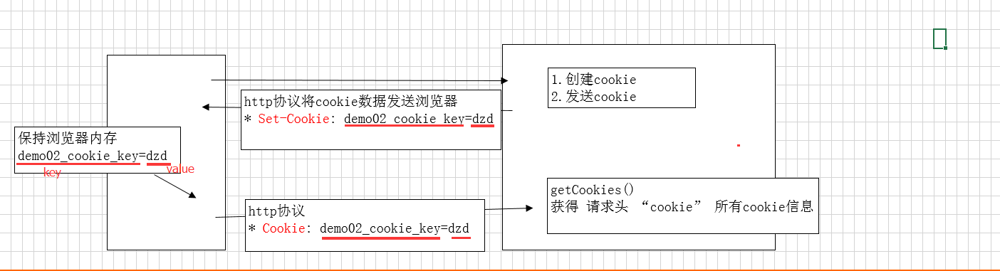

# Cookie

## 1. 奶茶买五送一的例子中，Cookie如何识别用户？

Cookie 相当于给用户发一张积分卡篇，每次买奶茶都盖一个章。

这种做法就是客户端保存状态

## 2.如何创建Cookie

延续我们的奶茶例子就是，如何发积分卡，填写积分卡内容，并发送给用户

```
//由服务器进行创建，也就相当于咖啡店来创建会员卡，在创建会员卡的同时，就会将会员卡中的内容也给设置了
Cookie cookie = new Cookie(key,value);　　//以键值对的方式存放内容，
response.addCookie(cookie);　　//发送回浏览器端
//注意：一旦cookie创建好了，就不能在往其中增加别的键值对，但是可以修改其中的内容，
cookie.setValue();　　//将key对应的value值修改
```

## 3. 工作原理

客户如何使用积分卡，cookie在客户端是如何工作的，工作原理是什么？



这个过程就相当于，奶茶店创建好了会员卡，并且已经设置了其中的内容，交到了客户手中，下次客户过来时，就带着积分卡过来，就知道你是会员了，然后奶茶店就拿到你的会员卡对其进行操作。

## 4.Cookie有效期

积分卡的有效日期？也就是cookie也是拥有有效日期的。

```
这个可以自由设置，默认是关闭浏览器，cookie就没用了。
cookie.setMaxAge(expiry);　　//设置cookie被浏览器保存的时间。
expiry：单位秒，默认为-1，
expiry=-1：代表浏览器关闭后，也就是会话结束后，cookie就失效了，也就没有了。
expiry>0：代表浏览器关闭后，cookie不会失效，仍然存在。并且会将cookie保存到硬盘中，直到设置时间过期才会被浏览器自动删除，
expiry=0：删除cookie。不管是之前的expiry=-1还是expiry>0，当设置expiry=0时，cookie都会被浏览器给删除。
```

## 5. Cookie使用范围

设置服务器端获取cookie的访问路径，而并非在服务器端的web项目中所有的servlet都能访问该cookie。

```
cookie默认路径：当前访问的servlet父路径。
例如：http://localhost:8080/test01/a/b/c/SendCookieServlet
默认路径：/test01/a/b/c　　也就是说，在该默认路径下的所有Servlet都能够获取到cookie，/test01/a/b/c/MyServlet　这个MyServlet就能获取到cookie。
修改cookie的访问路径
setPath("/")；　　//在该服务器下，任何项目，任何位置都能获取到cookie，
通途：保证在tomcat下所有的web项目可以共享相同的cookie 
例如：tieba , wenku , beike 多个项目共享数据。例如用户名。
setPath("/test01/");　　//在test01项目下任何位置都能获取到cookie。
```

### 5、总结Cookie：

工作流程：

1.  servlet创建cookie，保存少量数据，发送浏览器。

2. 浏览器获得服务器发送的cookie数据，将自动的保存到浏览器端。

3. 下次访问时，浏览器将自动携带cookie数据发送给服务器。

cookie操作

1. 创建cookie：new Cookie(name,value)

2. 发送cookie到浏览器：HttpServletResponse.addCookie(Cookie)

3. servlet接收cookie：HttpServletRequest.getCookies()  浏览器发送的所有cookie

cookie特点

1. 每一个cookie文件大小：4kb ， 如果超过4kb浏览器不识别

2. 一个web站点（web项目）：发送20个

3. 一个浏览器保存总大小：300个

4. cookie 不安全，可能泄露用户信息。浏览器支持禁用cookie操作。

5. 默认情况生命周期：与浏览器会话一样，当浏览器关闭时cookie销毁的。---临时cookie

### 6.cookie案例

1. 记住用户名

　登录时，在服务器端获取到用户名，然后创建一个cookie，将用户名存入cookie中，发送回浏览器端，然后浏览器下次在访问登录页面时，先拿到cookie，将cookie中的信息拿出来，看是否保存了该用户名，如果保存了，那么直接用他，如果没有，则自己手写用户名。

2. 历史记录

 比如购物网站，都会有我们的浏览记录的，实现原理其实也是用cookie技术，每浏览一个商品，就将其存入cookie中，到需要显示浏览记录时，只需要将cookie拿出来遍历即可。　　