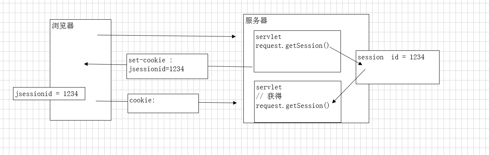
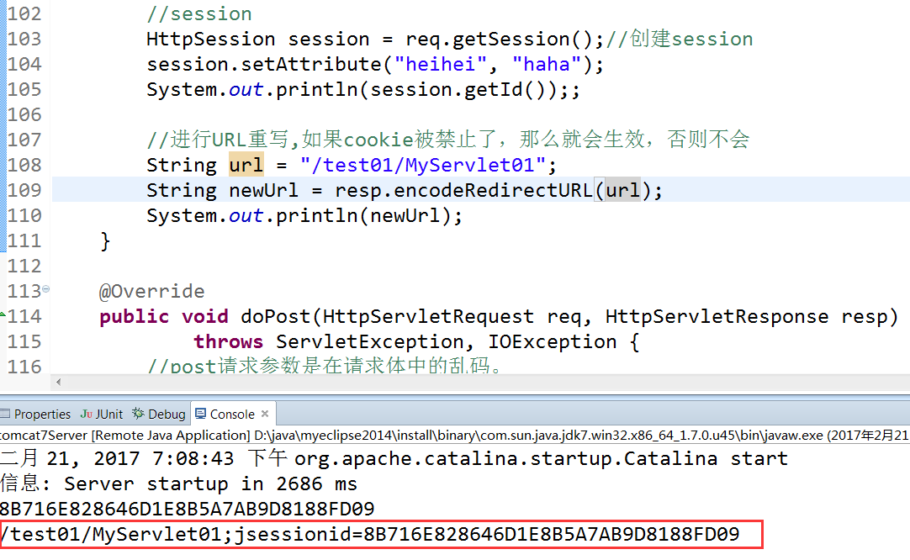

# Session

## 1. 奶茶买五送一的例子中，Session如何识别用户？

Session 相当于办了一张会员卡来确定你是哪个用户。

1. 店铺给顾客办理一张会员卡，除了卡号什么信息都不记录

2. 每次消费，如果顾客出示会员卡，店员记录找到这个卡号对应记录添加一些消费信息

这种做法就是在服务器端保持状态。

这就是session的用法，在服务器端来保持状态，保存一些用户信息。

功能作用：服务器用于共享数据技术，



## 2. session原理分析：

浏览器请求服务器访问web站点时，

1. 首先会检查是否创建过session

   程序需要为客户端的请求创建一个session的时候，服务器首先会检查这个客户端请求是否已经包含了一个session标识、称为SESSIONID，

2. 如果已经包含sessionId，则检索出原来的seesion

3. 如果客户端请求不包含session id，创建一个session并且生成一个与此session相关联的session id

4. sessionid将在本次响应中返回到客户端保存

   保存方式: 名字为JSESSIONID的cookie中 

### 3. 获取session：

- request.getSession();　　

  如果没有将创建一个新的，等效getSession(true);

  PS:为什么是从request中获取呢？因为在获取session时，需要检查是否有session表示

- request.getSession(boolean);　　

  true：没有将创建，false：没有将返回null


### 4. session属性操作：

- xxxAttribute(...)

　　用来存放一些信息，然后才能共享信息　

- setAttrubute(key,value);

- getAttribute(key);

### 5. session生命周期

### 5.1 错误思想：只要关闭浏览器，session就消失了

常常听到这样一种误解“只要关闭浏览器，session就消失了”。其实可以想象一下会员卡的例子，除非顾客主动对店家提出销卡，否则店家绝对不会轻易删除顾客的资料。

对session来说也是一样的，**除非程序通知服务器删除一个session，否则服务器会一直保留**，程序一般都是在用户做log off的时候发个指令去删除session。然而浏览器从来不会主动在关闭之前通知服务器它将要关闭，因此服务器根本不会有机会知道浏览器已经关闭，

**之所以会有这种错觉，是大部分session机制都使用会话cookie来保存session id，而关闭浏览器后这个session id就消失了，再次连接服务器时也就无法找到原来的session**。如果服务器设置的cookie被保存到硬盘上，或者使用某种手段改写浏览器发出的HTTP请求头，把原来的session id发送给服务器，则再次打开浏览器仍然能够找到原来的session　

恰恰是**由于关闭浏览器不会导致session被删除，迫使服务器为seesion设置了一个失效时间，一般是30分钟**，当距离客户端上一次使用session的时间超过这个失效时间时，服务器就可以认为客户端已经停止了活动，才会把session删除以节省存储空间

### 5.2 控制session的有效时间

- session.invalidate()

  将session对象销毁

- setMaxInactiveInterval(int interval) 

  设置有效时间，单位秒

- 在web.xml中配置session的有效时间

```
　<session-config>
	<session-timeout>30</session-timeout>   单位：分钟
 <session-config>
```

### 5.3 session的生命周期

- 创建：第一次调用getSession()

- 销毁：

   1. 超时，默认30分钟
   2. 执行api：session.invalidate()将session对象销毁、setMaxInactiveInterval(int interval) 设置有效时间，单位秒
   3. 服务器非正常关闭
   4. 自杀，直接将JVM马上关闭
   5. 如果正常关闭，session就会被持久化(写入到文件中，因为session默认的超时时间为30分钟，正常关闭后，就会将session持久化，等30分钟后，就会被删除)

位置：　D:\java\tomcat\apache-tomcat-7.0.53\work\Catalina\localhost\test01\SESSIONS.ser

## 6. session id的URL重写

**当浏览器将cookie禁用，基于cookie的session将不能正常工作**，每次使用request.getSession() 都将创建一个新的session。达不到session共享数据的目的，

但是我们知道原理，**只需要将session id 传递给服务器session就可以正常工作的。**

### 6.1 解决方案：URL重写

通过URL将session id 传递给服务器：URL重写

- 手动方式： url;jsessionid=....

- api方式：

  **如果浏览器禁用cooke，api将自动追加session id ，如果没有禁用，api将不进行任何修改。**

  response.encodeURL(java.lang.String url) 进行所有URL重写

　　response.encodeRedirectURL(java.lang.String url) 进行重定向 URL重写　

​	这两个用法基本一致,只不过考虑特殊情况,要访问的链接可能会被Redirect到其他servlet去进行处理,这样你用上述方法带来的session的id信息不能被同时传送到其他servlet.这时候用encodeRedirectURL()方法就可以了　

　　　　　　　　　　

注意：如果浏览器禁用cookie，web项目的所有url都需进行重写。否则session将不能正常工作

当禁止了cookie时，

　　　　　　　　　　　