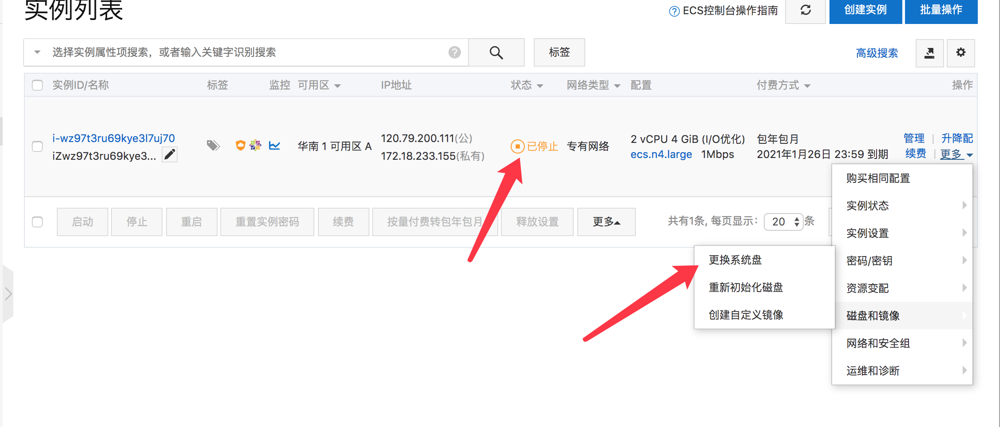
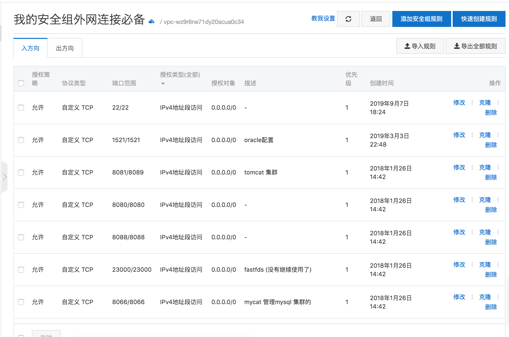
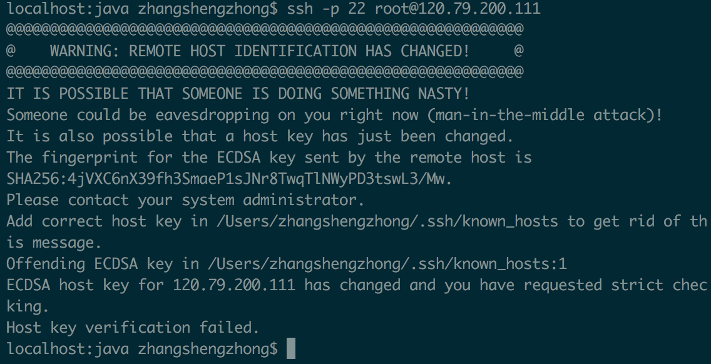

# 安装/重装系统

## 1. 选择重装系统

 如果是重装，先确保设备已停止



选择Centos7.6 作为系统盘


确定后输入验证码就完成了

## 2. 安全组设置

如果未设置安全组外网是连接不上服务器的



## 2. ssh 连接

刚创建完成的系统直接连接后会提示



此时可以删除knows_hosts解决

```
rm -rf  /root/.ssh/known_hosts
// 或者删除该提示中的文件
```

可能需要重启电脑才能生效


通过ssh -p 22 root@xxx.xx.xxx.xxx 就可以连接上服务器了

```
localhost:~ zhangshengzhong$ ssh -p 22 root@120.79.200.111
root@120.79.200.111's password:
Last failed login: Sat Sep  7 18:32:37 CST 2019 from 120.36.175.115 on ssh:notty
There was 1 failed login attempt since the last successful login.
Last login: Sat Sep  7 18:26:31 2019 from 120.36.175.115

Welcome to Alibaba Cloud Elastic Compute Service !

[root@iZwz97t3ru69kye3l7uj70Z ~]#
```

