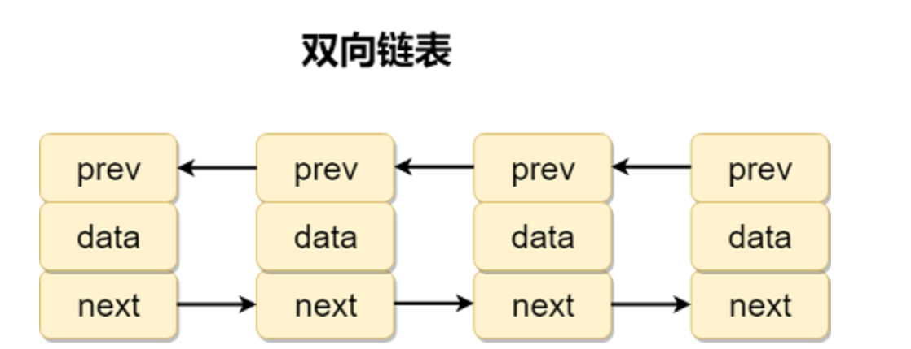
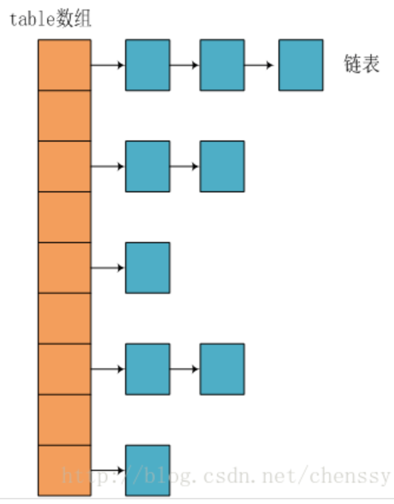
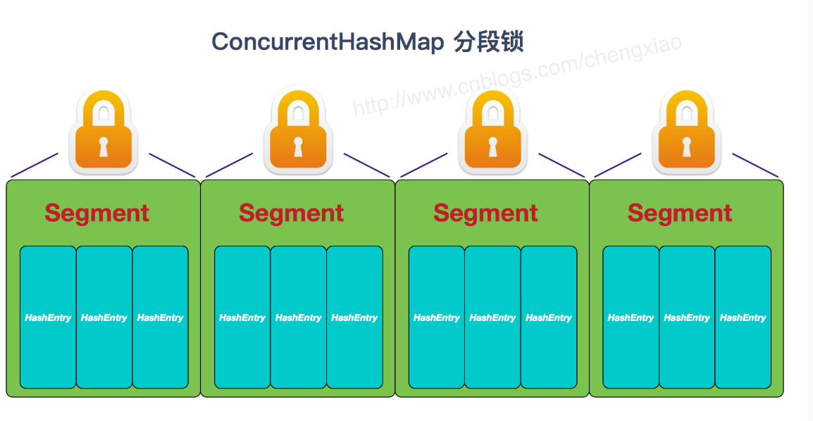
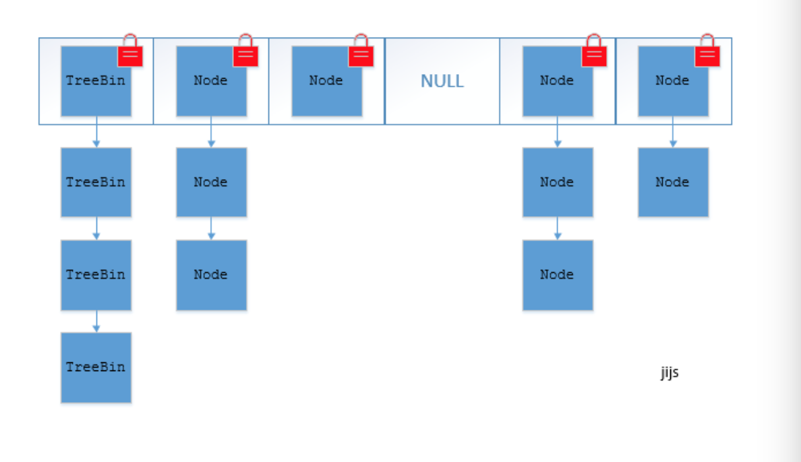

# Java容器基础

## 1. 说说List、Set、Map三者的区别

- List：List接口存储一组不唯一（可以有多个元素引用相同的对象），有序的对象
- Set（注重独一无二的性质）：不允许重复的集合，不会有多个元素引用相同的对象
- Map（用key来搜索的专家）：使用键值对存储。Map会维护与key有关联的值。两个key可以引用相同的对象，但key不能重复。

## 2. ArrayList 和 LinkedList 区别？

1. **是否保证线程安全**：ArrayList 和 LinkedList 都是不同步的，也就是不保证线程安全
2. **底层数据结构**：ArrayList 底层使用的是**Object 数组**，LinkedList 底层使用的是**双向链表**（JDK1.6之前为循环链表，JDK1.7取消了循环）

3. **插入和删除是否受元素位置的影响**：

   | z          | ArrayList（数组）                      | LinkedList(链表)         |
   | ---------- | -------------------------------------- | ------------------------ |
   | 是否影响   | 影响                                   | 不影响                   |
   | 算法复杂度 | 追加到末尾O(1)，插入和删除i位置 O(N-1) | 插入删除都不影响都是O(1) |

4. **是否支持随机访问**：LinkedList 不支持高效的随机元素访问，而ArrayList 支持。

   >快速随机访问就是通过元素的序号快速获取元素对象(对应于`get(int index) `方法)。

5. **内存空间占用**：ArrayList 的空间浪费主要体现在list列表的结尾会预留一定的容量空间。而LinkedList 的空间花费则体现在他的每一个元素都需要消耗比ArrayList更多的空间（因为要存放直接后继和直接前驱以及数据）

### 2.1 Linked为什么不支持随机访问(RandomAccess接口)

RandomAccess接口中什么都没有定义，只是一个标识，标识实现这个接口的类具有随机访问的功能

**`ArrayList` 实现了 `RandomAccess` 接口， 而 `LinkedList` 没有实现。为什么呢？**

我觉得还是和底层数据结构有关！`ArrayList` 底层是数组，而 `LinkedList` 底层是链表。数组天然支持随机访问，时间复杂度为 O（1），所以称为快速随机访问。链表需要遍历到特定位置才能访问特定位置的元素，时间复杂度为 O（n），所以不支持快速随机访问。，`ArrayList` 实现了 `RandomAccess` 接口，就表明了他具有快速随机访问功能。 `RandomAccess` 接口只是标识，并不是说 `ArrayList` 实现 `RandomAccess` 接口才具有快速随机访问功能的！

### 2.2 list 遍历方式选择

- 实现了RandomAccess 接口的list，优先选择普通for循环，其次foreach
- 未实现 RandomAccess 接口的list，优先选择iterator遍历（foreach遍历底层也是通过iterator实现），大size的数据，千万不要使用普通for循环

### 2.3 补充：双向链表和双向循环列表

**双向链表**：包含两个指针，一个prev指向前一个节点，一个next指向后一个节点



**双向循环链表**：最后一个节点的next指向head，而head 的prev指向最后一个节点，构成一个环

## 3.ArrayList与Vector区别？为什么要用ArrayList取代Vector呢？

Vector 类的所有方法都是同步方法的。可以由两个线程安全得访问一个Vector对象。但是一个线程访问Vector的话代码要在同步操作上耗费大量的时间

ArrayList 不是同步的，所以在不需要保证线程安全时建议使用ArrayList

## 4. ArrayList 的扩容机制

[ArrayList 的扩容机制](./ArrayList 的扩容机制.md)

## 5. HashMap 和 Hashtable 的区别

1. **线程是否安全**：HashMap是非线程安全的，HashTable是线程安全的；HashTable内部的方法基本都经过synchronized修饰。（如果你要保证线程安全的话使用ConcureentHashMap）
2. **效率**：因为线程安全的问题，HashMap 要比HashTable 效率要高一点，另外，HashTable 基本被淘汰，不要再代码中使用它
3. 对Null key 和Null value 的支持：HashMap 中，null 可以作为键，这样的键只有一个，可以有一个或多个键所对应的值为null。。但是在hashTable中put进的键值只要有一个null，直接抛出NullPointerException。
4. 初始容量大小和每次扩充容量大小的不同：
   1. 创建时如果不指定容量初始值。
      1. Hashtable默认的初始大小为11，之后每次扩充，容量变为原来的2n+1
      2. HashMap 默认的初始化大小为16.之后每次扩充，容量变为原来的2倍
   2. 创建时如果给定了容量初始值
      1. Hashtable 会直接使用你给定的大小
      2. HashMap 会将其扩充为2的幂次方大小（也就是说 HashMap 总是使用2的幂作为哈希表的大小,）
5. 底层数据结构：JDK1.8 以后的HashMap 在解决哈希冲突时有了较大的变化。当链表长度大于阈值（默认是8），将链表转为红黑树，以减少搜索时间。HashTable
   没有这样的机制

## 6. HashMap 如何保证总是使用2的幂次方作为哈希表的大小

**HashMap 中带有初始容量的构造函数：**

```java
public HashMap(int initialCapacity, float loadFactor) {
        if (initialCapacity < 0)
            throw new IllegalArgumentException("Illegal initial capacity: " +
                                               initialCapacity);
        if (initialCapacity > MAXIMUM_CAPACITY)
            initialCapacity = MAXIMUM_CAPACITY;
        if (loadFactor <= 0 || Float.isNaN(loadFactor))
            throw new IllegalArgumentException("Illegal load factor: " +
                                               loadFactor);
        this.loadFactor = loadFactor;
        this.threshold = tableSizeFor(initialCapacity);
    }
     public HashMap(int initialCapacity) {
        this(initialCapacity, DEFAULT_LOAD_FACTOR);
    }
```

下面这个方法保证了 HashMap 总是使用2的幂作为哈希表的大小。

```java
 /**
     * Returns a power of two size for the given target capacity.
     */
    static final int tableSizeFor(int cap) {
        int n = cap - 1;
        n |= n >>> 1;
        n |= n >>> 2;
        n |= n >>> 4;
        n |= n >>> 8;
        n |= n >>> 16;
        return (n < 0) ? 1 : (n >= MAXIMUM_CAPACITY) ? MAXIMUM_CAPACITY : n + 1;
    }
```

## 7. HashMap 和 HashSet区别

HashSet 底层就是基于 HashMap 实现的，（HashSet 的源码非常非常少，除了clone()、writeObject()、readObject（）是hashSet自己不得不实现指纹，其他都是调用hashMap中的方法）

| HashMap                         | hashSet                                                      |
| ------------------------------- | ------------------------------------------------------------ |
| 实现了Map接口                   | 实现了set接口                                                |
| 存储键值对                      | 仅存储对象                                                   |
| 调用put() 向map中添加元素       | 调用add 方法向set中添加元素                                  |
| HashMap 使用（key）计算hashcode | HashSet使用成员对象来计算hashcode值，对于两个对象来说hashcode可能相同。所以equals（）方法来判断对象的相等行 |

## 8. HashSet如何检查重复

当你吧对象加入HashSet 时，

- HashSet会先计算对象的hashCode来判断对象加入的位置，
- 同时也会与其他加入的对象的hashCode值做比较。如果没有相符的hashCode，hashSet 会假设对象没有重复出现。
- 但是如果方向有hashCode值的对象，这时候会调用equals（）方法来检查hashCode相等的对象是否真的相同。如果两者相同，hashSet就不会让加入操作成功

### 8.1 **hashCode（）与equals（）的相关规定：**

1. 如果两个对象相等，则hashcode一定也是相同的
2. 两个对象相等,对两个equals方法返回true
3. 两个对象有相同的hashcode值，它们也不一定是相等的
4. 综上，equals方法被覆盖过，则hashCode方法也必须被覆盖
5. hashCode()的默认行为是对堆上的对象产生独特值。如果没有重写hashCode()，则该class的两个对象无论如何都不会相等（即使这两个对象指向相同的数据）。

### 8.2 ==与equals的区别

1. ==是判断两个变量或实例是不是指向同一个内存空间 equals是判断两个变量或实例所指向的内存空间的值是不是相同
2. ==是指对内存地址进行比较 equals()是对字符串的内容进行比较
3. ==指引用是否相同 equals()指的是值是否相同

## 9. HashMap 的底层实现

### 9.1 JDK1.8 之前

JDK1.8 之前 HashMap 底层是 **数组和链表** 结合在一起使用也就是 **链表散列**。**HashMap 通过 key的hashCode 经过扰动函数处理过后得到 hash 值，然后通过（n-1）&hash判断当前元素的存放位置（这里的n指的是数组的长度），如果当前位置存在元素的话，就判断该元素与要存入的元素的hash 值以及key 是否相同，如果相同的话，直接覆盖，不相同就通过拉链法解决冲突**。

#### 9.2 HashMap 的扰动函数/ hash 方法源码

所谓扰动函数指的就是 HashMap 的hash 方法。使用 hash 方法也就是扰动函数是为了防止一些实现比较差的 hashCode() 方法，换句话说**使用扰动函数之后可以减少碰撞

- JDK 1.8 hash

  JDK 1.8 的 hash方法 相比于 JDK 1.7 hash 方法更加简化，但是原理不变。

  ```java
      static final int hash(Object key) {
        int h;
        // key.hashCode()：返回散列值也就是hashcode
        // ^ ：按位异或
        // >>>:无符号右移，忽略符号位，空位都以0补齐
        return (key == null) ? 0 : (h = key.hashCode()) ^ (h >>> 16);
    }
  ```

- JDK 1.7 的HashMap 的hash 方法源码

  ```java
  static int hash(int h) {
      // This function ensures that hashCodes that differ only by
      // constant multiples at each bit position have a bounded
      // number of collisions (approximately 8 at default load factor).
  
      h ^= (h >>> 20) ^ (h >>> 12);
      return h ^ (h >>> 7) ^ (h >>> 4);
  }
  ```

  相比于 JDK1.8 的 hash 方法 ，JDK 1.7 的 hash 方法的性能会稍差一点点，因为毕竟扰动了 4 次。

### 9.3 拉链法

#### 9.3.1 JDK1.7 版本

所谓”拉链法“就是：将链表和数组相结合。也就是说创建一个链表数组，数组中每一格就是一个链表。若遇到hash冲突，则将冲突的值加到链表中即可



#### JDK1.8 之后

当链表长度大于阈值（默认为8）时，将链表转化为红黑树，以减少搜索时间

> TreeMap、TreeSet以及JDK1.8之后的HashMap底层都用到了红黑树。红黑树就是为了解决二叉查找树的缺陷，因为二叉查找树在某些情况下会退化成一个线性结构。

## 10. HashMap 的长度为什么是2的幂次方

目的：为了能让 HashMap 存取高效，**尽量较少碰撞**。也就是要尽量把数据分配均匀**。

- **总空间足够大，难以出现碰撞**：我们上面也讲到过了，Hash值的方位值-2147483648到2147483647，前后加起来大概40亿的映射空间，只要哈希函数映射得比较均匀松散，一般应用是很难出现碰撞的。

- **内存放不下**：但问题是一个40亿长度的数组，内存是放不下的。所以这个散列值是不能直接拿来用的。
- **取模运算余数当下标**：用之前还要先做对数组的长度**取模运算**，得到的余数才能用来要存放的位置也就是对应的数组下标
- 这个数组下标的计算方法是“（n-1）&hash”，（n代表数组长度），这也解释了 HashMap 的长度为什么是2 的幂次方

这个算法应该如何设计呢？

我们首先可能会想到采用%取余的操作来实现。但是，重点来了：**“取余(%)操作中如果除数是2的幂次则等价于与其除数减一的与(&)操作（也就是说 hash%length==hash&(length-1)的前提是 length 是2的 n 次方；）。”** 并且 **采用二进制位操作 &，相对于%能够提高运算效率，这就解释了 HashMap 的长度为什么是2的幂次方。**

总结：

1. HashMap的hash表算法思路是：**对数组的长度取余当下标**
2. HashMap的hash表实际算法是：**（n-1）&hash，（n代表数组长度）**
3. 取余（%）操作和（n-1）&hash相等的前提就是 **length 是2的 n 次方**

## 11. HashMap 多线程操作导致死循环问题

主要原因在于 并发下的 Rehash 会造成元素之间**会形成一个循环链表**。不过，JDK1.8 之后解决了这个问题，但是还是不建议在多线程下使用 HashMap，因为多线程下使用 HashMap 还是会存在其他问题，比如数据丢失，并发环境下推荐使用ConcurrentHashMap

## 12. ConcurrentHashMap 和 HashTable 的区别

ConcurrentHashMap 和 Hashtable 的区别主要体现在实现线程安全的方式不同

- 底层数据结构上

  - JDK1.7 的 ConcurrentHashMap 底层采用 分段的数组+链表实现，JDK1.8 采用的数据结构跟HashMap的节后一样，数组+链表/红黑二叉树

  - HashTable 和 JDK1.8 之前的 HashMap 的底层数据结构类似都是采用 **数组+链表** 的形式，数组是HashTable 的主体，链表则是主要为了解决哈希冲突而存在的

- 实现线程安全的方式（重要）

  - ConcurrentHashMap：

     在JDK1.7 的时候，ConcurrentHashMap（分段锁）对整个桶数进行了分割分段（Segment）。**每一把锁只锁容器其中一部分数据**，多线程访问容器里不同数据段的数据，就不会存在锁竞争，提高并发访问率。

    在JDK1.8 的时候，已经摒弃了Segment的概念，而是直接使用**Node数组+链表+红黑树的数据结构来实现**，**并发控制使用synchronized 和 CAS 来操作**（JDK1.6以后 对 synchronized锁做了很多优化）** 整个看起来就像是优化过且线程安全的 HashMap，虽然在JDK1.8中还能看到 Segment 的数据结构，但是已经简化了属性，只是为了兼容旧版本；

  - HashTable（同一把锁）

    使用syncronized 来保证线程安全，效率非常低下，当一个线程访问同步方法时，其他线程也访问同步方法，可能会进入阻塞或轮询状态，如使用put添加元素，另一个线程不能使用put添加元素，也不能使用get，竞争会越来越激烈效率越低

### 12.1 两者对比图

- HashTable，这个table 就一把锁

  

- **ConcurrentHashMap**

  - 在JDK1.7 的ConcurrentHashMap

    

  - 在JDK1.8 的ConcurrentHashMap

    

## 13. ConcurrentHashMap 线程安全的具体实现方式/ 底层具体实现

### 13.1 在JDK1.7 上的ConcurrentHashMap

- 首先将数据分为一段一段的存储，
- 然后给每一段数据配一把锁，
- 当一个线程占用锁访问其中一个数据段数据时，
- 其他段的数据也能被其他线程访问。

**ConcurrentHashMap 是由Segment 数组结构和HashEntry数据结构组成**

Segment 实现了ReentrantLock，所以Segment 是一种可重入锁，扮演锁的角色。HashEnery 用于存储键值对数据

```ajava
static class Segment<K,V> extends ReentrantLock implements Serializable {
}
```

一个ConcurrentHashMap 里包含一个Segment 数组。Segment 的结构和 HashMap类似，是一种数组和链表结构，一个Segment包含一个HashEntry 数组，每个HashEntry 是一个链表结构的元素，每一个Segment守护着一个HashEntry数组里的元素，当对HashEntry 数组的数据进行修改时，必须首先获得对应的Segment的锁

### 13.2 JDK1.8 ConcurrentHashMap

ConcurrentHashMap 取消了Segment分段锁，采用CAS和synchronized来保证并发安全，数据结构跟HashMap1.8的结构类似，数组+链表/红黑二叉树。Java8 在链表长度超过一定阈值（8）时将链表（寻址时间复杂度为0(n)转换为红黑树（寻址时间复杂度为O(log(N))））

synchronized 只锁定当前链表或红黑树的首节点，这样只要hash不冲突，就不会产生并发，效率又提示了N呗

## 14. 集合框架底层数据结构总结

1. **List**

   - **ArrayList**：Object数组

   - **Vector**：Object数组

   - **LinkedList**：双向链表（JDK1.6之前为循环链表，JDK1.7取消了循环）

2. **Set**

   - **HashSet**（无序，唯一）：基于HashMap实现的，底层采用 HashMap 来保存元素

   - **LinkedHashSet**: LinkedHashSet 继承与 HashSet,并且其内部是通过LinkedHashMap实现的

   - **TreeSet(有序唯一)**：红黑树（自平衡的排序二叉树）

3. **Map**

   - **HashMap**: JDK1.8 之前HashMap由数组+链表组成的，数组是HashMap的主题。链表则是主要为了解决哈希冲突而存在的（“拉链法”解决冲突）。JDK1.8 以后在解决哈希冲突时有了较大的变化，当链表长度大于阈值（默认为8）时，将链表转化为红黑树
   - **LinkedHashMap**: LinkedHashMap 继承自 HashMap, 所以他的底层仍然是基于拉链式散列结构，既由数据和链表或红黑树组成。另外，LinkedHashMap 在上面的结构的基础上，增加了一条双向链表，使得上面的结构可以保持键值对的插入顺序。同时通过对链表的相应操作，实现了访问顺序相关逻辑
   - **HashTable**: 数组+链表组成的，数组是 HashMap 的主体，链表则是主要为了解决哈希冲突而存在的
   - **TreeMap**：红黑树（自平衡的排序二叉树）

## 15. 如何选用集合？

主要根据集合的特点来选用，

- 比如我们需要**根据键值获取到元素值**时就选用Map接口下的集合
  - 需要排序时选择TreeMap
  - 不需要排序时就选择HashMap
  - 需要保证线程安全就选用ConcurrentHashMap
- 当我们只需要存放元素值时，就选择实现Collection 接口的集合
  - 需要保证元素唯一时选择Set接口的集合，比如TreeSet或HashSet
  - 不需要就实现List接口的。比如ArrayList或者LinkedList