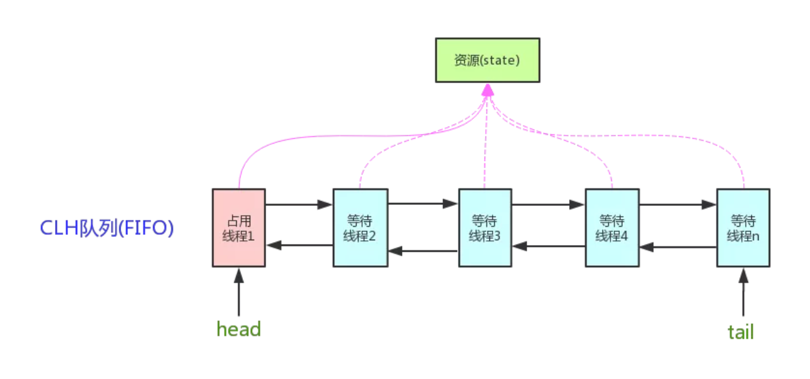

# AQS构建锁和同步器

## 1. 简介

AQS的全称为（AbstractQueuedSynchronizer），这个类在java.util.concurrent.locks包下面。


AQS是一个**用来构建锁和同步器的框架**，使用AQS能简单且高效得构造出应用广泛的大量同步器，比如我们提到了ReentrantLock，Semaphore，其他的诸如ReentrantReadWriteLock，SynchronousQueue，FutureTask等等皆是基于AQS的。当然，我们自己也能利用AQS非常轻松容易地构造出符合我们自己需求的同步器。

## 2. AQS 原理

### 2.1 AQS 原理概览

AQS 核心思想是

- 如果被请求的**共享资源空闲**，则将当前请求资源的**线程设置为有效的工作线程**，并且**将共享资源设置为锁定状态**
- 如果被请求的**共享资源被占用**，那么就需要一套**线程阻塞等待以及被唤醒时锁分配的机制**，这个机制AQS是用**CLH队列**实现的，即将暂时获取不到锁的线程加入到队列中

>CLH(Craig,Landin,and Hagersten)队列是一个虚拟的双向队列（虚拟的双向队列既不存在队列实例，仅存在结点之间的关联关系）。AQS是将每条请求共享资源的线程封装成一个CLH锁队列的一个节点（Node）来实现锁的分配

看个AQS(AbstractQueuedSynchronizer)原理图：



AQS使用一个int成员变量来表示同步状态，通过内置的FIFO队列来完成资源线程的排队工作，AQS使用CAS对该同步状态进行原子操作实现对其值的修改。

```JAVA
private volatile int state;//共享变量，使用volatile修饰保证线程可见性
```

状态信息通过procted类型的getState，setState，compareAndSetState进行操作

```JAVA
//返回同步状态的当前值
protected final int getState() {  
        return state;
}
 // 设置同步状态的值
protected final void setState(int newState) { 
        state = newState;
}
//原子地（CAS操作）将同步状态值设置为给定值update如果当前同步状态的值等于expect（期望值）
protected final boolean compareAndSetState(int expect, int update) {
        return unsafe.compareAndSwapInt(this, stateOffset, expect, update);
}
```

### 2.2 AQS 对资源的共享方式

**AQS定义两种资源共享方式**

- **Exclusive**（独占）：只有一个线程能执行，如ReentrantLock。又可分为公平锁和非公平锁：

- - 公平锁：按照线程在队列中的排队顺序，先到者先拿到锁
  - 非公平锁：当线程要获取锁时，无视队列顺序直接去抢锁，谁抢到就是谁的

- **Share**（共享）：多个线程可同时执行，如Semaphore/CountDownLatch。Semaphore、CountDownLatCh、 CyclicBarrier、ReadWriteLock 我们都会在后面讲到。

ReentrantReadWriteLock 可以看成是组合式，因为ReentrantReadWriteLock也就是读写锁允许多个线程同时对某一资源进行读。

不同的自定义同步器争用共享资源的方式也不同。自定义同步器在实现时只需要实现共享资源 state 的获取与释放方式即可，至于具体线程等待队列的维护（如获取资源失败入队/唤醒出队等），AQS已经在上层已经帮我们实现好了。


….

### 参考文章

[并发编程面试必备：AQS 原理以及 AQS 同步组件总结](<https://mp.weixin.qq.com/s?__biz=Mzg2OTA0Njk0OA==&mid=2247484832&idx=1&sn=f902febd050eac59d67fc0804d7e1ad5&source=41#wechat_redirect>)