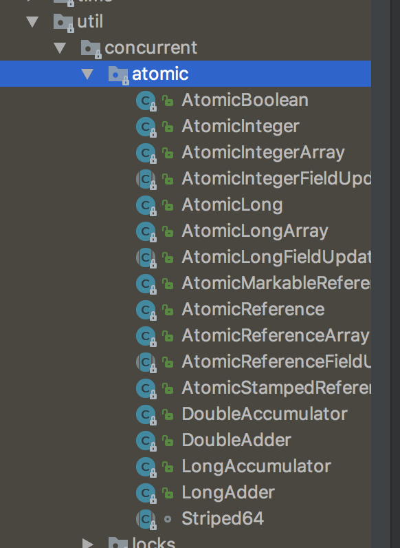

# Atomic原子类

## 1. 简介

Atomic 翻译成中文的意思，在化学上，我们知道原子是构成一般物质的最小单位。在化学反应中是不可分割的。在我们这里**Atomic是指一个操作是不可终端的，即使是在多个线程一起执行的时候，一个操作一旦开始，就不会被其他线程干扰**

所以，所谓原子类说简单点就是具有原子/原子操作特征的类。

并发包 `java.util.concurrent` 的原子类都存放在`java.util.concurrent.atomic`下,如下图所示。



## 2. JUC包中的4类原子类

**基本类型**

使用原子的方式更新基本类型

- AtomicInteger：整形原子类
- AtomicLong：长整型原子类
- AtomicBoolean：布尔型原子类

**数组类型**

使用原子的方式更新数组里的某个元素

- AtomicIntegerArray：整形数组原子类
- AtomicLongArray：长整形数组原子类
- AtomicReferenceArray：引用类型数组原子类

**引用类型**

- AtomicReference：引用类型原子类
- AtomicStampedReference：原子更新引用类型里的字段原子类
- AtomicMarkableReference ：原子更新带有标记位的引用类型

**对象的属性修改类型**

- AtomicIntegerFieldUpdater：原子更新整形字段的更新器
- AtomicLongFieldUpdater：原子更新长整形字段的更新器
- AtomicStampedReference：原子更新带有版本号的引用类型。该类将整数值与引用关联起来，可用于解决原子的更新数据和数据的版本号，可以解决使用 CAS 进行原子更新时可能出现的 ABA 问题。

## 3. AtomicInteger 的使用

**AtomicInteger 类常用方法**

```java
public final int get() //获取当前的值
public final int getAndSet(int newValue)//获取当前的值，并设置新的值
public final int getAndIncrement()//获取当前的值，并自增
public final int getAndDecrement() //获取当前的值，并自减
public final int getAndAdd(int delta) //获取当前的值，并加上预期的值
boolean compareAndSet(int expect, int update) //如果输入的数值等于预期值，则以原子方式将该值设置为输入值（update）
public final void lazySet(int newValue)//最终设置为newValue,使用 lazySet 设置之后可能导致其他线程在之后的一小段时间内还是可以读到旧的值。
```

**AtomicInteger 类的使用示例**

使用 AtomicInteger 之后，不用对 increment() 方法加锁也可以保证线程安全。

```
class AtomicIntegerTest {
        private AtomicInteger count = new AtomicInteger();
      //使用AtomicInteger之后，不需要对该方法加锁，也可以实现线程安全。
        public void increment() {
                  count.incrementAndGet();
        }
     
       public int getCount() {
                return count.get();
        }
}
```

## 4. AtomicInteger 类的原理

AtomicInteger 类的部分源码：

```java
 // setup to use Unsafe.compareAndSwapInt for updates（更新操作时提供“比较并替换”的作用）
    private static final Unsafe unsafe = Unsafe.getUnsafe();
    private static final long valueOffset;

    static {
        try {
            valueOffset = unsafe.objectFieldOffset
                (AtomicInteger.class.getDeclaredField("value"));
        } catch (Exception ex) { throw new Error(ex); }
    }

    private volatile int value;
```

AtomicInteger 类主要利用 CAS (compare and swap) + volatile 和 native 方法来保证原子操作，从而避免 synchronized 的高开销，执行效率大为提升。

CAS的原理是拿期望的值和原本的一个值作比较，如果相同则更新成新的值。UnSafe 类的 objectFieldOffset() 方法是一个本地方法，这个方法是用来拿到“原来的值”的内存地址，返回值是 valueOffset。另外 value 是一个volatile变量，在内存中可见，因此 JVM 可以保证任何时刻任何线程总能拿到该变量的最新值。