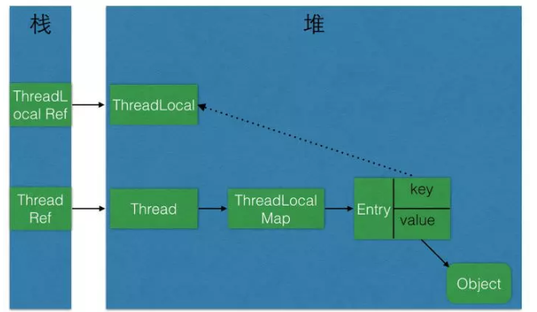

# ThreadLocal

## 1. 什么是ThreadLocal

我们先来看下JDK 的文档介绍

```
/**
 * This class provides thread-local variables.  These variables differ from
 * their normal counterparts in that each thread that accesses one (via its
 * {@code get} or {@code set} method) has its own, independently initialized
 * copy of the variable.  {@code ThreadLocal} instances are typically private
 * static fields in classes that wish to associate state with a thread (e.g.,
 * a user ID or Transaction ID).
 * 
 * <p>For example, the class below generates unique identifiers local to each
 * thread.
 * A thread's id is assigned the first time it invokes {@code ThreadId.get()}
 * and remains unchanged on subsequent calls.
 */  
```

ThreadLocal提供了线程的局部变量。每个线程都可以通过`set()`和`get()`来对这个 局部变量进行操作，但不会和其他线程的局部变量进行冲突。**实现了线程的数据隔离**

简要言之：往ThreadLocal中填充的变量属于**当前**线程，该变量对其他线程而言是隔离的。

## 2. 为什么要学习ThreadLocal

从上面可以得出：ThreadLocal可以让我们拥有当前线程的变量，那这个作用有什么用呢？？？

### 2.1 管理Connection

**最典型的是管理数据库的Connection**：

当时在学JDBC的时候，为了方便操作写了一个简单数据库连接池，需要数据库连接池的理由也很简单，频繁创建和关闭Connection是一件非常耗费资源的操作，因此需要创建数据库连接池～

那么，数据库连接池的连接怎么管理呢？？我们交由ThreadLocal来进行管理。为什么交给它来管理呢？？ThreadLocal能够实现**当前线程的操作都是用同一个Connection，保证了事务！**

当时候写的代码：

```
public class DBUtil {
    //数据库连接池
    private static BasicDataSource source;

    //为不同的线程管理连接
    private static ThreadLocal<Connection> local;


    static {
        try {
            //加载配置文件
            Properties properties = new Properties();

            //获取读取流
            InputStream stream = DBUtil.class.getClassLoader().getResourceAsStream("连接池/config.properties");

            //从配置文件中读取数据
            properties.load(stream);

            //关闭流
            stream.close();

            //初始化连接池
            source = new BasicDataSource();

            //设置驱动
            source.setDriverClassName(properties.getProperty("driver"));

            //设置url
            source.setUrl(properties.getProperty("url"));

            //设置用户名
            source.setUsername(properties.getProperty("user"));

            //设置密码
            source.setPassword(properties.getProperty("pwd"));

            //设置初始连接数量
            source.setInitialSize(Integer.parseInt(properties.getProperty("initsize")));

            //设置最大的连接数量
            source.setMaxActive(Integer.parseInt(properties.getProperty("maxactive")));

            //设置最长的等待时间
            source.setMaxWait(Integer.parseInt(properties.getProperty("maxwait")));

            //设置最小空闲数
            source.setMinIdle(Integer.parseInt(properties.getProperty("minidle")));

            //初始化线程本地
            local = new ThreadLocal<>();


        } catch (IOException e) {
            e.printStackTrace();
        }
    }

    public static Connection getConnection() throws SQLException {
        
        if(local.get()!=null){
            return local.get();
        }else{
        
            //获取Connection对象
            Connection connection = source.getConnection();
    
            //把Connection放进ThreadLocal里面
            local.set(connection);
    
            //返回Connection对象
            return connection;
        }

    }

    //关闭数据库连接
    public static void closeConnection() {
        //从线程中拿到Connection对象
        Connection connection = local.get();

        try {
            if (connection != null) {
                //恢复连接为自动提交
                connection.setAutoCommit(true);

                //这里不是真的把连接关了,只是将该连接归还给连接池
                connection.close();

                //既然连接已经归还给连接池了,ThreadLocal保存的Connction对象也已经没用了
                local.remove();

            }
        } catch (SQLException e) {
            e.printStackTrace();
        }
    }


}
```

同样的，Hibernate对Connection的管理也是采用了相同的手法(使用ThreadLocal，当然了Hibernate的实现是更强大的)～

## 2.2 避免一些参数传递

**避免一些参数的传递的理解**可以参考一下Cookie和Session：


## 3. ThreadLocal 实现的原理

```java
 public void set(T value) {

		// 得到当前线程对象
        Thread t = Thread.currentThread();
		
		// 这里获取ThreadLocalMap
        ThreadLocalMap map = getMap(t);

		// 如果map存在，则将当前线程对象t作为key，要存储的对象作为value存到map里面去
        if (map != null)
            map.set(this, value);
        else
            createMap(t, value);
    }

```

上面有个ThreadLocalMap，我们去看看这是什么？

```java
static class ThreadLocalMap {

        /**
         * The entries in this hash map extend WeakReference, using
         * its main ref field as the key (which is always a
         * ThreadLocal object).  Note that null keys (i.e. entry.get()
         * == null) mean that the key is no longer referenced, so the
         * entry can be expunged from table.  Such entries are referred to
         * as "stale entries" in the code that follows.
         */
        static class Entry extends WeakReference<ThreadLocal<?>> {
            /** The value associated with this ThreadLocal. */
            Object value;

            Entry(ThreadLocal<?> k, Object v) {
                super(k);
                value = v;
            }
        }
		//....很长
}

```

通过上面我们可以发现的是**ThreadLocalMap是ThreadLocal的一个内部类。用Entry类来进行存储**

我们的**值都是存储到这个Map上的，key是当前ThreadLocal对象**！

如果该Map不存在，则初始化一个：

```
void createMap(Thread t, T firstValue) {
        t.threadLocals = new ThreadLocalMap(this, firstValue);
    }
```

如果该Map存在，则**从Thread中获取**！

```java
  /**
     * Get the map associated with a ThreadLocal. Overridden in
     * InheritableThreadLocal.
     *
     * @param  t the current thread
     * @return the map
     */
    ThreadLocalMap getMap(Thread t) {
        return t.threadLocals;
    }

```

Thread维护了ThreadLocalMap变量

```java
  /* ThreadLocal values pertaining to this thread. This map is maintained
     * by the ThreadLocal class. */
    ThreadLocal.ThreadLocalMap threadLocals = null
```

从上面又可以看出，**ThreadLocalMap是在ThreadLocal中使用内部类来编写的，但对象的引用是在Thread中**！

于是我们可以总结出：**Thread为每个线程维护了ThreadLocalMap这么一个Map，而ThreadLocalMap的key是LocalThread对象本身，value则是要存储的对象**

有了上面的基础，我们看get()方法就一点都不难理解了

```java
public T get() {
        Thread t = Thread.currentThread();
        ThreadLocalMap map = getMap(t);
        if (map != null) {
            ThreadLocalMap.Entry e = map.getEntry(this);
            if (e != null) {
                @SuppressWarnings("unchecked")
                T result = (T)e.value;
                return result;
            }
        }
        return setInitialValue();
    }

```

### 3.1 ThreadLocal 原理总结

1. 每个Thread维护着一个ThreadLocalMap的引用
2. ThreadLocalMap 是ThreadLocal的内部类，用Entry来进行存储
3. 调用ThreadLocal的set()方法时，实际上就是往ThreadLocalMap设置值，key是ThreadLocal对象，值是传递进来的对象
4. 调用ThreadLocal的get()方法时，实际上就是往ThreadLocalMap获取值，key是ThreadLocal对象
5. **ThreadLocal本身并不存储值**，它只是**作为一个key来让线程从ThreadLocalMap获取value**。

## 4. 避免内存泄漏

我们来看一下ThreadLocal的对象关系引用图：



ThreadLocal内存泄漏的根源是：**由于ThreadLocalMap的生命周期跟Thread一样长，如果没有手动删除对应key就会导致内存泄漏，而不是因为弱引用**。

想要避免内存泄露就要**手动remove()掉**！

## 5. 总结

**ThreadLocal设计的目的就是为了能够在当前线程中有属于自己的变量，并不是为了解决并发或者共享变量的问题**

### 参考文章

[ThreadLocal就是这么简单](<https://juejin.im/post/5ac2eb52518825555e5e06ee#comment>)