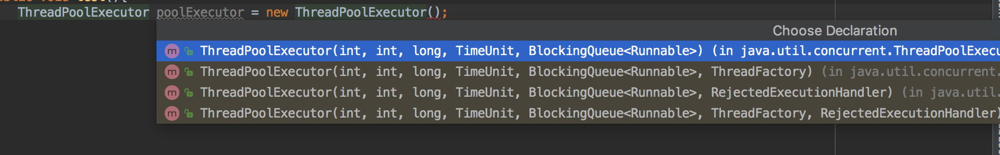
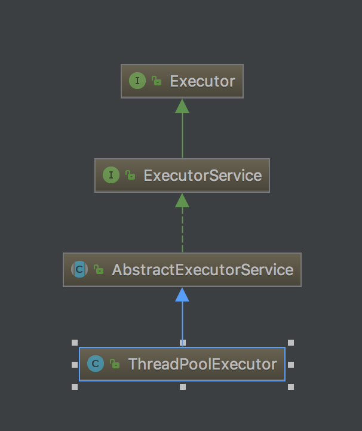

# ThreadPoolExecutor类

## 1. ThreadPoolExecutor类构造器

java.uitl.concurrent.ThreadPoolExecutor类是线程池中最核心的一个类，因此如果要透彻了解Java中线程池，就需要先了解这个类。下面我们来看一ThreadPoolExecutor类的具体实现源码

在ThreadPoolExecutor类中提供了四个构造方法：



```java
public class ThreadPoolExecutor extends AbstractExecutorService {
    // 第一个构造器
      public ThreadPoolExecutor(int corePoolSize,
                              int maximumPoolSize,
                              long keepAliveTime,
                              TimeUnit unit,
                              BlockingQueue<Runnable> workQueue) {
        this(corePoolSize, maximumPoolSize, keepAliveTime, unit, workQueue,
             Executors.defaultThreadFactory(), defaultHandler);
    }
    
    // 第二个构造器
       public ThreadPoolExecutor(int corePoolSize,
                              int maximumPoolSize,
                              long keepAliveTime,
                              TimeUnit unit,
                              BlockingQueue<Runnable> workQueue,
                              ThreadFactory threadFactory) {
        this(corePoolSize, maximumPoolSize, keepAliveTime, unit, workQueue,
             threadFactory, defaultHandler);
    }

    // 第三个构造器
      public ThreadPoolExecutor(int corePoolSize,
                              int maximumPoolSize,
                              long keepAliveTime,
                              TimeUnit unit,
                              BlockingQueue<Runnable> workQueue,
                              RejectedExecutionHandler handler) {
        this(corePoolSize, maximumPoolSize, keepAliveTime, unit, workQueue,
             Executors.defaultThreadFactory(), handler);
    }
    
    // 第四个构造器
      public ThreadPoolExecutor(int corePoolSize,
                              int maximumPoolSize,
                              long keepAliveTime,
                              TimeUnit unit,
                              BlockingQueue<Runnable> workQueue,
                              ThreadFactory threadFactory,
                              RejectedExecutionHandler handler) {
        if (corePoolSize < 0 ||
            maximumPoolSize <= 0 ||
            maximumPoolSize < corePoolSize ||
            keepAliveTime < 0)
            throw new IllegalArgumentException();
        if (workQueue == null || threadFactory == null || handler == null)
            throw new NullPointerException();
        this.corePoolSize = corePoolSize;
        this.maximumPoolSize = maximumPoolSize;
        this.workQueue = workQueue;
        this.keepAliveTime = unit.toNanos(keepAliveTime);
        this.threadFactory = threadFactory;
        this.handler = handler;
    }
}
```

从上面的代码可以得知，ThreadPoolExecutor继承了AbstractExecutorService类，并提供了四个构造器，事实上，通过观察每个构造器的源码具体实现，发现前面三个构造器都是调用的第四个构造器进行的初始化工作。

## 2. 构造器参数含义

### 2.1 corePoolSize：核心池的大小

corePoolSize：核心池的大小

- 在创建了线程池后，默认情况下，**线程池中并没有任何线程**，而是等待**有任务到来才创建线程**去执行任务。当线程池中的线程数目达到corePoolSize后，就会**把到达的任务放到缓存队列**当中；

- 除非调用了prestartAllCoreThreads()或者prestartCoreThread()方法**预创建线程**。即在没有任务到来之前就创建corePoolSize个线程或者一个线程

### 2.2 maximumPoolSize：线程池最大线程数

maximumPoolSize：线程池最大线程数，这个参数也是一个非常重要的参数，它表示在线程池中最多能创建多少个线程；

### 2.3 keepAliveTime：线程没有任务执行时最多保持多久时间会终止

keepAliveTime：表示线程没有任务执行时最多保持多久时间会终止。

- 默认情况下，只有当线程池中的线程数大于corePoolSize时，keepAliveTime才会起作用，直到线程池中的线程数不大于corePoolSize
- 即当线程池中的线程数大于corePoolSize时，如果一个线程空闲的时间达到keepAliveTime，则会终止，直到线程池中的线程数不超过corePoolSize
- 但是如果调用了allowCoreThreadTimeOut(boolean)方法，在线程池中的线程数不大于corePoolSize时，keepAliveTime参数也会起作用，直到线程池中的线程数为0；

### 2.4 unit：参数keepAliveTime的时间单位

unit：参数keepAliveTime的时间单位，有7种取值，在TimeUnit类中有7种静态属性：

```java
TimeUnit.DAYS;               //天
TimeUnit.HOURS;             //小时
TimeUnit.MINUTES;           //分钟
TimeUnit.SECONDS;           //秒
TimeUnit.MILLISECONDS;      //毫秒
TimeUnit.MICROSECONDS;      //微妙
TimeUnit.NANOSECONDS;       //纳秒
```

### 2.5 workQueue: 阻塞队列

workQueue：一个阻塞队列，用来存储等待执行的任务，这个参数的选择也很重要，会对线程池的运行过程产生重大影响，一般来说，这里的阻塞队列有以下几种选择：

```
ArrayBlockingQueue;
LinkedBlockingQueue;
SynchronousQueue;
```

ArrayBlockingQueue和PriorityBlockingQueue使用较少，一般使用LinkedBlockingQueue和Synchronous。线程池的排队策略与BlockingQueue有关。

### 2.6 threadFactory: 线程工厂

threadFactory：线程工厂，主要用来创建线程；

### 2.7 handler：拒绝处理任务时的策略

handler：表示当拒绝处理任务时的策略，有以下四种取值：

```
ThreadPoolExecutor.AbortPolicy:丢弃任务并抛出RejectedExecutionException异常。 
ThreadPoolExecutor.DiscardPolicy：也是丢弃任务，但是不抛出异常。 
ThreadPoolExecutor.DiscardOldestPolicy：丢弃队列最前面的任务，然后重新尝试执行任务（重复此过程）
ThreadPoolExecutor.CallerRunsPolicy：由调用线程处理该任务 
```

## 3. ThreadPoolExecutor的继承关系


从上面给出的ThreadPoolExecutor类的代码可以知道，ThreadPoolExecutor继承了AbstractExecutorService，我们来看一下AbstractExecutorService的实现：

```java
public abstract class AbstractExecutorService implements ExecutorService {
 
     
    protected <T> RunnableFuture<T> newTaskFor(Runnable runnable, T value) { };
    protected <T> RunnableFuture<T> newTaskFor(Callable<T> callable) { };
    public Future<?> submit(Runnable task) {};
    public <T> Future<T> submit(Runnable task, T result) { };
    public <T> Future<T> submit(Callable<T> task) { };
    private <T> T doInvokeAny(Collection<? extends Callable<T>> tasks,
                            boolean timed, long nanos)
        throws InterruptedException, ExecutionException, TimeoutException {
    };
    public <T> T invokeAny(Collection<? extends Callable<T>> tasks)
        throws InterruptedException, ExecutionException {
    };
    public <T> T invokeAny(Collection<? extends Callable<T>> tasks,
                           long timeout, TimeUnit unit)
        throws InterruptedException, ExecutionException, TimeoutException {
    };
    public <T> List<Future<T>> invokeAll(Collection<? extends Callable<T>> tasks)
        throws InterruptedException {
    };
    public <T> List<Future<T>> invokeAll(Collection<? extends Callable<T>> tasks,
                                         long timeout, TimeUnit unit)
        throws InterruptedException {
    };
}
```

AbstractExecutorService是一个抽象类，它实现了ExecutorService接口。

　　我们接着看ExecutorService接口的实现：

```
public interface ExecutorService extends Executor {
 
    void shutdown();
    boolean isShutdown();
    boolean isTerminated();
    boolean awaitTermination(long timeout, TimeUnit unit)
        throws InterruptedException;
    <T> Future<T> submit(Callable<T> task);
    <T> Future<T> submit(Runnable task, T result);
    Future<?> submit(Runnable task);
    <T> List<Future<T>> invokeAll(Collection<? extends Callable<T>> tasks)
        throws InterruptedException;
    <T> List<Future<T>> invokeAll(Collection<? extends Callable<T>> tasks,
                                  long timeout, TimeUnit unit)
        throws InterruptedException;
 
    <T> T invokeAny(Collection<? extends Callable<T>> tasks)
        throws InterruptedException, ExecutionException;
    <T> T invokeAny(Collection<? extends Callable<T>> tasks,
                    long timeout, TimeUnit unit)
        throws InterruptedException, ExecutionException, TimeoutException;
}
```

而ExecutorService又是继承了Executor接口，我们看一下Executor接口的实现：

```
public interface Executor {
    void execute(Runnable command);
}
```

到这里，大家应该明白了ThreadPoolExecutor、AbstractExecutorService、ExecutorService和Executor几个之间的关系了。



Executor是一个顶层接口，在它里面只声明了一个方法execute(Runnable)，返回值为void，参数为Runnable类型，从字面意思可以理解，就是用来执行传进去的任务的；

　　然后ExecutorService接口继承了Executor接口，并声明了一些方法：submit、invokeAll、invokeAny以及shutDown等；

　　抽象类AbstractExecutorService实现了ExecutorService接口，基本实现了ExecutorService中声明的所有方法；

然后ThreadPoolExecutor继承了类AbstractExecutorService。

## 4. 在ThreadPoolExecutor类中有几个非常重要的方法：

### 4.1 execute()方法

execute()方法实际上是Executor中声明的方法，在ThreadPoolExecutor进行了具体的实现，这个方法是ThreadPoolExecutor的核心方法，通过这个方法可以**向线程池提交一个任务，交由线程池去执行**。

### 4.2 submit()方法

submit()方法是在ExecutorService中声明的方法，在AbstractExecutorService就已经有了具体的实现，在ThreadPoolExecutor中并没有对其进行重写，这个方法也是用来向线程池提交任务的，但是**它和execute()方法不同，它能够返回任务执行的结果**，去看submit()方法的实现，会发现它**实际上还是调用的execute()方法**，只不过它利用了**Future来获取任务执行结果**（Future相关内容将在下一篇讲述）。

### 4.3 shutdown()和shutdownNow()：关闭线程池

### 参考文章

[Java并发编程：线程池的使用](<https://www.cnblogs.com/dolphin0520/p/3932921.html>)