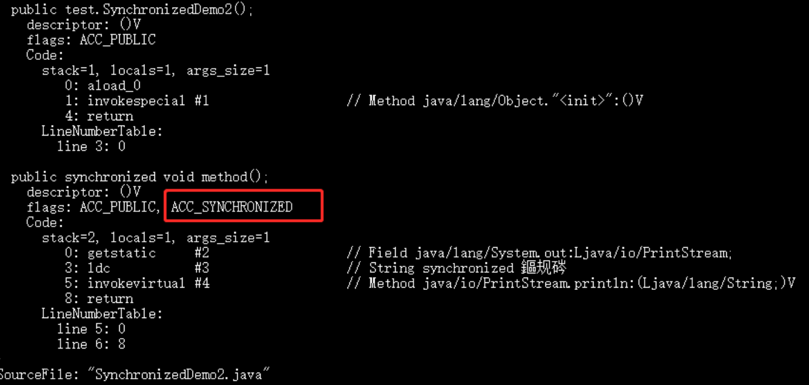

# synchronized关键字

## 1. 简介

synchronized关键字解决的是**多个线程之间访问资源的同步性**，synchronize关键字可以保证被它修饰的方法或者代码块在任意时刻只能有一个线程执行

### 1.1 synchronized 如何保证多线程之间访问资源的同步性

- 原子性
- 可见性
- 有序性

具体可参照[volatile关键字](./volatile关键字)

### 1.2  java早期synchronized效率为什么低

在 Java 早期版本中，synchronized属于重量级锁，效率低下，因为**监视器锁（monitor）是依赖于底层的操作系统的 互斥锁（Mutex Lock ）来实现的**，Java 的线程是映射到操作系统的原生线程之上的。如果要挂起或者唤醒一个线程，都需要操作系统帮忙完成，而操作系统实现线程之间的切换时需要从用户态转换到内核态，这个状态之间的转换需要**相对比较长的时间，时间成本相对较高**，这也是为什么早期的 synchronized 效率低的原因。

#### 1.2.1 Java 6之后效率提高原因

庆幸的是在 Java 6 之后 Java 官方对从 JVM 层面对synchronized 较大优化，所以现在的 synchronized 锁效率也优化得很不错了。**JDK1.6对锁的实现引入了大量的优化，如自旋锁、适应性自旋锁、锁消除、锁粗化、偏向锁、轻量级锁等技术来减少锁操作的开销。**

## 2. synchronized关键字最主要的三种使用方式

- **修饰实例方法:** 作用于当前对象实例加锁，进入同步代码前要获得当前对象实例的锁
- **修饰静态方法:** :也就是给当前类加锁，会作用于类的所有对象实例，因为静态成员不属于任何一个实例对象，是类成员（ static 表明这是该类的一个静态资源，不管new了多少个对象，只有一份）。所以如果一个线程A调用一个实例对象的非静态 synchronized 方法，而线程B需要调用这个实例对象所属类的静态 synchronized 方法，是允许的，不会发生互斥现象，**因为访问静态 synchronized 方法占用的锁是当前类的锁，而访问非静态 synchronized 方法占用的锁是当前实例对象锁**。
- **修饰代码块:** 指定加锁对象，对给定对象加锁，进入同步代码库前要获得给定对象的锁。

**总结：** synchronized 关键字加到 static 静态方法和 synchronized(class)代码块上都是是给 Class 类上锁。synchronized 关键字加到实例方法上是给对象实例上锁。尽量不要使用 synchronized(String a) 因为JVM中，字符串常量池具有缓存功能！

### 2.1 单例模式中双层校验锁

```
public class Singleton {

    private volatile static Singleton instance;

    private Singleton() {
    }

    public static Singleton getiInstance() {
       //先判断对象是否已经实例过，没有实例化过才进入加锁代码
        if (instance == null) {
            //类对象加锁
            synchronized (Singleton.class) {
                if (instance == null) {
                    instance = new Singleton();
                }
            }
        }
        return instance;
    }
}
```

另外，需要注意 instance 采用 volatile 关键字修饰也是很有必要。

instance = new Singleton(); **这段代码其实是分为三步执行**：

1. 为 instance 分配内存空间
2. 初始化 instance
3. 将 instance 指向分配的内存地址

但是由于 JVM 具有指令重排的特性，执行顺序有**可能变成 1->3->2**。指令重排在单线程环境下不会出先问题，但是在多线程环境下会导致一个线程获得还没有初始化的实例。例如，线程 T1 执行了 1 和 3，此时 T2 调用 getInstance() 后发现 instance 不为空，因此返回 instance，但此时 instance 还未被初始化。

**使用 volatile 可以禁止 JVM 的指令重排，保证在多线程环境下也能正常运行。**

## 3. synchronized 关键字的底层原理

**synchronized 关键字底层原理属于 JVM 层面。**

### 3.1 **synchronized 同步语句块的情况**

```
public class SynchronizedDemo {
	public void method() {
		synchronized (this) {
			System.out.println("synchronized 代码块");
		}
	}
}
```

通过 JDK 自带的 javap 命令查看 SynchronizedDemo 类的相关字节码信息：首先切换到类的对应目录执行 `javac SynchronizedDemo.java` 命令生成编译后的 .class 文件，然后执行`javap -c -s -v -l SynchronizedDemo.class`。


从上面我们可以看出：

**synchronized 同步语句块的实现使用的是 monitorenter 和 monitorexit 指令，其中 monitorenter 指令指向同步代码块的开始位置，monitorexit 指令则指明同步代码块的结束位置。** 当执行 monitorenter 指令时，线程试图获取锁也就是获取 monitor(monitor对象存在于每个Java对象的对象头中，synchronized 锁便是通过这种方式获取锁的，也是为什么Java中任意对象可以作为锁的原因) 的持有权。当计数器为0则可以成功获取，获取后将锁计数器设为1也就是加1。相应的在执行 monitorexit 指令后，将锁计数器设为0，表明锁被释放。如果获取对象锁失败，那当前线程就要阻塞等待，直到锁被另外一个线程释放为止。

### 3.2 **ynchronized 修饰方法的的情况**

```
public class SynchronizedDemo2 {
	public synchronized void method() {
		System.out.println("synchronized 方法");
	}
}
```



synchronized 修饰的方法并没有 monitorenter 指令和 monitorexit 指令，取得代之的确实是 ACC_SYNCHRONIZED 标识，该标识指明了该方法是一个同步方法，**JVM 通过该 ACC_SYNCHRONIZED 访问标志来辨别一个方法是否声明为同步方法**，从而执行相应的同步调用。

## 4. JDK1.6 之后的synchronized 关键字底层做了哪些优化

JDK1.6 对锁的实现引入了大量的优化，如偏向锁、轻量级锁、自旋锁、适应性自旋锁、锁消除、锁粗化等技术来减少锁操作的开销。

锁主要存在四种状态，依次是：无锁状态、偏向锁状态、轻量级锁状态、重量级锁状态，他们会随着竞争的激烈而逐渐升级。注意锁可以升级不可降级，这种策略是为了提高获得锁和释放锁的效率。

## 5. 谈谈 synchronized和ReentrantLock 的区别

**① 两者都是可重入锁**

两者都是可重入锁。“可重入锁”概念是：自己可以再次获取自己的内部锁。比如一个线程获得了某个对象的锁，此时这个对象锁还没有释放，当其再次想要获取这个对象的锁的时候还是可以获取的，如果不可锁重入的话，就会造成死锁。同一个线程每次获取锁，锁的计数器都自增1，所以要等到锁的计数器下降为0时才能释放锁。

**② synchronized 依赖于 JVM 而 ReentrantLock 依赖于 API**

synchronized 是依赖于 JVM 实现的，前面我们也讲到了 虚拟机团队在 JDK1.6 为 synchronized 关键字进行了很多优化，但是这些优化都是在虚拟机层面实现的，并没有直接暴露给我们。ReentrantLock 是 JDK 层面实现的（也就是 API 层面，需要 lock() 和 unlock() 方法配合 try/finally 语句块来完成），所以我们可以通过查看它的源代码，来看它是如何实现的。

**③ ReentrantLock 比 synchronized 增加了一些高级功能**

相比synchronized，ReentrantLock增加了一些高级功能。主要来说主要有三点：**①等待可中断；②可实现公平锁；③可实现选择性通知（锁可以绑定多个条件）**

- **ReentrantLock提供了一种能够中断等待锁的线程的机制**，通过lock.lockInterruptibly()来实现这个机制。也就是说正在等待的线程可以选择放弃等待，改为处理其他事情。
- **ReentrantLock可以指定是公平锁还是非公平锁。而synchronized只能是非公平锁。所谓的公平锁就是先等待的线程先获得锁。** ReentrantLock默认情况是非公平的，可以通过 ReentrantLock类的`ReentrantLock(boolean fair)`构造方法来制定是否是公平的。
- synchronized关键字与wait()和notify()/notifyAll()方法相结合可以实现等待/通知机制，ReentrantLock类当然也可以实现，但是需要借助于Condition接口与newCondition() 方法。Condition是JDK1.5之后才有的，它具有很好的灵活性，比如可以实现多路通知功能也就是在一个Lock对象中可以创建多个Condition实例（即对象监视器），**线程对象可以注册在指定的Condition中，从而可以有选择性的进行线程通知，在调度线程上更加灵活。 在使用notify()/notifyAll()方法进行通知时，被通知的线程是由 JVM 选择的，用ReentrantLock类结合Condition实例可以实现“选择性通知”** ，这个功能非常重要，而且是Condition接口默认提供的。而synchronized关键字就相当于整个Lock对象中只有一个Condition实例，所有的线程都注册在它一个身上。如果执行notifyAll()方法的话就会通知所有处于等待状态的线程这样会造成很大的效率问题，而Condition实例的signalAll()方法 只会唤醒注册在该Condition实例中的所有等待线程。

如果你想使用上述功能，那么选择ReentrantLock是一个不错的选择。

**④ 性能已不是选择标准**