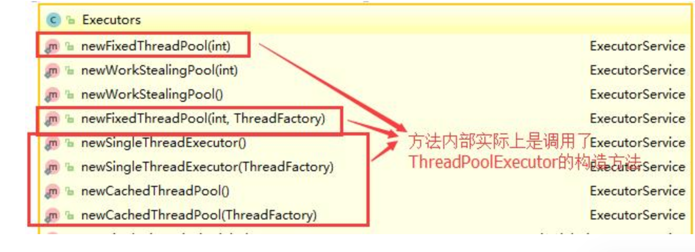

# 线程池

## 1. 为什么要使用线程池

- **降低资源消耗**：通过重复利用已创建的线程降低线程创建和销毁造成的消耗。
- **提高响应速度**：当任务到达时，任务可以不需要的等到线程创建就能立即执行。
- **提高线程的可管理行性**：线程是稀缺资源，如果无限制的创建，不仅会消耗系统资源，还会降低系统的稳定性，使用线程池可以进行统一的分配，调优和监控。

##  2. 实现Runnable接口和Callable接口的区别

两者的区别在于 Runnable 接口不会返回结果但是 Callable 接口可以返回结果。

>**备注：** 工具类`Executors`可以实现`Runnable`对象和`Callable`对象之间的相互转换。（`Executors.callable（Runnable task）`或`Executors.callable（Runnable task，Object resule）`）

## 3. 执行execute()方法和submit()方法的区别是什么呢？

1)**execute() 方法用于提交不需要返回值的任务，所以无法判断任务是否被线程池执行成功与否；**

2)**submit() 方法用于提交需要返回值的任务。线程池会返回一个Future类型的对象，通过这个Future对象可以判断任务是否执行成功**，并且可以通过future的get()方法来获取返回值，get()方法会阻塞当前线程直到任务完成，而使用 `get（long timeout，TimeUnit unit）`方法则会阻塞当前线程一段时间后立即返回，这时候有可能任务没有执行完。

## 4. 如何创建线程池

《阿里巴巴Java开发手册》中强制线程池不允许使用 Executors 去创建，而是通过 ThreadPoolExecutor 的方式，这样的处理方式让写的同学更加明确线程池的运行规则，规避资源耗尽的风险

> Executors 返回线程池对象的弊端如下：
>
> - **FixedThreadPool 和 SingleThreadExecutor** ： 允许**请求的队列**长度为 Integer.MAX_VALUE ，可能堆积大量的请求，从而导致OOM。
>   - 请求队列（LinkedBlockingQueue）不是指默认是 Integer.MAX_VALUE
> - **CachedThreadPool 和 ScheduledThreadPool** ： 允许创建的线程数量为 Integer.MAX_VALUE ，可能会创建大量线程，从而导致OOM。
>   - 他们默认最大线程都是MAX

**方式一：通过构造方法实现** 

**方式二：通过Executor 框架的工具类Executors来实现** 我们可以创建三种类型的ThreadPoolExecutor：

- **FixedThreadPool** ： 该方法返回一个固定线程数量的线程池。该线程池中的线程数量始终不变。当有一个新的任务提交时，线程池中若有空闲线程，则立即执行。若没有，则新的任务会被暂存在一个任务队列中，待有线程空闲时，便处理在任务队列中的任务。
- **SingleThreadExecutor：** 方法返回一个只有一个线程的线程池。若多余一个任务被提交到该线程池，任务会被保存在一个任务队列中，待线程空闲，按先入先出的顺序执行队列中的任务。
- **CachedThreadPool：** 该方法返回一个可根据实际情况调整线程数量的线程池。线程池的线程数量不确定，但若有空闲线程可以复用，则会优先使用可复用的线程。若所有线程均在工作，又有新的任务提交，则会创建新的线程处理任务。所有线程在当前任务执行完毕后，将返回线程池进行复用。

对应Executors工具类中的方法如图所示：

## 