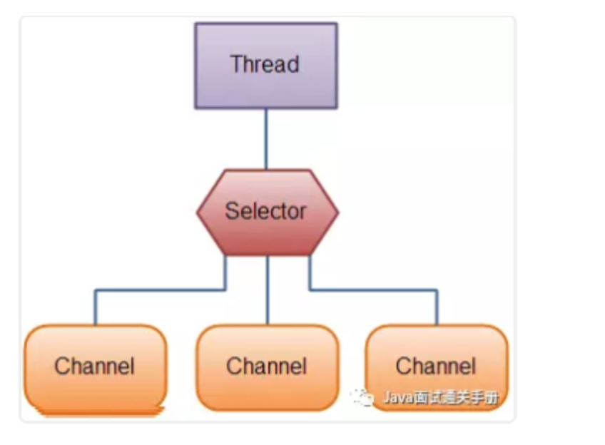

# IO总结

## 1. 相关概念介绍

## 1.1 同步与异步

- **同步**：同步就是发起一个调用后，被调用者未处理完请求之前，调用不返回
- **异步**：异步就是发起一个调用后，立刻得到调用者的回应表示已接收到请求，但是被调用者并没有放回结果，此时我们可以处理其他请求，被调用者通常依靠事件，回调等机制来通知调用者返回结果

同步和异步的最大区别在于：**调用者不需要等待处理结果**，被调用者会**通过回调等机制**来通知调用者其返回结果

### 1.2 阻塞和非阻塞

- 阻塞：阻塞就是发起一个请求，调用者一直等待请求结果返回，也就是当前线程会被挂起，无法从事其他任务，只有当条件就绪才能继续
- 非阻塞：非阻塞就是发起一个请求，调用者不用一直等着结果返回，可以先去干其他时间

举个生活中简单的例子，你妈妈让你烧水，小时候你比较笨啊，在那里傻等着水开（**同步阻塞**）。等你稍微再长大一点，你知道每次烧水的空隙可以去干点其他事，然后只需要时不时来看看水开了没有（**同步非阻塞**）。后来，你们家用上了水开了会发出声音的壶，这样你就只需要听到响声后就知道水开了，在这期间你可以随便干自己的事情，你需要去倒水了（**异步非阻塞**）。

## 2. BIO(Blocking I/O)

同步阻塞I/O模式，数据的读取写入必须阻塞在一个线程内等待其完成

### 2.1 传统BIO

BIO 通信（一请求一应答）模型如下

>采用 **BIO 通信模型** 的服务端，通常由一个独立的 Acceptor 线程负责监听客户端的连接。我们一般通过在`while(true)` 循环中服务端会调用 `accept()` 方法等待接收客户端的连接的方式监听请求，请求一旦接收到一个连接请求，就可以建立通信套接字在这个通信套接字上进行读写操作，此时不能再接收其他客户端连接请求，只能等待同当前连接的客户端的操作执行完成， 不过可以通过多线程来支持多个客户端的连接，如上图所示。
>
>如果要让 **BIO 通信模型** 能够同时处理多个客户端请求，就必须使用多线程（主要原因是`socket.accept()`、`socket.read()`、`socket.write()` 涉及的三个主要函数都是同步阻塞的），也就是说它在接收到客户端连接请求之后为每个客户端创建一个新的线程进行链路处理，处理完成之后，通过输出流返回应答给客户端，线程销毁。这就是典型的 **一请求一应答通信模型** 。我们可以设想一下如果这个连接不做任何事情的话就会造成不必要的线程开销，不过可以通过 **线程池机制** 改善，线程池还可以让线程的创建和回收成本相对较低。使用`FixedThreadPool` 可以有效的控制了线程的最大数量，保证了系统有限的资源的控制，实现了N(客户端请求数量):M(处理客户端请求的线程数量)的伪异步I/O模型（N 可以远远大于 M），下面一节"伪异步 BIO"中会详细介绍到。
>
>**我们再设想一下当客户端并发访问量增加后这种模型会出现什么问题？**
>
>在 Java 虚拟机中，线程是宝贵的资源，线程的创建和销毁成本很高，除此之外，线程的切换成本也是很高的。尤其在 Linux 这样的操作系统中，线程本质上就是一个进程，创建和销毁线程都是重量级的系统函数。如果并发访问量增加会导致线程数急剧膨胀可能会导致线程堆栈溢出、创建新线程失败等问题，最终导致进程宕机或者僵死，不能对外提供服务。

## 2.2 伪异步IO

为了解决同步阻塞I/O 面临的一个链路需要一个线程处理的问题，后来有人对他的线程模型进行了优化——后端通过一个**线程池**来处理多个客户端请求接入，形成客户端个数,线程池最大线程N的比例关系，其中M 可以远远大于N，通过线程池可以灵活的调配线程资源，设置线程的最大值，防止由于海量并发接入导致线程耗尽

### 2.3 BIO 总结

- 当活动连接数小于1000：

  可以让每一个连接专注自己的I/O 并且模型简单，也不用过多考虑系统过载，限流等问题，

  线程池本身就是一个天然漏斗，可以缓冲一些系统处理不了的连接或请求

- 面对十万甚至百万连接的时候：

  传统BIO模型是无能为力的

## 3. NIO(New IO)

### 3.1 NIO简介

NIO 是一种同步非阻塞的I/O模型，在Java1.4 中引入了NIO 框架，对应java.nio 包，提供了Channel，Selector，Buffer 等抽象

> NIO中的N可以理解为Non-blocking，不单纯是New。它支持面向缓冲的，基于通道的I/O操作方法。 NIO提供了与传统BIO模型中的 `Socket` 和 `ServerSocket` 相对应的 `SocketChannel` 和 `ServerSocketChannel` 两种不同的套接字通道实现,两种通道都支持阻塞和非阻塞两种模式。阻塞模式使用就像传统中的支持一样，比较简单，但是性能和可靠性都不好；非阻塞模式正好与之相反。对于低负载、低并发的应用程序，可以使用同步阻塞I/O来提升开发速率和更好的维护性；对于高负载、高并发的（网络）应用，应使用 NIO 的非阻塞模式来开发。

### 3.2 NIO的特性/NIO与IO区别

面试思路: 

- 首先从NIO流是非阻塞IO,而IO流是阻塞式IO说起
- 然后说NIO的3个核心组件/特性为NIO 带来一些改进来分析

1. Non-blocking IO (非阻塞IO)

   **IO流是阻塞的，NIO流是不阻塞的。**

   >Java NIO使我们可以进行非阻塞IO操作。比如说，单线程中从通道读取数据到buffer，同时可以继续做别的事情，当数据读取到buffer中后，线程再继续处理数据。写数据也是一样的。另外，非阻塞写也是如此。一个线程请求写入一些数据到某通道，但不需要等待它完全写入，这个线程同时可以去做别的事情。
   >
   >Java IO的各种流是阻塞的。这意味着，当一个线程调用 `read()` 或 `write()` 时，该线程被阻塞，直到有一些数据被读取，或数据完全写入。该线程在此期间不能再干任何事情了

2. Buffer (缓冲区)

   **IO 面向流（Stream oriented）,而NIO 面向缓冲区（Buffer oriented）**

   >Buffer是一个对象，它包含一些要写入或者要读出的数据。在NIO类库中加入Buffer对象，体现了新库与原I/O的一个重要区别。在面向流的I/O中·可以将数据直接写入或者将数据直接读到 Stream 对象中。虽然 Stream 中也有 Buffer 开头的扩展类，但只是流的包装类，还是从流读到缓冲区，而 NIO 却是直接读到 Buffer 中进行操作。
   >
   >在NIO厍中，所有数据都是用缓冲区处理的。在读取数据时，它是直接读到缓冲区中的; 在写入数据时，写入到缓冲区中。任何时候访问NIO中的数据，都是通过缓冲区进行操作。
   >
   >最常用的缓冲区是 ByteBuffer,一个 ByteBuffer 提供了一组功能用于操作 byte 数组。除了ByteBuffer,还有其他的一些缓冲区，事实上，每一种Java基本类型（除了Boolean类型）都对应有一种缓冲区。

3. Channel(通道)

   NIO 通过Channel （通道）进行读写

   通道是双向的，可读也可写，而流的读写是单向的。无论读写，通道只能和Buffer交互。因为 Buffer，通道可以异步地读写。

4. Selector （选择器）

   NIO 有选择器，而IO 没有

   选择器用于使用单个线程处理多个通道，因此，他需要较少的线程来处理这些通过，线程之间的切换对于操作系统来说是昂贵的。因此，为了提高系统效率选择器是有用的



## 3.3 NIO 读数据和写数据方式

通常来说NIO 中所有IO 都是从 Channel（通道）开始的

- 从通道进行数据读取：创建一个缓冲区，然后请求通道读取数据
- 从通道进行数据写入：创建一个缓冲区，填充数据，并要求通道写入数据

数据读取和写入操作图示：


### 3.4 NIO 核心组件简单介绍

- Channel（通道）
- Buffer（缓冲区）
- Selector (选择器)

## 3.5 代码示例

客户端 IOClient.java 的代码不变，我们对服务端使用 NIO 进行改造。以下代码较多而且逻辑比较复杂，大家看看就好。

```java
/**
 * 
 * @author 闪电侠
 * @date 2019年2月21日
 * @Description: NIO 改造后的服务端
 */
public class NIOServer {
  public static void main(String[] args) throws IOException {
    // 1. serverSelector负责轮询是否有新的连接，服务端监测到新的连接之后，不再创建一个新的线程，
    // 而是直接将新连接绑定到clientSelector上，这样就不用 IO 模型中 1w 个 while 循环在死等
    Selector serverSelector = Selector.open();
    // 2. clientSelector负责轮询连接是否有数据可读
    Selector clientSelector = Selector.open();

    new Thread(() -> {
      try {
        // 对应IO编程中服务端启动
        ServerSocketChannel listenerChannel = ServerSocketChannel.open();
        listenerChannel.socket().bind(new InetSocketAddress(3333));
        listenerChannel.configureBlocking(false);
        listenerChannel.register(serverSelector, SelectionKey.OP_ACCEPT);

        while (true) {
          // 监测是否有新的连接，这里的1指的是阻塞的时间为 1ms
          if (serverSelector.select(1) > 0) {
            Set<SelectionKey> set = serverSelector.selectedKeys();
            Iterator<SelectionKey> keyIterator = set.iterator();

            while (keyIterator.hasNext()) {
              SelectionKey key = keyIterator.next();

              if (key.isAcceptable()) {
                try {
                  // (1) 每来一个新连接，不需要创建一个线程，而是直接注册到clientSelector
                  SocketChannel clientChannel = ((ServerSocketChannel) key.channel()).accept();
                  clientChannel.configureBlocking(false);
                  clientChannel.register(clientSelector, SelectionKey.OP_READ);
                } finally {
                  keyIterator.remove();
                }
              }

            }
          }
        }
      } catch (IOException ignored) {
      }
    }).start();
    new Thread(() -> {
      try {
        while (true) {
          // (2) 批量轮询是否有哪些连接有数据可读，这里的1指的是阻塞的时间为 1ms
          if (clientSelector.select(1) > 0) {
            Set<SelectionKey> set = clientSelector.selectedKeys();
            Iterator<SelectionKey> keyIterator = set.iterator();

            while (keyIterator.hasNext()) {
              SelectionKey key = keyIterator.next();

              if (key.isReadable()) {
                try {
                  SocketChannel clientChannel = (SocketChannel) key.channel();
                  ByteBuffer byteBuffer = ByteBuffer.allocate(1024);
                  // (3) 面向 Buffer
                  clientChannel.read(byteBuffer);
                  byteBuffer.flip();
                  System.out.println(
                      Charset.defaultCharset().newDecoder().decode(byteBuffer).toString());
                } finally {
                  keyIterator.remove();
                  key.interestOps(SelectionKey.OP_READ);
                }
              }

            }
          }
        }
      } catch (IOException ignored) {
      }
    }).start();

  }
}
```

### 3.6 为什么不愿意用 JDK 原生 NIO 进行开发？

从上面代码可以看出，除了编程复杂、编程模型难之外

- JDK 的 NIO 底层由 epoll 实现，该实现饱受诟病的空轮询 bug 会导致cpu飙升100%
- 项目庞大之后，自行实现的NIO 很容器出现各类bug，维护成本较高

Netty 的出现很大程度上改善了 JDK 原生 NIO 所存在的一些让人难以忍受的问题。

## 4. AIO (Asynchronous I/O)

AIO 也就是NIO2。在java7 中引入了NIO的改进版NIO2。他是异常非阻塞的IO模型。异步IO 是基于事件和回调机制实现的，也就是应用操作之间会直接返回。不会阻塞在哪里，当后台处理完成，操作系统会通知响应的线程进行后续操作


## 参考文章

[真正理解NIO](<https://www.jianshu.com/p/362b365e1bcc>)