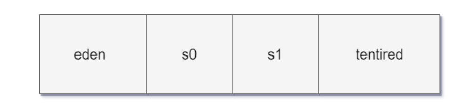
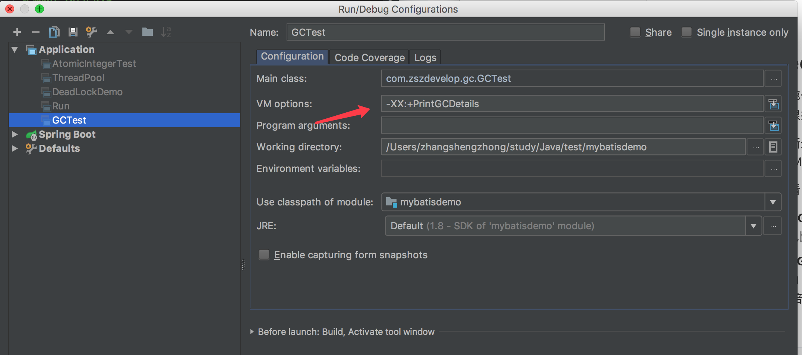

#  JVM 内存分配与回收

## 1. JVM 内存分配与回收

Java 的自动内存管理主要是针对象内存的回收和对象的内存的分配。同时，java 自动内存管理最核心的功能是 **堆**内存中的对象分配与回收

Java 堆是垃圾收集器管理的主要区域，因此也被称作**GC 堆（Garbage Collected Heap）**.从垃圾回收的角度，由于现在收集器基本都采用分代垃圾收集算法，所以 Java 堆还可以细分为：新生代和老年代：再细致一点有：Eden 空间、From Survivor、To Survivor 空间等。**进一步划分的目的是更好地回收内存，或者更快地分配内存。**

**堆空间的基本结构：**



上图所示的 eden区，s0("From") 区、s1("To") 区都属于新生代，tentired 区属于老年代。大部分情况，

- 对象都会首先在 Eden 区域分配

- 在一次新生代垃圾回收后，如果对象还存活，则会进入 s1("To")，并且对象的年龄还会加 1(Eden 区->Survivor 区后对象的初始年龄变为 1)

- 当它的年龄增加到一定程度（默认为 15 岁），就会被晋升到老年代中

  对象晋升到老年代的年龄阈值，可以通过参数 `-XX:MaxTenuringThreshold` 来设置

- 经过这次GC后，Eden区和"From"区已经被清空。这个时候，"From"和"To"会交换他们的角色，也就是新的"To"就是上次GC前的“From”，新的"From"就是上次GC前的"To"。不管怎样，都会**保证名为To的Survivor区域是空的**

- Minor GC会一直重复这样的过程，直到“To”区被填满，"To"区被填满之后，会将所有对象移动到年老代中。


### 1.1 对象优先在eden 区分配

目前主流的垃圾收集器都会采用分代回收算法，因此需要将堆内存分为新生代和老年代，这样我们就可以根据各个年代的特点选择合适的垃圾收集算法。

大多数情况下，对象在新生代中 eden 区分配。当 eden 区没有足够空间进行分配时，虚拟机将发起一次 Minor GC.下面我们来进行实际测试以下。

在测试之前我们先来看看 **Minor GC 和 Full GC 有什么不同呢？**

- **新生代 GC（Minor GC）**:指发生新生代的的垃圾收集动作，Minor GC 非常频繁，回收速度一般也比较快。
- **老年代 GC（Major GC/Full GC）**:指发生在老年代的 GC，出现了 Major GC 经常会伴随至少一次的 Minor GC（并非绝对），Major GC 的速度一般会比 Minor GC 的慢 10 倍以上。

**测试**

```
public class GCTest {

    public static void main(String[] args) {
        byte[] allocation1, allocation2;
        allocation1 = new byte[30900*1024];
        //allocation2 = new byte[900*1024];
    }
}
```

添加的参数：`-XX:+PrintGCDetails`



运行结果（JDK 1.8）


从上图我们可以看出 eden 区内存几乎已经被分配完全（即使程序什么也不做，新生代也会使用 2000 多 k 内存）。假如我们再为 allocation2 分配内存会出现什么情况呢？

```
allocation2 = new byte[900*1024];
```


**简单解释一下为什么会出现这种情况：** 因为给 allocation2 分配内存的时候 eden 区内存几乎已经被分配完了，我们刚刚讲了当 Eden 区没有足够空间进行分配时，虚拟机将发起一次 Minor GC.GC 期间虚拟机又发现 allocation1 无法存入 Survivor 空间，所以只好通过 **分配担保机制** 把新生代的对象提前转移到老年代中去，老年代上的空间足够存放 allocation1，所以不会出现 Full GC。执行 Minor GC 后，后面分配的对象如果能够存在 eden 区的话，还是会在 eden 区分配内存。可以执行如下代码验证：

```
public class GCTest {

	public static void main(String[] args) {
		byte[] allocation1, allocation2,allocation3,allocation4,allocation5;
		allocation1 = new byte[32000*1024];
		allocation2 = new byte[1000*1024];
		allocation3 = new byte[1000*1024];
		allocation4 = new byte[1000*1024];
		allocation5 = new byte[1000*1024];
	}
}
```

### 1.2 大对象直接进入老年代

大对象就是需要大量连续内存空间的对象（比如：字符串、数组）。

**为什么需要这样呢？**

为了避免为大对象分配内存时由于分配担保机制带来的复制而降低效率

### 1.3 长期存活的对象将进入老年代

既然虚拟机采用了分代收集的思想来管理内存，那么内存回收时就必须能识别哪些对象应放在新生代，哪些对象应放在老年代中。为了做到这一点，虚拟机给每个对象一个对象年龄（Age）计数器。

- 如果对象在 Eden 出生并经过第一次 Minor GC 后仍然能够存活，并且能被Survivor容纳的话，将被移动到Survivor空间中，并将对象年龄设为1。

- 对象在Survivor中没经过一次MinorGC 年龄就增加1岁

- 当它的年龄增加到一定程度（默认为15岁），就会被晋升到老年代中

  对象晋升到老年代的年龄阈值，可以通过参数 `-XX:MaxTenuringThreshold` 来设置。

### 1.4 动态对象年龄判定

为了更好的适应不同程序的内存情况，虚拟机不是永远要求对象年龄必须达到了某个值才能进入老年代，如果 Survivor 空间中相同年龄所有对象大小的总和大于 Survivor 空间的一半，年龄大于或等于该年龄的对象就可以直接进入老年代，无需达到要求的年龄。