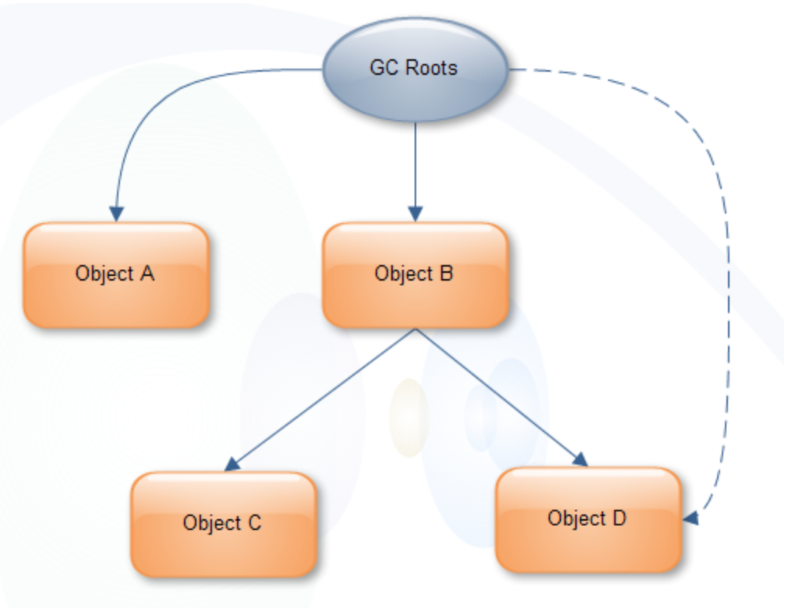

# Shallow heap和Retained heap

所有包含Heap Proflin 功能的工具（MAT，TPTP等）都会使用到两个名词，一个是Shallow Size，另一个是Retained Size

## 1 概念

### 1.1 Shallow Size

**对象自身占用的内存大小，不包括他引用的对象**

针对非数组类型的对象，它的大小就是对象与他所有的成员变量大小的总和。当然这里面还会包括一些java语言特性的数据存储单元。
针对数组类型的对象，它的大小是数组元素对象的大小总和。

### 1.2 Retained Size

Retained Size= **当前对象大小+当前对象可直接或间接引用到的对象的大小总和**(间接引用的含义：A->B->C, C就是间接引用)

换句话说，Retained Size 就是当前对象被GC后，从Heap 上总共能释放掉的内存，从Heap 上总共能释放掉的内存

不过，释放的时候还要排除被GC Roots直接或间接引用的对象。他们暂时不会被被当做Garbage。

## 2. 看图理解Retained Size

上图中，GC Roots直接引用了A和B 两个对象

- A对象的Retained Size = A对象Shallow Size

- B对象的Reatined Size = B 对象的Shallow Size + C对象的Shallow Size

  ps:这里不包含D对象，因为D对象被GCroot直接引用了

### 如果GC Roots不引用D对象？

此时，B对象的Retained Size=B对象的Shallow Size + C对象的Shallow Size + D对象的Shallow Size

## 参考文章

[Shallow heap & Retained heap](https://www.iteye.com/blog/bjyzxxds-1532937)