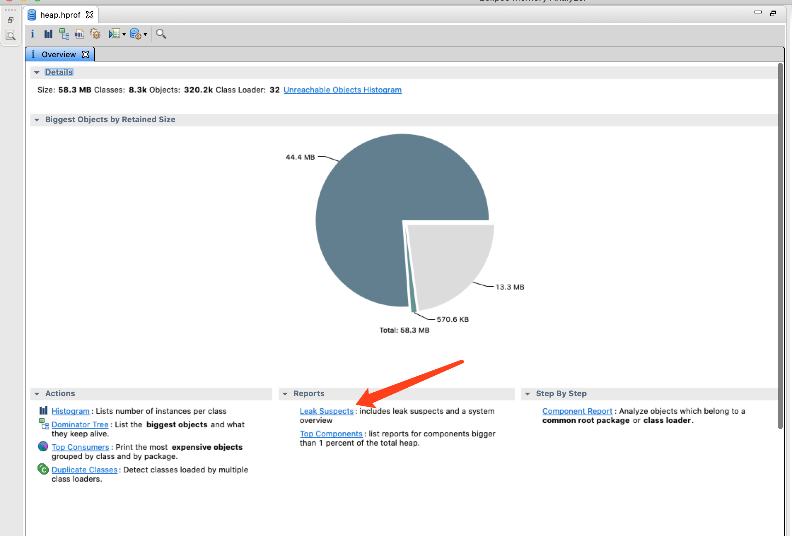
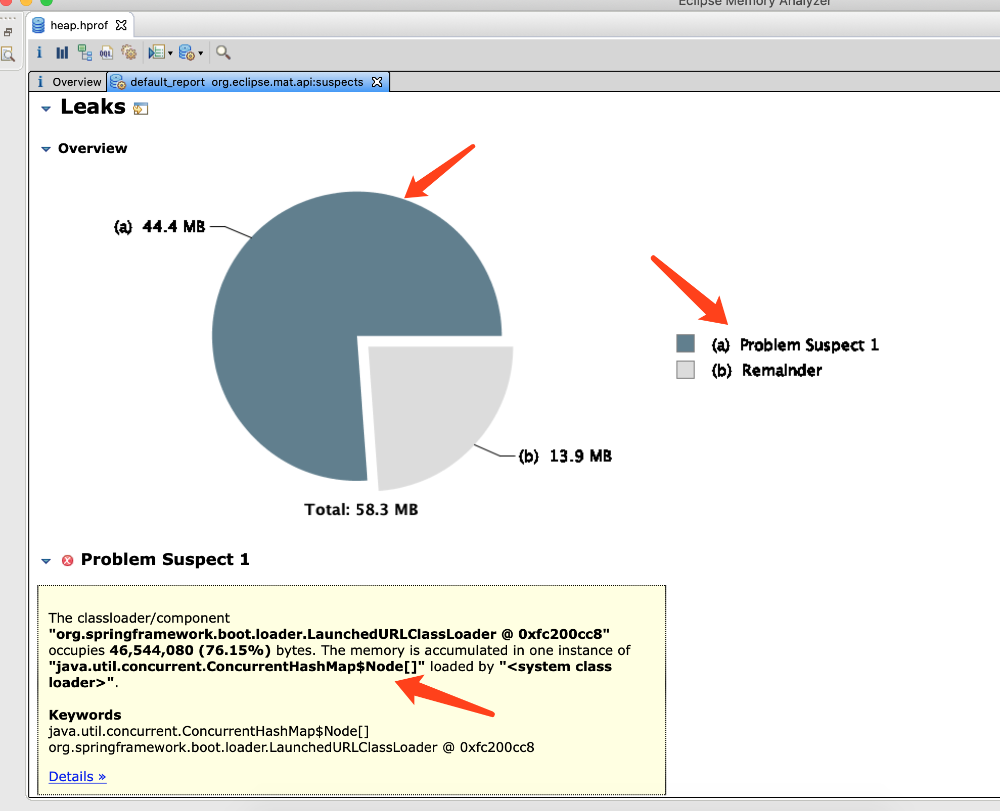
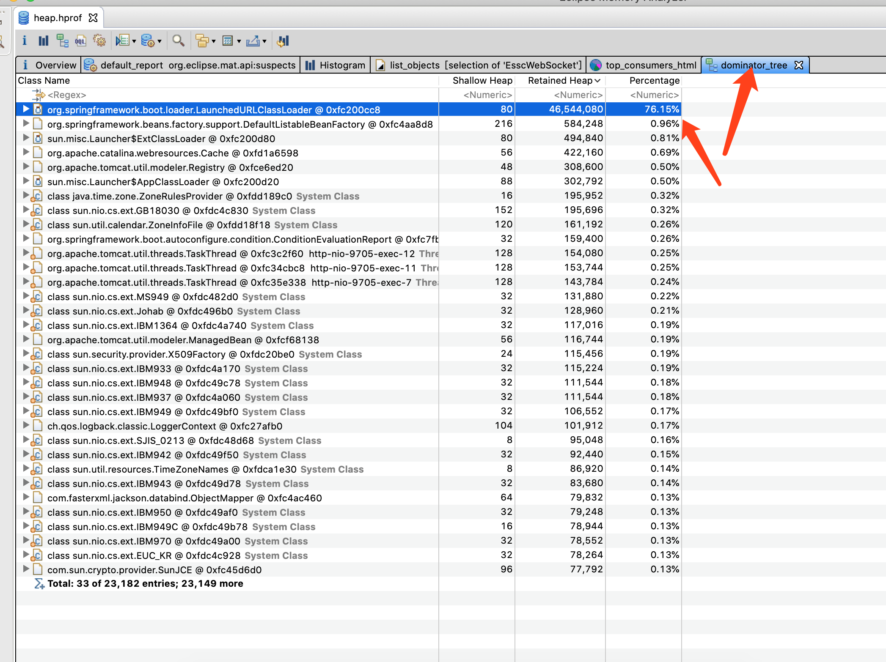
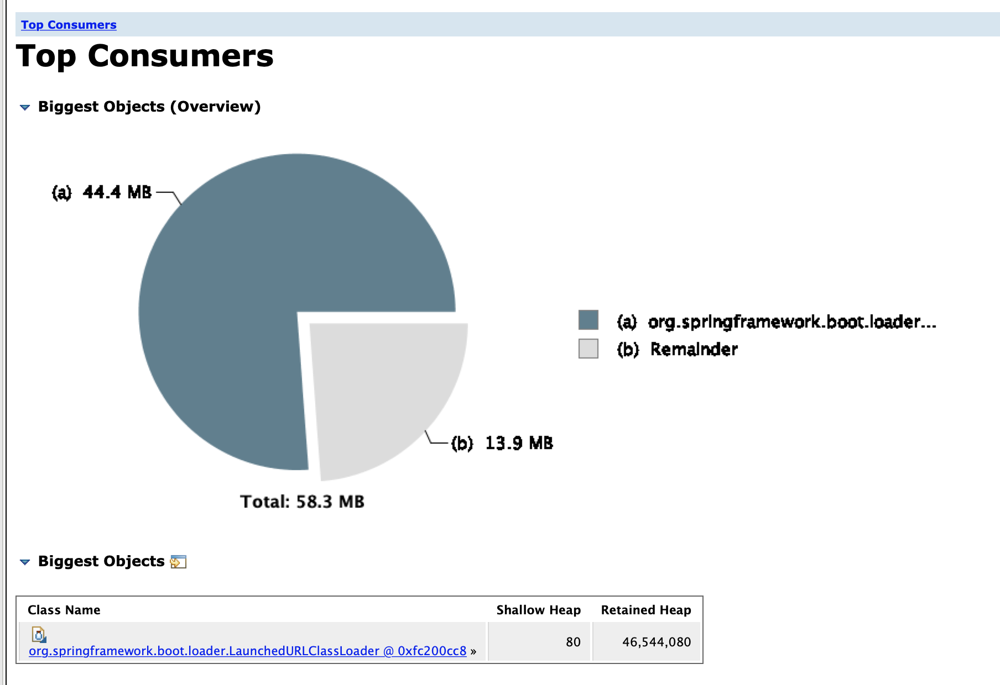

# 记一次MAT分析线上项目过程

## 1. 背景

前段时间接手了一个项目，正常运行都没有问题。但是**运行个几天就会OOM异常**，导致服务不可用。我们首先第一个想到的就是该项目内存泄漏导致，但是项目本身已经比较庞大，要找到一个内存泄漏的点，还是比较难得。

所以我们使用MAT来分析线上项目的运行情况

## 2. `jmap`:生成堆转储快照

```
jmap -dump:format=b,file=./heap.hprof 19012
Dumping heap to /home/ftpuser/services/mywebsocket/heap.hprof ...
Heap dump file created
```

19012 是进程号

我们将heap.hprof 导出到我们本地，使用MAT来分析

## 3. MAT分析

### 3.1 查看内存泄漏疑点报告

这是最简单有效的方式，我们根据报告的提示来进行分析



我们点开报告得到



我们根据报告得知，有个对象已经占用了44.4 MB的内存，他来源于**ConcurrentHashMap$Node[]**

### 3.2 查看Histogram

通过查看**Histogram**，列出内存中的对象情况（个数，大小）


- **Class Name** ： 类名称，java类名
- **Objects **： 类的对象的数量，这个对象被创建了多少个
- **Shallow Heap ：一个对象内存的消耗大小，不包含对其他对象的引用**

- **Retained Heap ：是shallow Heap的总和，也就是该对象被GC之后所能回收到内存的总和**

#### 3.2.1 通过正则查找自己的类

这儿借助工具提供的regex正则搜索一下我们自己的类，排序后看看哪些相对是占用比较大的。


我们可以看出内存泄漏是有EsscWebSocket开始的

### 3.3 查看Dominator Tree



### 3.4 Top consumers



**这张图展示的是占用内存比较多的****对象的分布，下面是具体的一些类和占用。**


## 参考文章

[Java程序内存分析：使用mat工具分析内存占用](https://www.cnblogs.com/AloneSword/p/3821569.html)

