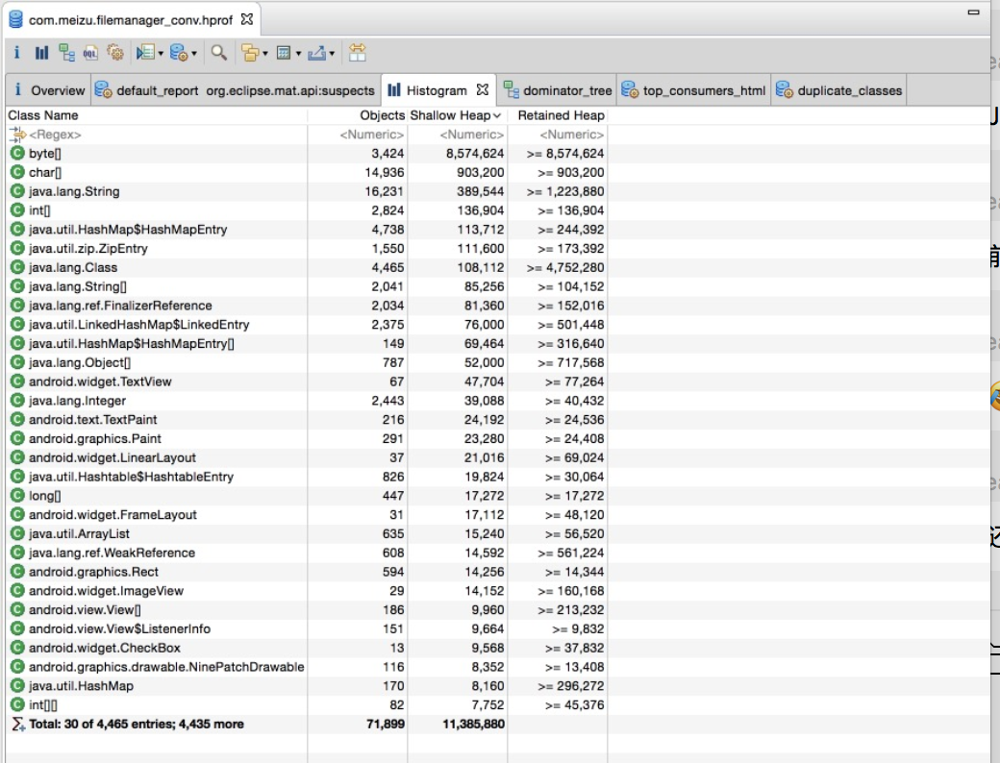
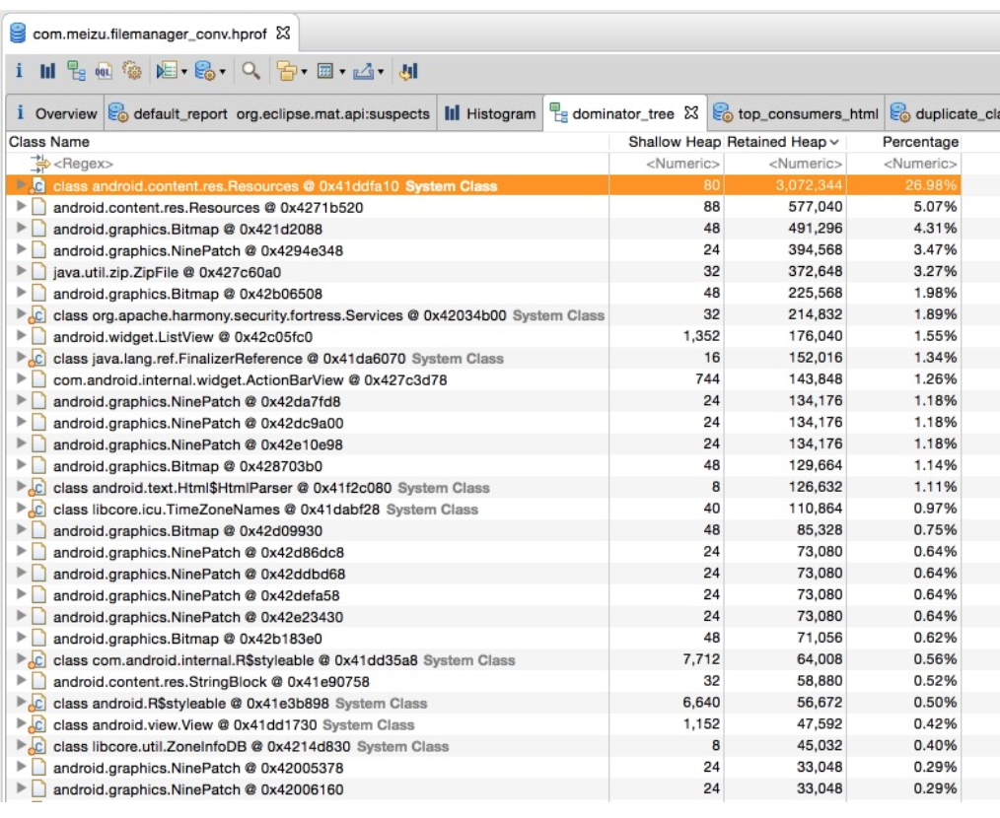
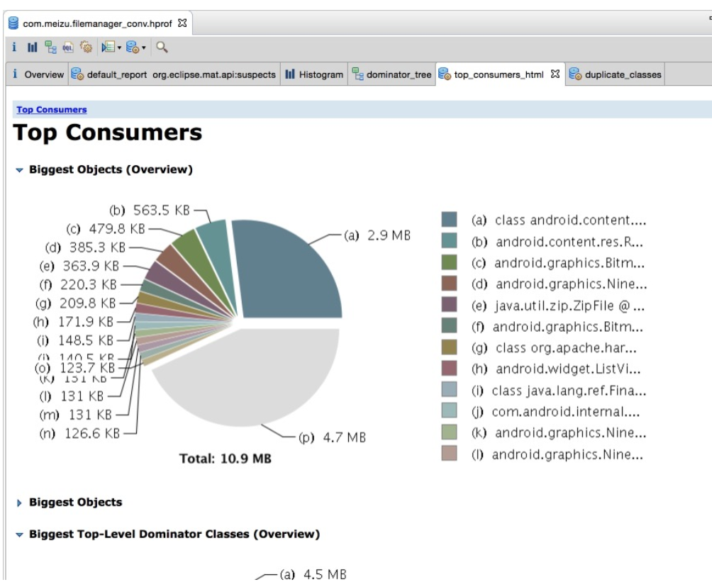

# MAT使用

## 1 MAT主界面介绍

### 1.1 导入hprof文件

导入文件之后，显示OverView界面

如果选择了第一个，则会生成一个报告

## 1.2 OverView 界面

需要关注的是下面的Actions区域

- Histogram: 列出内存中的对象，对象的个人以及大小

  

- Dominator Tree: 列出最大的对象以及其依赖存活的Object（大小以Retained Heap为标准的排序）

  

- Top Consumers: 通过图形列出最大的Object

  

  一般Histogram和 Dominator Tree是最常用的。

## 2. MAT 中一些概念

要看懂MAT的列表信息，Shallow heap、Retained Heap、GC Root这几个概念一定要弄懂。

### 2.1 Shallow heap

Shallow size 就是对象本身占用内存的大小，不包含其引用的对象

- 常规对象（非数组）的Shallow size有其成员变量的数量和类型决定
- 数组的shallow size 有数组元素的类型（对象类型，基本类型）和数组长度决定

因为不像c++的对象本身可以存放大量内存，java的对象成员都是些引用。真正的内存都在堆上，看起来是一堆原生的byte[], char[], int[]，所以我们如果只看对象本身的内存，那么数量都很小。所以我们看到Histogram图是以Shallow size进行排序的，排在第一位第二位的是byte，char 。

### 2.2 Retained Heap

Retained Heap的概念，它表示如果一个对象被释放掉，那会因为该对象的释放而减少引用进而被释放的所有的对象（包括被递归释放的）所占用的heap大小。于是，如果一个对象的某个成员new了一大块int数组，那这个int数组也可以计算到这个对象中。相对于shallow heap，Retained heap可以更精确的反映一个对象实际占用的大小（因为如果该对象释放，retained heap都可以被释放）。

这里要说一下的是，Retained Heap并不总是那么有效。例如我在A里new了一块内存，赋值给A的一个成员变量。此时我让B也指向这块内存。此时，因为A和B都引用到这块内存，所以A释放时，该内存不会被释放。所以这块内存不会被计算到A或者B的Retained Heap中。为了纠正这点，MAT中的Leading Object（例如A或者B）不一定只是一个对象，也可以是多个对象。此时，(A, B)这个组合的Retained Set就包含那块大内存了。对应到MAT的UI中，在Histogram中，可以选择Group By class, superclass or package来选择这个组。

为了计算Retained Memory，MAT引入了Dominator Tree。加入对象A引用B和C，B和C又都引用到D（一个菱形）。此时要计算Retained Memory，A的包括A本身和B，C，D。B和C因为共同引用D，所以他俩的Retained Memory都只是他们本身。D当然也只是自己。我觉得是为了加快计算的速度，MAT改变了对象引用图，而转换成一个对象引用树。在这里例子中，树根是A，而B，C，D是他的三个儿子。B，C，D不再有相互关系。把引用图变成引用树，计算Retained Heap就会非常方便，显示也非常方便。对应到MAT UI上，在dominator tree这个view中，显示了每个对象的shallow heap和retained heap。然后可以以该节点位树根，一步步的细化看看retained heap到底是用在什么地方了。要说一下的是，这种从图到树的转换确实方便了内存分析，但有时候会让人有些疑惑。本来对象B是对象A的一个成员，但因为B还被C引用，所以B在树中并不在A下面，而很可能是平级。

为了纠正这点，MAT中点击右键，可以List objects中选择with outgoing references和with incoming references。这是个真正的引用图的概念，

- outgoing references ：表示该对象的出节点（被该对象引用的对象）。
- incoming references ：表示该对象的入节点（引用到该对象的对象）。

为了更好地理解Retained Heap，下面引用一个例子来说明：

把内存中的对象看成下图中的节点，并且对象和对象之间互相引用。这里有一个特殊的节点GC Roots，这就是reference chain(引用链)的起点:

### 2.3 GC Root

GC发现通过任何reference chain(引用链)无法访问某个对象的时候，该对象即被回收。名词GC Roots正是分析这一过程的起点，例如JVM自己确保了对象的可到达性(那么JVM就是GC Roots)，所以GC Roots就是这样在内存中保持对象可到达性的，一旦不可到达，即被回收。通常GC Roots是一个在current thread(当前线程)的call stack(调用栈)上的对象（例如方法参数和局部变量），或者是线程自身或者是system class loader(系统类加载器)加载的类以及native code(本地代码)保留的活动对象。所以GC Roots是分析对象为何还存活于内存中的利器。

## 3. MAT 中一些有用的视图

### 3.1 Thread OvewView

Thread OvewView可以查看这个应用的Thread信息：

### 3.2 Group

在Histogram和Domiantor Tree界面，可以选择将结果用另一种Group的方式显示（默认是Group by Object），切换到Group by package，可以更好地查看具体是哪个包里的类占用内存大，也很容易定位到自己的应用程序。

### 3.3 Path to GC Root

在Histogram或者Domiantor Tree的某一个条目上，右键可以查看其GC Root Path：

这里也要说明一下Java的引用规则：
从最强到最弱，不同的引用（可到达性）级别反映了对象的生命周期。

- Strong Ref(强引用)：通常我们编写的代码都是Strong Ref，于此对应的是强可达性，只有去掉强可达，对象才被回收。
- Soft Ref(软引用)：对应软可达性，只要有足够的内存，就一直保持对象，直到发现内存吃紧且没有Strong Ref时才回收对象。一般可用来实现缓存，通过java.lang.ref.SoftReference类实现。
- Weak Ref(弱引用)：比Soft Ref更弱，当发现不存在Strong Ref时，立刻回收对象而不必等到内存吃紧的时候。通过java.lang.ref.WeakReference和java.util.WeakHashMap类实现。
- Phantom Ref(虚引用)：根本不会在内存中保持任何对象，你只能使用Phantom Ref本身。一般用于在进入finalize()方法后进行特殊的清理过程，通过 java.lang.ref.PhantomReference实现。

点击Path To GC Roots –> with all references

### 参考文章

[Android内存优化之一：MAT使用入门](<http://ju.outofmemory.cn/entry/172684>)