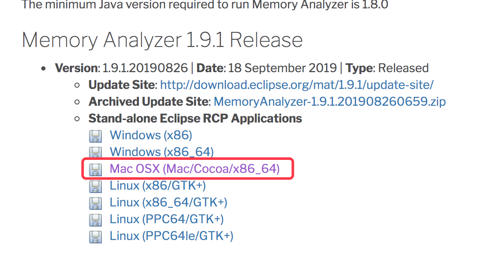
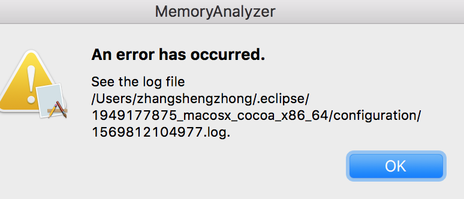

# MAT安装

# 1. 下载

[下载地址](<https://www.eclipse.org/mat/downloads.php>)选择适合自己的系统版本



## 2. 安装报错

### 2.1 报错提示



### 2.2 报错原因

但是官方文档指出MAT需要1.7 Java才可以运行，所以此时需要为MAT指定一个1.7的Java VM。只需要在MemoryAnalyzer.ini文件中**最开始**添加

```
-vm
<你的Jdk路径>

#例如我的
-vm
/Library/Java/JavaVirtualMachines/jdk1.8.0_71.jdk/Contents/Home/bin
```

### 2.3 MemoryAnalyzer.ini位置

mat.app 打开就可以看见

/Applications/mat.app/Contents/Eclipse/MemoryAnalyzer.ini