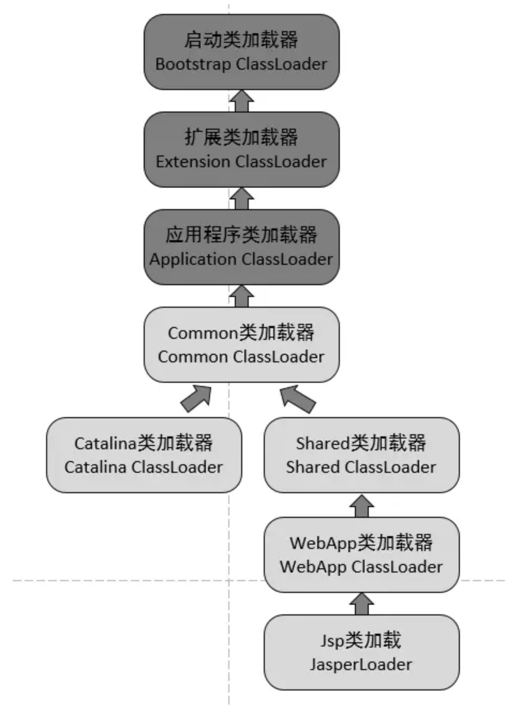

# tomcat类加载器

通过前文我们已经了解了类加载器以及双亲委派模型，并且了解为什么使用双亲委派模型。但我们考虑一下我们tomcat 中的场景

- 一个web容器可能需要部署两个应用程序，不同的应用程序可能会**依赖同一个第三方类库的不同版本**。不能要求同一个类库在同一个服务器只有一份，因此要保证每个应用程序的类库都是独立的，保证相互隔离。

如果我们使用双亲委派模型就不能保证他们的隔离性了，那么我们如果要破坏双亲委派模型

## 1. 如何破坏双亲委派模型

双亲委任模型**不是一个强制性的约束模型**，而是一个建议型的类加载器实现方式。

历史上出现的三次破坏

- 第一次：双亲委派模型出现之前，既jdk 1.2 发布之前

- 第二次：因为自身模型缺陷

  双亲委派模型解决了各个类加载器的基础类的同一问题（越基础的类由越上层的加载器进行加载），基础类之所以称为“基础”，是因为它们总是作为被用户代码调用的API， 但没有绝对，**如果基础类调用会用户的代码**怎么办呢？

  >为了解决这个问题，Java设计团队只好引入了一个不太优雅的设计：**线程上下文类加载器（Thread Context ClassLoader）**。这个类加载器可以通过java.lang.Thread类的setContextClassLoader方法进行设置。如果创建线程时还未设置，它将会从父线程中继承一个，如果在应用程序的全局范围内都没有设置过多的话，那这个类加载器默认即使应用程序类加载器。
  >
  >嘿嘿，有了线程上下文加载器，JNDI服务使用这个线程上下文加载器去加载所需要的SPI代码，也就是父类加载器请求子类加载器去完成类加载的动作，这种行为实际上就是打通了双亲委派模型的层次结构来逆向使用类加载器，实际上已经违背了双亲委派模型的一般性原则。但这无可奈何，Java中所有涉及SPI的加载动作基本胜都采用这种方式。例如JNDI，**JDBC**，JCE，JAXB，JBI等。

- **第三次**：为了实现热插拔，热部署，模块化，意思是添加一个功能或减去一个功能不用重启，只需要把这模块连同类加载器一起换掉就实现了代码的热替换。

## 2. Tomcat 的类加载器是怎么设计的？

### 2.1 tomcat是个web容器，那么他要解决什么问题

1. 一个web容器可能需要部署两个应用程序，不同的应用程序可能会依赖**同一个第三方类库的不同版本**，不能要求同一个类库在同一个服务器只有一份，因此要保证每个应用程序的类库都是独立的，保证相互隔离。

2. 部署在同一个web容器中相同的类库相同的版本可以共享。否则，如果服务器有10个应用程序，那么要有10份相同的类库加载进虚拟机，这是扯淡的。

3. web容器也有自己依赖的类库，不能于应用程序的类库混淆。基于安全考虑，应该让容器的类库和程序的类库隔离开来。

4. web容器要支持jsp的修改，我们知道，jsp 文件最终也是要编译成class文件才能在虚拟机中运行，但程序运行后修改jsp已经是司空见惯的事情，否则要你何用？ 所以，web容器需要支持 jsp 修改后不用重启。

再看看我们的问题：Tomcat 如果使用默认的类加载机制行不行？ 答案是不行的。为什么？我们看，

- 第一个问题，如果使用默认的类加载器机制，那么是无法加载两个相同类库的不同版本的，默认的累加器是不管你是什么版本的，只在乎你的全限定类名，并且只有一份。
- 第二个问题，默认的类加载器是能够实现的，因为他的职责就是保证唯一性。
- 第三个问题和第一个问题一样。
- 四个问题，我们想我们要怎么实现jsp文件的热修改（楼主起的名字），jsp 文件其实也就是class文件，那么如果修改了，但类名还是一样，类加载器会直接取方法区中已经存在的，修改后的jsp是不会重新加载的。那么怎么办呢？我们可以直接卸载掉这jsp文件的类加载器，所以你应该想到了，每个jsp文件对应一个唯一的类加载器，当一个jsp文件修改了，就直接卸载这个jsp类加载器。重新创建类加载器，重新加载jsp文件。

### 2.2 Tomcat 如何实现自己独特的类加载机制？

所以，Tomcat 是怎么实现的呢？牛逼的Tomcat团队已经设计好了。我们看看他们的设计图：

我们看到，前面3个类加载和默认的一致，CommonClassLoader、CatalinaClassLoader、SharedClassLoader和WebappClassLoader则是Tomcat自己定义的类加载器，它们分别加载`/common/*`、`/server/*`、`/shared/*`（在tomcat 6之后已经合并到根目录下的lib目录下）和`/WebApp/WEB-INF/*`中的Java类库。其中WebApp类加载器和Jsp类加载器通常会存在多个实例，**每一个Web应用程序**对应一个WebApp类加载器，每一个JSP文件对应一个Jsp类加载器。

- commonLoader：Tomcat最基本的类加载器，加载路径中的class可以被Tomcat容器本身以及各个Webapp访问；
- catalinaLoader：Tomcat容器私有的类加载器，加载路径中的class对于Webapp不可见；
- sharedLoader：各个Webapp共享的类加载器，加载路径中的class对于所有Webapp可见，但是对于Tomcat容器不可见；
- WebappClassLoader：各个Webapp私有的类加载器，加载路径中的class只对当前Webapp可见；

从图中的委派关系中可以看出：

> CommonClassLoader能加载的类都可以被Catalina ClassLoader和SharedClassLoader使用，从而实现了公有类库的共用，而CatalinaClassLoader和Shared ClassLoader自己能加载的类则与对方相互隔离。

> WebAppClassLoader可以使用SharedClassLoader加载到的类，但各个WebAppClassLoader实例之间相互隔离。

> 而JasperLoader的加载范围仅仅是这个JSP文件所编译出来的那一个.Class文件，它出现的目的就是为了被丢弃：当Web容器检测到JSP文件被修改时，会替换掉目前的JasperLoader的实例，并通过再建立一个新的Jsp类加载器来实现JSP文件的HotSwap功能。

很显然，tomcat 不是这样实现，tomcat 为了实现隔离性，没有遵守这个约定，每个webappClassLoader加载自己的目录下的class文件，不会传递给父类加载器。

##### 我们扩展出一个问题：如果tomcat 的 Common ClassLoader 想加载 WebApp ClassLoader 中的类，该怎么办？

看了前面的关于破坏双亲委派模型的内容，我们心里有数了，我们可以使用线程上下文类加载器实现，使用线程上下文加载器，可以让父类加载器请求子类加载器去完成类加载的动作。牛逼吧。

### 参考文章

[深入理解 Tomcat（四）Tomcat 类加载器之为何违背双亲委派模型](<https://juejin.im/post/5a59f2296fb9a01ca871eb8c>)

