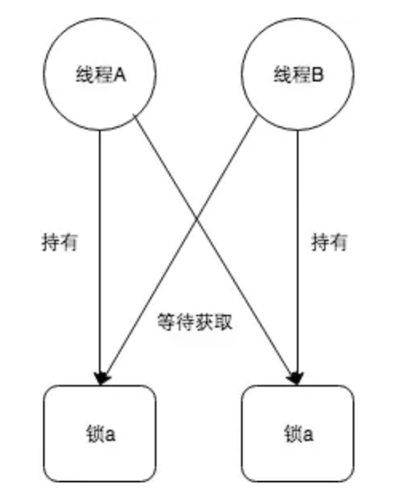
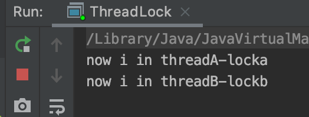
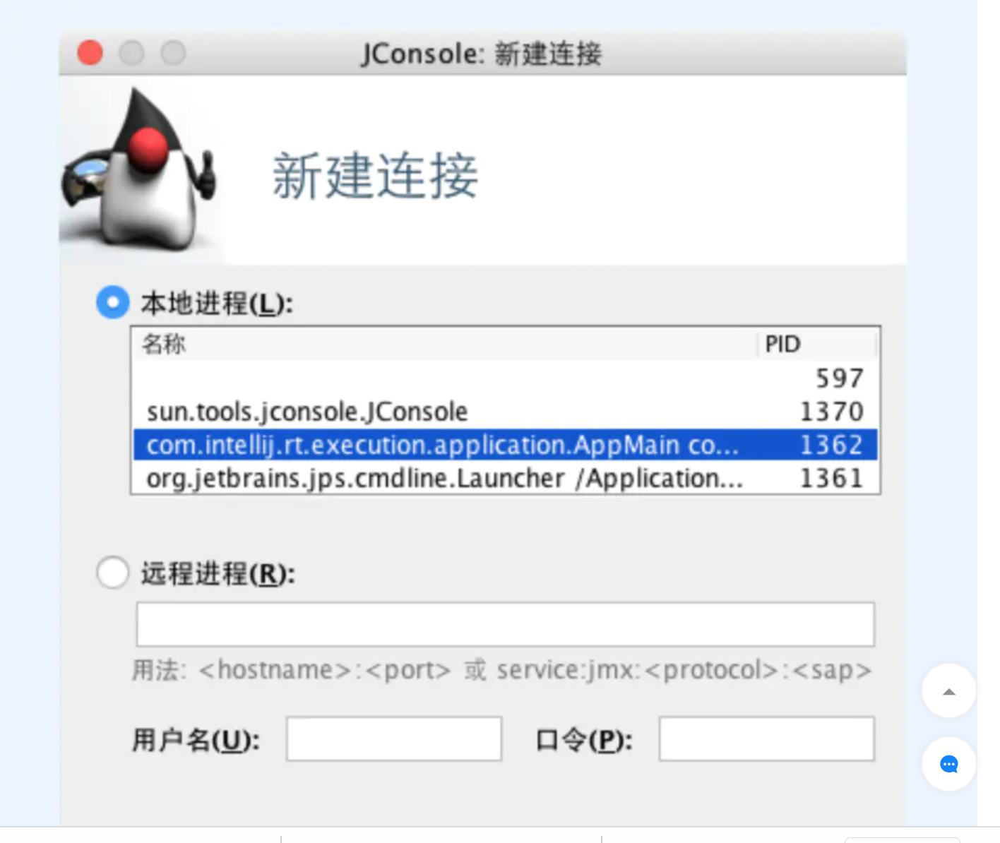

# 如何发现、预防、解决死锁

## 1. 死锁的定义

“死锁是指两个或两个以上的进程在执行过程中，由于竞争资源或者由于彼此通信而造成的一种阻塞的现象，若无外力作用，它们都将无法推进下去。”

竞争的资源可以是：锁、网络连接、通知事件，磁盘、带宽，以及一切可以被称作“资源”的东西。

## 2. 举例

如果此时有一个线程A，按照先锁a再获得锁b的顺序获得锁，而在此时又有一个线程B，按照先锁b再锁a的顺序获得锁



我们可以用一段代码来表示：

```
public static void main(String[] args) {
    final Object a = new Object();
    final Object b = new Object();
    Thread threadA = new Thread(new Runnable() {
        public void run() {
            synchronized (a) {
                try {
                    System.out.println("now i in threadA-locka");
                    Thread.sleep(1000l);
                    synchronized (b) {
                        System.out.println("now i in threadA-lockb");
                    }
                } catch (Exception e) {
                    // ignore
                }
            }
        }
    });

    Thread threadB = new Thread(new Runnable() {
        public void run() {
            synchronized (b) {
                try {
                    System.out.println("now i in threadB-lockb");
                    Thread.sleep(1000l);
                    synchronized (a) {
                        System.out.println("now i in threadB-locka");
                    }
                } catch (Exception e) {
                    // ignore
                }
            }
        }
    });

    threadA.start();
    threadB.start();
}

```

我们可以看到执行结果如下：



很明显，程序执行停滞了

## 2. 死锁检测

主要介绍两种死锁检查工具

## 2.1 Jstack命令

Jstack 是java 虚拟机自带的一种堆栈跟踪工具。jstack 用于**打印**出给定的java 进程ID或core file 或远程调试服务的**java堆栈信息**。Jstack工具可以用于生成Java虚拟机当前时刻的线程快照，**线程快照**是当前java虚拟机内每一条线程**正在执行**的**方法堆栈**的集合，生成线程快照的主要目的是定位线程出现长时间停顿原因，如`线程间死锁`、`死循环`、`请求外部资源导致的长时间等待`等。线程出现停顿的时候通过jstack来查看各个线程的调用堆栈，就可以知道没有相应的线程到底在后台做了什么事情，或者等待什么资源

首先，我们通过jps确定当前执行任务的进程号:

```
jonny@~$ jps
597
1370 JConsole
1362 AppMain
1421 Jps
1361 Launcher
```


可以确定任务进程号1362，然后执行jstack命令查看当前进程堆栈信息：

```
jonny@~$ jstack -F 1362
Attaching to process ID 1362, please wait...
Debugger attached successfully.
Server compiler detected.
JVM version is 23.21-b01
Deadlock Detection:

Found one Java-level deadlock:
=============================

"Thread-1":
  waiting to lock Monitor@0x00007fea1900f6b8 (Object@0x00000007efa684c8, a java/lang/Object),
  which is held by "Thread-0"
"Thread-0":
  waiting to lock Monitor@0x00007fea1900ceb0 (Object@0x00000007efa684d8, a java/lang/Object),
  which is held by "Thread-1"

Found a total of 1 deadlock.

```

可以看到，进程的确存在死锁，两个线程分别在等待对方持有的Object对象

### 2.2 JConsole 工具

Jconsole 是 Jdk自带的监控工具，在Jdk/bin 目录下可以找到，他用户连接正在运行的本地或者远程的JVM，对运行在Java 应用程序的资源消耗和性能进行监控，并画出大量的图表，提供强大的可视化界面。而且本身占用的服务器内存很小

我们在命令行中敲入jconsole命令，会自动弹出以下对话框，选择进程1362，并点击“**链接**”



进入锁检查的进程后，选择“线程”选项卡，并点击“检查死锁”


我们可以看到


可以看到进程中存在死锁

## 2. 预防与解决死锁

破坏死锁产生的四个必要条件

### 2.1 破坏互斥条件

这个条件我们没有办法破坏，因为我们用锁本来就是想让他们互斥的（临界资源需要互斥访问）

### 2.2 破坏请求与保持条件

一次性申请所有的资源

### 2.3 破坏不可剥夺条件

占用部分资源的线程进一步申请其他资源时，如果申请不到，可以**主动释放他占有的资源**

### 2.4 破坏循环等待条件

靠按顺序申请资源来预防，按某一顺序申请资源，释放资源则反序释放。破坏循环等待条件