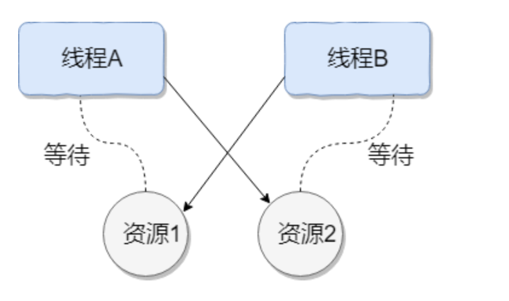

# 死锁

## 1. 什么是死锁

多个线程同时被阻塞，他们中的一个或者全部都在等待某个资源被释放。由于线程被无限期的阻塞，因此程序不可能正常终止

### 1.1 案例

如下图所示，线程A持有资源2，线程B持有资源 1,他们同时都想申请对方的资源，所以这两个线程就会互相等待而进入死锁状态



### 1.2 案例代码

通过例子来模拟线程死锁

```java
public class DeadLockDemo {
    private static Object resource1 = new Object();//资源 1
    private static Object resource2 = new Object();//资源 2

    public static void main(String[] args) {
        new Thread(() -> {
            synchronized (resource1) {
                System.out.println(Thread.currentThread() + "get resource1");
                try {
                    Thread.sleep(1000);
                } catch (InterruptedException e) {
                    e.printStackTrace();
                }
                System.out.println(Thread.currentThread() + "waiting get resource2");
                synchronized (resource2) {
                    System.out.println(Thread.currentThread() + "get resource2");
                }
            }
        }, "线程 1").start();

        new Thread(() -> {
            synchronized (resource2) {
                System.out.println(Thread.currentThread() + "get resource2");
                try {
                    Thread.sleep(1000);
                } catch (InterruptedException e) {
                    e.printStackTrace();
                }
                System.out.println(Thread.currentThread() + "waiting get resource1");
                synchronized (resource1) {
                    System.out.println(Thread.currentThread() + "get resource1");
                }
            }
        }, "线程 2").start();
    }
}
```

输出

```java
Thread[线程 1,5,main]get resource1
Thread[线程 2,5,main]get resource2
Thread[线程 1,5,main]waiting get resource2
Thread[线程 2,5,main]waiting get resource1
```

线程A 通过synchronized（resource1） 获得 resource1 的监视器锁，然后通过` Thread.sleep(1000);`让线程 A 休眠 1s 为的是让线程 B 得到执行然后获取到 resource2 的监视器锁。线程 A 和线程 B 休眠结束了都开始企图请求获取对方的资源，然后这两个线程就会陷入互相等待的状态，这也就产生了死锁。上面的例子符合产生死锁的四个必要条件。

## 2. 死锁产生的四个必备条件

1. 互斥条件：该资源任意一个时刻**只由一个线程占用**

2. 请求与保持条件：一个进程因请求资源而阻塞时，对**已获得的资源保持不放**

3. 不可剥夺条件：线程已获取的资源在未使用完之前**不能被其他线程强行剥夺**，只有自己使用完毕后才释放资源

4. 循环等待条件：若干进程之间形成一种**头尾相接的循环等待资源关系**

## 3. 如何避免死锁

我们只要破坏产生死锁的四个条件中的一个就可以

### 3.1 破坏互斥条件

这个条件我们没有办法破坏，因为我们用锁本来就是想让他们互斥的（临界资源需要互斥访问）

### 3.2 破坏请求与保持条件

一次性申请所有的资源

### 3.3 破坏不可剥夺条件

占用部分资源的线程进一步申请其他资源时，如果申请不到，可以**主动释放他占有的资源**

### 3.4 破坏循环等待条件

靠按顺序申请资源来预防，按某一顺序申请资源，释放资源则反序释放。破坏循环等待条件

