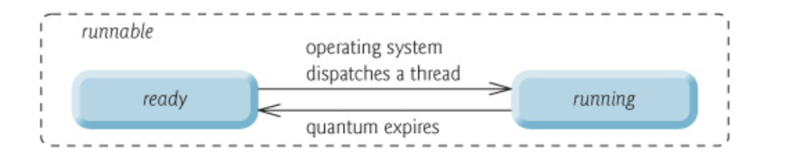

# 线程生命周期

## 1. 线程的生命周期

Java 线程在运行的生命周期中的指定时刻只可能处于下面6种不同状态的其中一个状态

| 状态名称     | 说明                                                         |
| ------------ | ------------------------------------------------------------ |
| NEW          | 初始状态，线程被构建，但是还没调用start方法                  |
| RUNNABLE     | 运行状态，Java线程将操作系统中的就绪和运行两种状态统称为”运行中“ |
| BLOCKED      | 阻塞状态，表示线程阻塞与所                                   |
| WAITING      | 等待状态，表示线程进入等待状态，进入该状态表示当前线程需要等待其他线程做出一些特定动作（通知或中断） |
| TIME_WAITING | 超时等待状态，该状态不同与WAITING,他是可以在指定时间自行返回的 |
| TERMINATED   | 终止状态，表示当前线程已经执行完毕                           |

线程在生命周期中并不是固定处于某一个状态，而是随着代码的执行在不同状态之间切换。状态变迁如下图所示

由上图可以看出：

- NEW（新建）

  线程创建之后它将处于 **NEW（新建）** 状态

- RUNNABLE(运行状态)

  调用 `start()` 方法后开始运行，线程这时候处于 **READY（可运行）** 状态。可运行状态的线程获得了 CPU 时间片（timeslice）后就处于 **RUNNING（运行）** 状态。

	>操作系统隐藏 Java 虚拟机（JVM）中的 RUNNABLE 和 RUNNING 状态，它只能看到 RUNNABLE 状态（图源：[HowToDoInJava](https://howtodoinjava.com/)：[Java Thread Life Cycle and Thread States](https://howtodoinjava.com/java/multi-threading/java-thread-life-cycle-and-thread-states/)），所以 Java 系统一般将这两个状态统称为 **RUNNABLE（运行中）** 状态 。

- WAITING (等待)

  当线程执行 `wait()`方法之后，线程进入**WAITING (等待)**状态，进入等待状态的线程需要依靠其他线程的通知才能够返回到运行状态

- TIME_WAITING(超时等待)

  TIME_WAITING(超时等待)状态相当于在等待状态的基础上加上超时限制，比如`sleep(long millis)`方法或`wait(long millis)`方法可以将java线程置于 TIMED WAITING 状态，当超时时间到达后 JAVA线程将会返回RUNNABLE 状态

- BLOCKED（阻塞）

  当线程调用同步方法时，在没有获取到锁的情况下，线程将进入**BLOCKED（阻塞）** 状态

- TERMINATED（终止）

  线程在执行Runnale的run() 方法之后将会进入到**TERMINATED（终止）**状态

## 2. sleep() 方法和wait()方法区别和共同点

- 两者最主要的区别在于：**sleep方法没有释放锁，而wait 方法释放了锁**

- 两者都可以暂停线程的执行

- wait通常被用于线程间的交互/通信，sleep通常被用于暂停执行

- wait() 方法被调用后，线程不会自动苏醒，需要别的线程调用同一个对象上的notify()或者notifyAll方法

  sleep（）方法执行完成后，线程会自动苏醒，或者可以使用wait(long timeout)超时后线程会自动苏醒