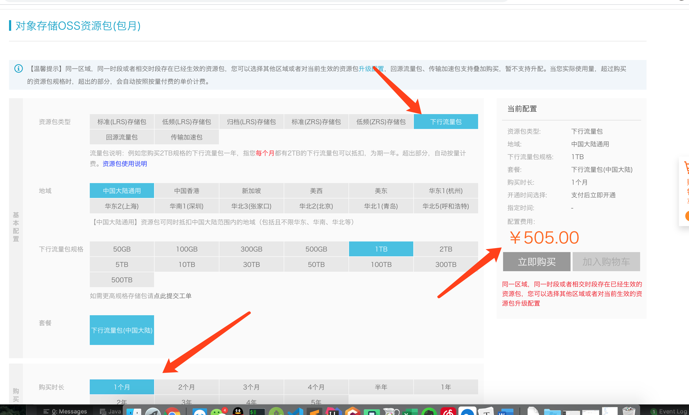
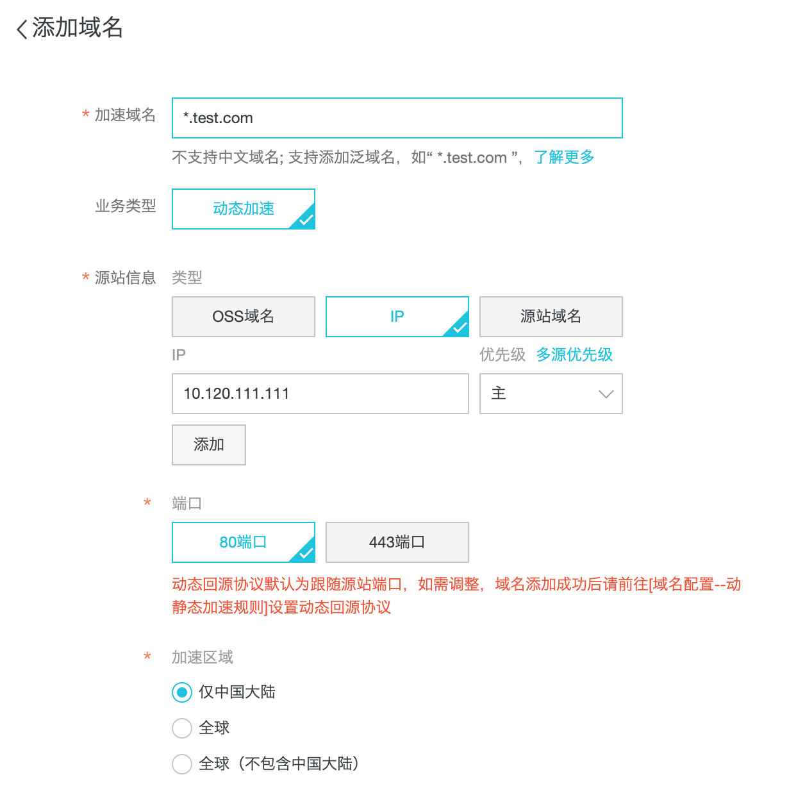
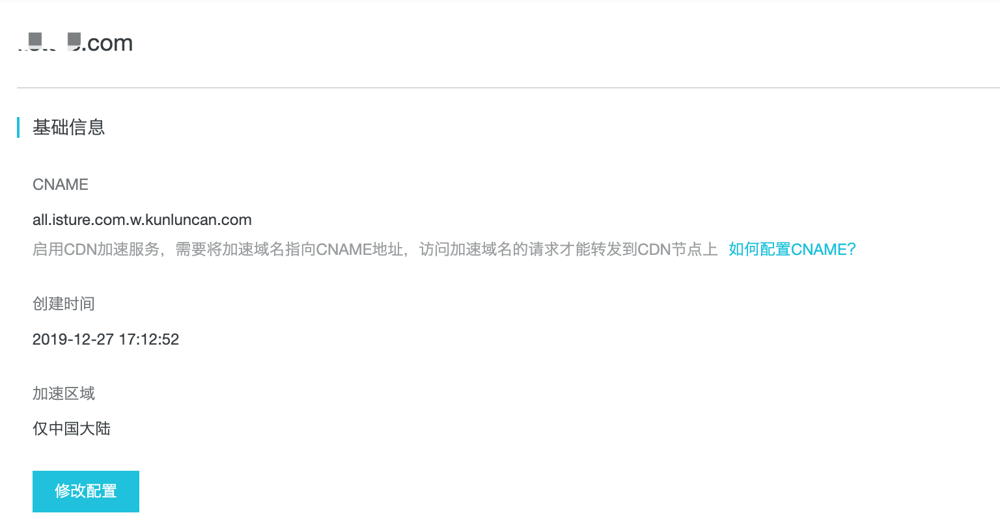

# 阿里云CDN使用

## 1. 背景

App升级是项目必不可少的环节。在项目初期公司将升级文件都放在公司的文件服务器中，下载的人少，下载速度还有几百K的速度。

但随着公司业务的扩张，用户量的增加。公司内部的文件服务器带宽完全撑不住,下载速度只剩下10k左右，下载一个30M的apk需要1个小时

>带宽是单位时间内某一点到另一点的“最高数据率”，带宽属于共享资源，例如我们app下载，随着同时下载的人数增加，带宽会被瓜分

所以我们考虑使用云来解决

## 2. 云存储还是CDN?

云存储和CDN 都能解决我们的问题。

### 2.1 云存储

将我们的apk等要下载的文件上传到云存储中，我们从云存储中下载。

存储apk 不需要多大的存储空间，反而是下载apk需要非常大的下行流量。

- 价格：

  以下为阿里云存储的 `1TB`**一个月的 下行流量价格505**

### 2.2 CDN

我们使用CDN的方式，对我们的文件服务器进行CDN 加速。

>CDN 第一次加载的时候，会将文件保存在CDN 的缓存服务器中供就近的用户下载。因为**有缓存可能会遇到缓存导致异常等风险**

- 价格

  以下为阿里CDN的 `1TB`**一个月的CDN加速包,价格162**。与云存储的下行流量价格差了3倍

### 2.3 选择

- 阿里云存储下行流量和CDN加速包价格相差了3倍
- 缓存问题，经过处理也是能解决的。可以逐步测试推进

所以最终还是选CND加速。cdn未来还能做全站的加速

## 3. CDN使用

### 3.1 购买CDN

### 3.2 配置要加速的CDN域名

- 我选择ip解析的比较多。直接映射到你对应的服务器，交由nginx 解析成对应的服务中

- 如果选择域名解析，切记不能选择同名的域名，否则会造成循环解析，无法回源。

### 3.3 配置域名解析下的CNAME

我们点开详情可以看到cname的配置，将陪cname的值配置到域名解析中

配置域名解析

### 3.4 nginx 配置

因为源站信息配置域名，所以在nginx 上要配置域名解析

    server {
        listen       80;
        server_name  filecdn.xxx.com;
    
        location / {
            root   /home/ftpuser/file;
            autoindex on;
            add_header Access-Control-Allow-Origin *;
            add_header Access-Control-Allow-Methods 'GET, POST, OPTIONS';
            add_header Access-Control-Allow-Headers 'DNT,X-Mx-ReqToken,Keep-Alive,User-Agent,X-Requested-With,If-Modified-Since,Cache-Control,Content-Type,Authorization';
    
            if ($request_method = 'OPTIONS') {
                return 204;
            }
        }
    }
## 4. 查看是否使用到了CDN

CDN配置之后大概几分钟就能生效

- 我们可以使用host 命令来查看是否使用到了CDN

- 使用dig命令来查看是否使用到了CDN

### 实际下载速度

同一个文件下载速度。

- 使用CDN的为1M 每秒

- 未使用CDN的为100k每秒