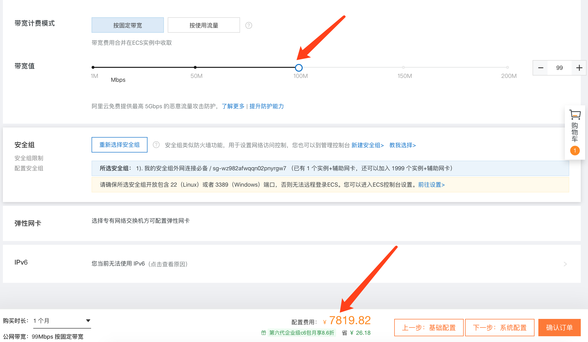

# 阿里云带宽价格

## 1. 背景

阿里云 CDN（1T 162） 和云存储(1T 505)还是太贵了，我们主要就是使用到了他们的带宽，如果直接购买阿里云的带宽会不会便宜一些

## 2. 操作流程

### 2.1 准备工作

选购了一台**2核4G，外网带宽1M** 的阿里云服务器，每个月的价格为**197.82元**

### 2.2 按固定带宽计费

相同变量下我们选购100M 的带宽，7819.82元

>100M带宽
>
>下载速度总和=100M/8=12.5M
>
>APP版本更新时：假如100个人同时下载，理论的下载速度就是125kb/s，随着下载人数的增加，速度持续下降

### 2.3 按使用流量计费

我们以100M 峰值计费，每G 是0.8元，下的越多价格就越贵。

>以实际情况为例：我们公司发布一次版本大概需要花费10T 的下载流量，每次就需要花费8000元的流量费。且每个月只能更新一次。
>
>

