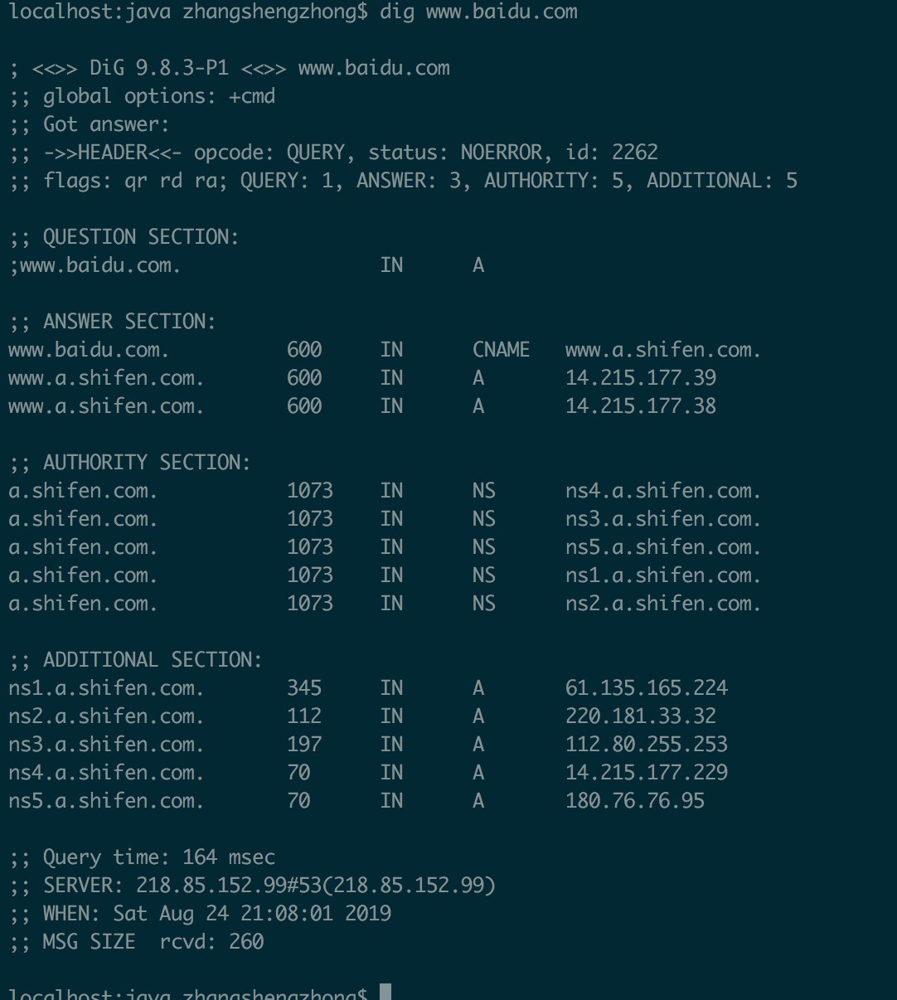
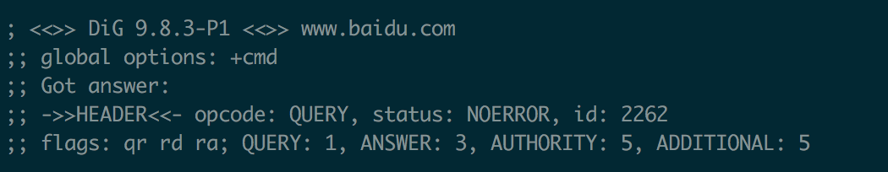
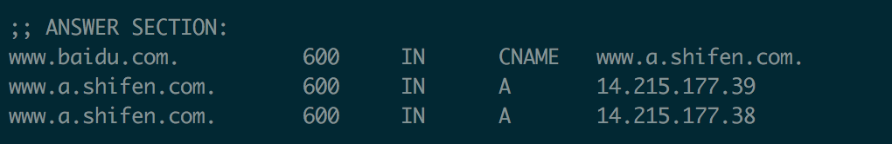
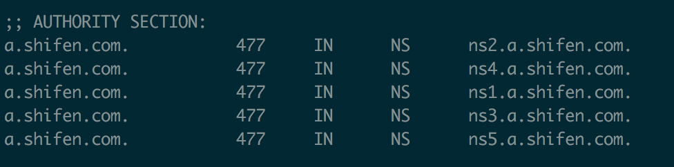
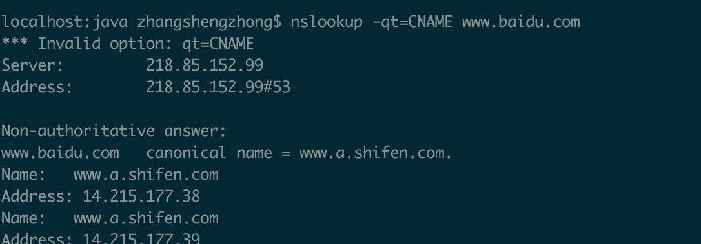

# DNS域名解析

## 1. DNS是什么？

DNS（Domain Namo System，域名解析系统）的作用非常简单，就是根据**域名查出ip地址**（可以想象成一本巨大的电话本）

例如：你要访问`www.baidu.com` 那么首先要通过DNS查出他的ip地址是14.215.177.38

## 2. 查询过程

虽然只需要返回一个IP地址，但是DNS的查询过程非常复杂，分成多个步骤

dig命令可以显示整个查询过程,在终端输入

```
dig www.baidu.com
```

会输出以下内容



- 第一段是查询参数和统计



- 第二段是查询内容


上面的结果表示，查询域名`www.baidu.com` 的A记录，A是address的缩写

- 第三段是DNS服务器的答复

  `www.baidu.com`被cname到了`www.a.shifen.com`



上面的结果显示，`www.baidu.com` 有三个A记录，既三个ip地址。600是TTL值（Time to live的缩写），表示缓存时间，既600秒之内不用重新查询

- 第四段显示`www.a.shifen.com` 的NS记录（Name Service），既哪些服务器负责管路`www.a.shifen.com` 的DNS记录



上面的结果显示a.shifen.com共有五条NS记录，既五域名服务器，向其中任一台查询都能知道a.shifen.com 的ip地址是什么

- 第五段是上面5个域名服务器的ip地址，这是随着前一段一起返回的


- 第六段是dns服务器的一些传输信息


上面的结果显示，本机的DNS服务器是218.168.1.253，查询端口是53（dns服务器的默认端口），以及回应长度是260字节

### 2.1 简化+short


上面命令值返回`www.baidu.com` 对应的3个ip地址


## 3.DNS 的记录类型

域名和IP之间的对应关系，称为“记录”（record），根据使用场景，记录可以分成不同类型（type）

常见的DNS记录类型如下

- A：地址记录（Address），返回的域名指向ip地址
- NS:域名服务器记录（Name Service），返回保存下一级域名信息的服务器地址。该记录只能设置为域名，不能设置为IP地址
- MX:邮件记录（Mail eXchange），返回接收电子邮件的服务器地址
- CNAME:规范名称记录（Canonical Name）,返回另一个域名，既当前查询的域名是另一个域名的调整。（例如百度）
- PTR:逆向查询记录（Pointer Record），只用于从IP地址查询域名

### 3.1 CNAME

CNAME 记录主要用于域名的内部跳转，为服务器配置提供灵活性，用户感知不到。

```
dig www.baidu.com

; <<>> DiG 9.8.3-P1 <<>> www.baidu.com
...
;; ANSWER SECTION:
www.baidu.com.		600	IN	CNAME	www.a.shifen.com.
www.a.shifen.com.	600	IN	A	14.215.177.39
www.a.shifen.com.	600	IN	A	14.215.177.38
```

上面的结果显示，`www.baidu.com` 的cname 记录指向的是`www.a.shifen.com`.也就是说用户查询`www.baidu.com` 的时候，实际上返回的是`www.a.shifen.com` 的ip地址。

**好处**

变更服务器ip地址的时候，只要修改`www.a.shifen.com` 这个域名就可以了，用户的`www.baidu.com`域名不用修改


## 4.其他DNS 工具

### 4.1 host命令

host命令可以看作dig命令的简化版本，返回当前请求域名的各种记录


### 4.2 nslookup命令

nslookup命令用于互动式的查询域名记录


也可以直接过滤出cname



### 4.3 whois 命令

whois 命令用来查看域名的注册情况

```bash
whois github.com
```

### 关于上文出现的218.85.152.99是我本机设置的dns地址


## 参考博客

[DNS 原理入门](<http://www.ruanyifeng.com/blog/2016/06/dns.html>)