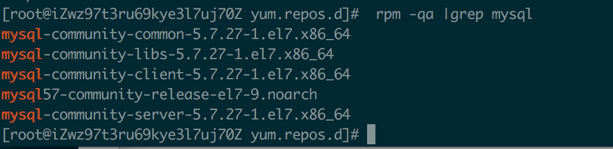
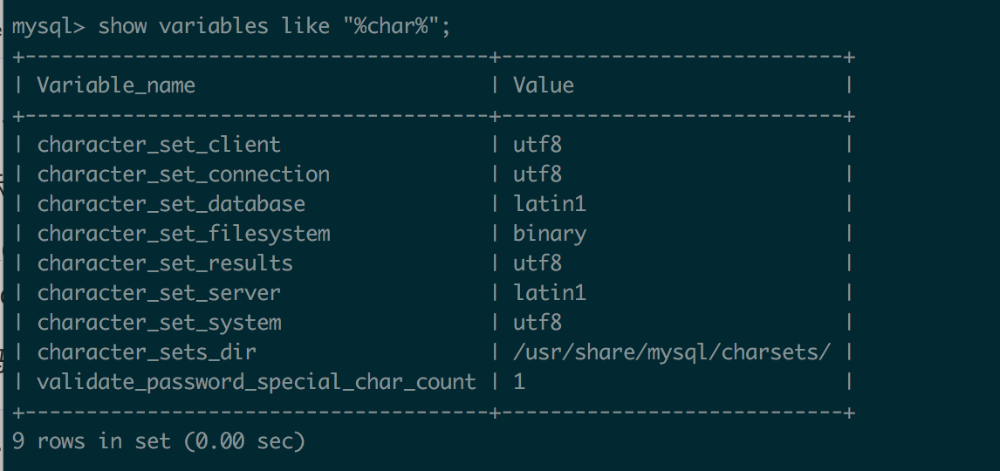

# CentosMySQL安装

## 1. 具体步骤

### 1.1 检查系统是否安装了MySQL

```
rpm -qa | grep mysql
```

返回空，说明没有安装

### 1.2 下载安装包

### 1.2.1 下载Mariadb

Cenntos-7 默认下载的是MariaDB,所以执行下面的命令下载到的是MariaDB

```
yum install mysql
```

删除

```
yum remove mysql
```

### 1.2.2 下载mysql的repo 源（MySQL 5.7）

```
wget http://repo.mysql.com/mysql57-community-release-el7-9.noarch.rpm
```

安装mysql57-community-release-el7-9.noarch.rpm包

```
sudo rpm -ivh mysql57-community-release-el7-9.noarch.rpm
```

安装这个包后，在/etc/yum.repos.d/下 会获得两个mysql 的yum repo源


### 1.3 安装MySQL

```
sudo yum install mysql-server
```

根据提示安装

#### 1.3.1 检查安装是否成功

执行

```
 rpm -qa |grep mysql
```

看到如下返回，证明安装成功了



### 1.4 登录

安装完成后，没有密码，需要重置密码

重置前需要登录

```
mysql -u root
```

#### 1.4.1 登录异常一

ERROR 2002 (HY000): Can't connect to local MySQL server through socket '/var/lib/mysql/mysql.sock' (2)

执行如下命令

```
sudo chown -R openscanner:openscanner /var/lib/mysql
```

如果报

chown: invalid user: ‘openscanner:openscanner’

更换命令 chown root /var/lib/mysql/， 并用 ll 查看目录权限列表

```
chown root /var/lib/mysql/
ll
```

重启服务

```
service mysqld restart
```

若还异常

```
 chmod 777 /var/lib/mysql
```


#### 1.4.2 登录异常2(默认密码)

Access denied for user 'root'@'localhost' (using password: NO)

查找默认密码

```
grep "temporary password" /var/log/mysqld.log
```

返回结果最后冒号后面的字符串就是root的默认密码。

```
[root@iZwz97t3ru69kye3l7uj70Z lib]# grep "temporary password" /var/log/mysqld.log
2019-09-08T13:57:32.059634Z 1 [Note] A temporary password is generated for root@localhost: xUu<ts%uO5gq
```

### 1.5 重置密码

```
SET PASSWORD = PASSWORD('123456');
```

重启之后才生效

```
exit;
service mysqld restart
```

#### 1.5.1  重置异常1

提示：

ERROR 1819 (HY000): Your password does not satisfy the current policy requirements

密码强度不足,执行

```
 set global validate_password_policy=0;
```

### 1.6 数据库编码

查看数据库编码格式

```
show variables like "%char%";
```



修改编码,在

```
vim /etc/my.cnf`
```

新增服务端默认字符集

```
[mysqld]
# 服务端使用的字符集默认为UTF8
character-set-server=utf8
```


### 参考文章

[CentOS7 64位安装mysql教程](<https://blog.csdn.net/a774630093/article/details/79270080>)

