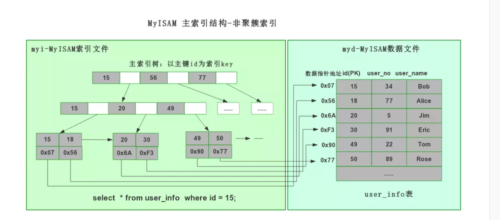
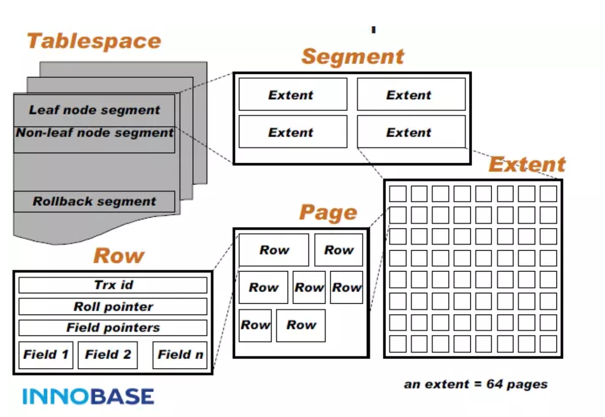
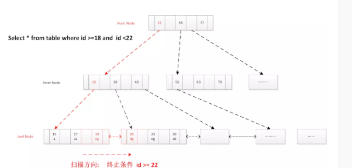
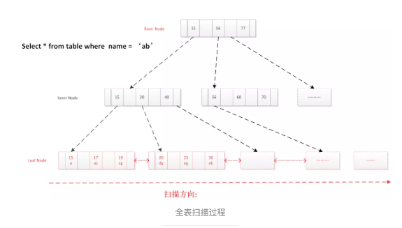
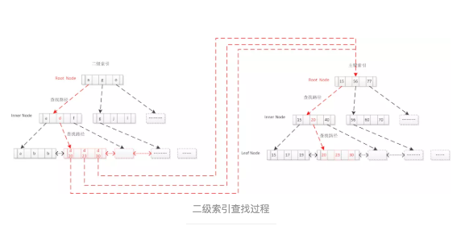

# 索引实现

## 1. 聚簇索引

MyISAM 和 InnoDB 都使用B+Tree索引结构，但底层索引存储不同，MyISAM 采用非聚簇索引，而InnoDB采用聚簇索引

- 聚簇索引：索引和数据文件为同一个文件
- 非聚簇索引：索引和数据文件 分开的索引

## 2. MyISAM 索引原理

### 2.1 底层存储结构

- frm：定义表
- myi: myisam索引
- myd：myisam数据

### 2.2 myISAM 索引结构特性

- 采用非聚簇索引

- MyISAM myi索引文件和myd 数据文件分离
- 索引文件仅保存数据记录的指针地址。
- 叶子节点data域存储指向数据记录的指针地址

### 2.3 MyISAM 索引查找流程

- MyISAM 索引按照B+Tree搜索，

- 如果指定的key存在，则取出其data域值

- 然后以data阈值-数据地址去读取响应的数据记录，

辅助索引和主索引在结构上没有任何区别，只是主索引要求key 是唯一的，而辅助索引的key 可以重复



## 3. InnoDB 

### 3.1 InnoDB优势

- 高扩展性
- 充分开发硬件性能
- Crash Safe
- 支持事务
- 可以在线热备份

### 3.2 InnoDB特性

1. 事务支持（ACID）

2. 扩展性优良

3. 读写不冲突

4. 缓存加速

### 3.3 组件功能

- redo/undo
- 异步IO
- MVCC
- 行级别锁
- Page Cache（LRU）

### 3.4 InnoDB物理存储结构



- 表空间(ibd文件)

  - InnoDB 以**表空间Tablespace**（idb文件）结构进行组织

- 段(Segment)

  - 每个Tablespce 包含**多个Segment段**

    分为2种段：叶子节点Segment 和非叶子节点Segment

- Extent

  - 一个Segment段**包含多个Extent**

    一个Extent占用占用1M空间包含**64个page**（每个Page 16K）

- Page(16K)

  - InnoDB B-Tree **一个逻辑节点扣分配一个物理Page**，一个节点一次IO操作

- Row

  - 一个Page里包含**很多有序数据Row行**数据

- Field

  - Row行数据中包含**Field 属性数据等信息**

#### 3.5 表插入数据扩展原理

一次扩张一个Extent空间（IM）,64个page，按顺序结构向每个page中插入数据

#### 3.6 InnoDB 逻辑组织结构


**每个索引一个B+Tree**，一个B+Tree节点 = 一个物理Page（16K）

数据按16KB切片为Page 并编号，编号可映射到物流文件偏移（16K*N）,B+Tree树叶子节点前后形成双向链表，数据按主键聚簇，二级索引叶节点存储主键值，通过叶节点主键值**回表查找数据**

## 4. InnoDB 索引原理

### 4.1 InnoDB 特点

- **采用聚簇索引**

- **InnoDB 数据&索引文件为idb文件，**
- **表数据文件本身就是就是主索引**
- **相邻的索引临近存储。**

- **叶节点data域保存了完整的数据记录（数据[除了主键id外其他data]+主索引）**

- **叶子节点直接存储数据记录，以主键id为key，叶子节点直接存储数据记录**


### 4.2 底层存储结构

- frm: 表定义
- idb: innoDB数据&索引文件

### 4.3 为什么InnoDB 一定要有主键

**由于InnoDB 采用聚簇索引结构存储，索引InnoDB 的数据文件需要按照主键聚集。**因此InnoDB 要求表必须有主键（MyISAM可以没有）。

如果没有指定mysql会**自动选择一个可以唯一标识数据记录的列作为主键**，如果不存在这样的列，mysql自动为innoDB表**生成一个隐含字段（6个字节长整型）作为主键**。innoDB所有辅助索引都引用数据记录的主键 作为data 域

### 4.4 辅助索引需要检索两遍

聚簇索引这种实现方式使得主键的搜索十分高效，但是**辅助索引搜索需要检索两遍索引**

1. 首先检索辅助索引获得数据记录主键

2. 然后用主键到主索引中检索获得数据记录

### 4.5 聚簇索引结构 


### 4.6 索引的查找流程

#### 2.6.1 索引精确查找：

```
select * from user_info where id = 23
```

1. 确定定位条件，找到根节点的PageNo
2. 根节点读到内存
3. 逐层向下查找
4. 读取叶子节点的Page
5. **通过二分查找找到记录或未命中**。


#### 2.6.2 索引范围查找

```
select * from user_info where id >= 18 and id < 22
```

1. 读取根节点至内存
2. 确定索引定位条件 id=18
3. 找到满足条件第一个叶子节点，
4. 顺序扫描所有结果，直到终止条件满足id>=22 



#### 2.6.3 全表扫描

select * from user_info where name = 'abc'

1. 直接读取叶子节点头结点
2. 顺序扫描
3. 返回符合条件记录，到最终节点结束



#### 2.6.4 二级索引查找

```
Create table table_x(int id primary key, varchar(64) name,key sec_index(name) )

• Select * from table_x where name = “d”;
```

1. 通过二级索引查出主键
2. 拿主键回表查主键索引得到数据
3. 二级索引可筛选掉大量无效记录，提高效率

