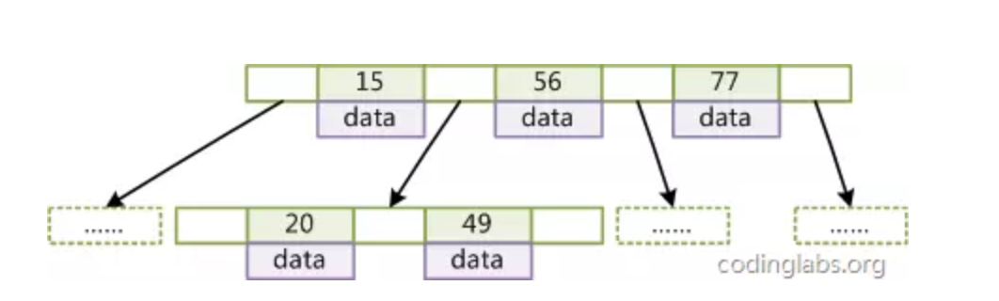

# 索引常见的数据结构

## 1. 顺序查找

**算法复杂度：O(n)**

最基本的查询算法，复杂度O(n),大数据量时此算法效率非常糟糕

## 2. 二叉树查找(binary tree search) 

**算法复杂度：O(log2n)**

左边是数据表，一共有两列七条记录，最左边的是数据记录的物理地址。（逻辑相邻的记录在磁盘上也并不一定是物理相邻）。

为了加快col2 的查找，可以维护一个右边所示的二叉查找树，**每个节点分别包含索引键值和一个指向对应数据记录物理地址的指针**，这样就可以运用二叉查找在O(log2n)的复杂度内获取响应的数据

## 3. hash索引

无法满足范围查找

## 4. 二叉树、红黑树

**算法复杂度：O(h)**

这将导致树的高度非常高。（平衡二叉树一个节点只能有左子树和右子树），**逻辑上很近的节点（父子）物理上可能很远，无法利用局部性，IO次数多查找慢，效率低**（逻辑上相邻节点没法直接通过顺序指针关联，可能需要迭代回上层节点重复向下遍历查找对应的节点，效率低）

## 5. B-Tree

结构：**B-Tree 每个节点都是一个二元数组**，所有的节点都可以存储数据，key为索引key，data为除key 指代的数据。结构如下

### 5.1 检索原理：

首先从**根节点进行二分查找**，如果找到则返回对应节点的data，否则**对相应区间的指针指向的节点递归**进行查找，直到找到节点或未找到节点返回null指针。

### 5.2 B-Tree缺点

- 插入删除新的数据记录会破坏B-Tree的性质，因此在插入删除时，需要对树进行一个分裂、合并、转移等操作以保持B-Tree性质。造成IO操作频繁
- 区间查找可能需要返回上层节点重复遍历，IO操作繁琐。

## 6. B+Tree

B+Tree 是B-Tree的变种

### 6.1 与B-Tree的不同点

- 非叶子节点不存储data，只存储索引key；
- 只有叶子节点才存储data

### 6.2 B+Tree数据结构

### 6.3 MySQL 中的B+Tree

#### 6.3.1 概述

在经典B+Tree的基础上进行了优化，增加了**顺序访问指针**。

#### 6.3.2 详细

在B+Tree的每个叶子节点增加一个指向相邻叶子节点的指针，就形成了**带有顺序访问指针的B+Tree**。这样就**提高了区间访问性能**：

#### 6.3.3 案例：

如果要查询key为从18到49的所有数据记录，当找到18后，只需顺着节点和指针顺序遍历就可以一次性访问到所有数据节点，极大提到了区间查询效率(**无需返回上层父节点重复遍历查找减少IO操作**)。

#### 6.3.4 数据结构

### 参考文档

[MYSQL-B+TREE索引原理](https://www.jianshu.com/p/486a514b0ded)

