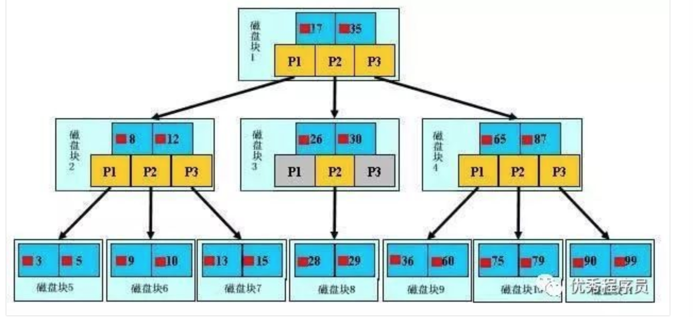

# 联合索引

## 1. 什么是联合索引

两个或更多个列上的索引被称为联合索引，联合索引又叫复合索引。

对于联合索引：

- MySql从左到右使用索引中字段
- 一个查询可以只使用索引中的一部分，但只能是最左部分（最左前缀）

例如：

索引是key index（a,b,c） 可以支持**a|a,b|a,b,c**，三种组合查找，但不支持b,c 进行查找。当最左侧字段是常量引用时，索引就十分有效

## 2. 需要遵循的规则

1. 需要加索引的字段，要在where条件中
2. 数据量少的字段不需要加索引
3. 如何where条件中是or关系，加索引不起作用
4. 符合最左前缀原则

## 3. 原理

### 3.1 B+Tree结构

每一个磁盘快在mysql中是一个页，页大小是固定的，mysql innodb的默认的页大小是16k。每个索引会分配在页上的数量是由字段的大小决定。当字段值长度越长，每一页上的数量就会越少，因此在一定数据量的情况下，所以的深度会越深，影响索引查找效率



对于复合索引（多列b+tree,使用多列值组合而成的b+tree索引）。遵循最左前缀原则，从左到右的使用索引中的字段，**一个查询可以只使用索引中的一部分，但只能是做左侧部分**

### 3.2 实例

创建表test

```
create table test(

a int,

b int,

c int,

KEY a(a,b,c)

);
```

比如（a,b,c）的时候，b+tree是按照从**左到右的顺序来建立搜索树**的

- 当（a =? and b= ? and c=?) 这样的数据来检索的时候
  - b+树会优先比较a列来确定下一步的方向
  - 如果a列相同再依次比较b列和c列
  - 最后得到检索数据
- 但当（b=? and c =?）这样没有a列的数据来的时候
  - b+树就不知道下一步该查那个节点，因为建立搜索树的时候a列就是第一个比较因子。必须要先跟a列来搜索才能知道下一步去哪里查询
- 当（a=? and c =?）这样的数据来检索时
  - b+树可以用a列来制定搜索方向，但下一个字段b列的缺失，只能吧a列的数据找到
  - 然后在匹配c列的数据

## 4. 多列索引的应用

### 4.1 多列索引在and查询中的应用

- select * from test where a=? and b=? and c=?；

  查询效率最高，索引全覆盖。

- select * from test where a=? and b=?

  索引覆盖a和b。

- select * from test where b=? and a=?

  经过mysql的查**询分析器的优化，索引覆盖a和b**。

- select * from test where a=?；

  索引覆盖a。

- select * from test where b=? and c=?

  没有a列，不走索引，索引失效。

- select * from test where c=?；

  没有a列，不走索引，索引失效。

### 4.2 多列索引在范围查询中应用

- select * from test where a=? and b between ? and ? and c=?；

  索引覆盖a和b，**因b列是范围查询，因此c列不能走索引**。

- select * from test where a between ? and ? and b=?；

  a列走索引，因a列是范围查询，因此b列是无法使用索引。

- select * from test where a between ? and ? and b between ? and ? and c=?；

  a列走索引，因a列是范围查询，b列是范围查询也不能使用索引。

### 4.3 **多列索引在排序中应用**

- select * from test where a=? and b=? order by c；

  a、b、c三列全覆盖索引，查询效率最高。

- select * from test where a=? and b between ? and ? order by c；

  a、b列使用索引查找，因b列是范围查询，因此c列不能使用索引，会出现file sort。

## 5. 总结

- 联合索引的使用在写where调的顺序无关，mysql 查询分析会进行优化而使用索引，但是为了减轻查询分析器的压力，最好和索引的从左到右的顺序一致
- 使用等值查询，多列同时查询，索引会一直传递并生效。因此等值查询效率最好。
- 索引查找遵循最左侧原则。**但是遇到范围查询列之后的列索引失效。**

- 排序也能使用索引，合理使用索引排序，避免出现file sort。