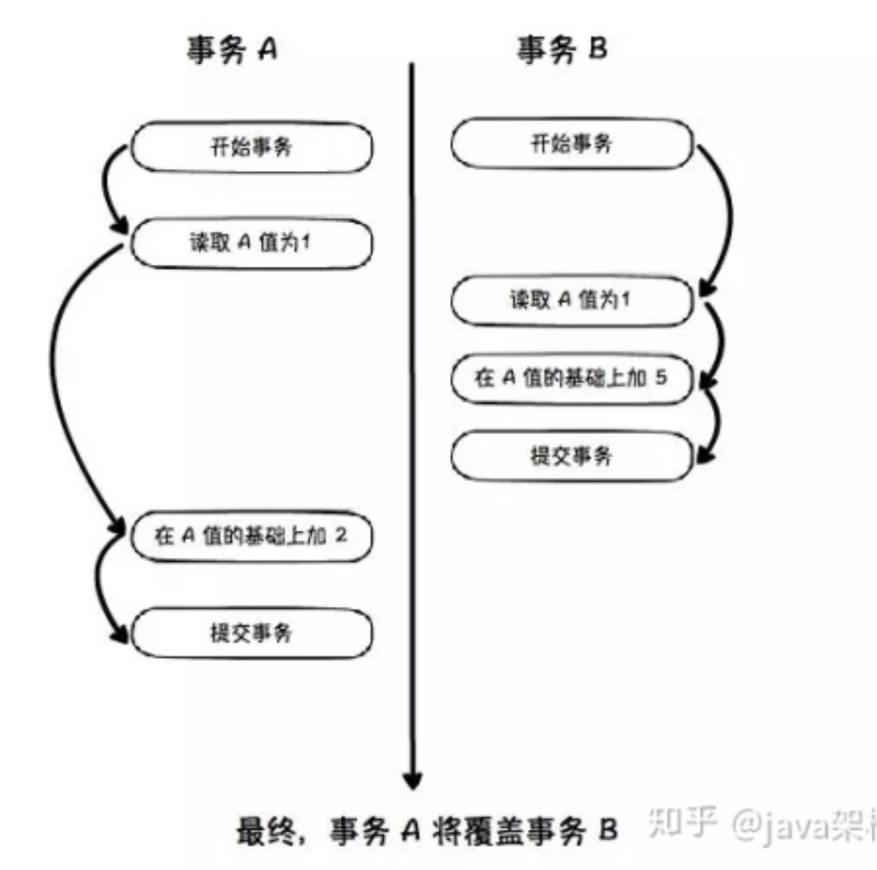

# 锁机制

## 1. 锁维度

锁有好几种维度

### 1.1 类型维度

- 共享锁（读锁/S锁）

- 排他锁（写锁/X 锁）

  类型细分

  - 意向共享锁
  - 意向排他（互斥）锁

- 悲观锁（使用锁，既for update）

- 乐观锁（使用版本号字段，类似 CAS 机制，既用户自己控制。缺点：并发很高的时候，多了很多无用的重试）

### 1.2 锁的粒度（粒度维度）

- 表锁

- 页锁（Mysql BerkeleyDB 引擎）

- 行锁（InnoDB）

  行锁的实现原理就是锁住聚集索引，如果你查询的时候，没有正确地击中索引，MySql 优化器将会抛弃行锁，使用表锁。

### 1.3 锁的算法（算法维度）

- Record Lock（单行记录）
- Gap Lock（间隙锁，锁定一个范围，但不包含锁定记录）
- Next-key Lock（Record Lock+Gap Lock，锁定一个范围，并且锁定记录本身。MySQL 防止幻读，就是使用此锁实现）

## 2. 默认的读操作，上锁吗？

默认是MVCC机制（“一致性非锁定读”）保证RR 级别的隔离正确性。是不上锁的

可以选择手动上锁

- 排他锁：select xxxx for update

- 共享锁：select xxx lock in share mode

  称为一致性锁定读

使用锁之后，就能在RR 级别下，避免幻读。当然默认的MVCC读，也能避免幻读

## 3 MySQL 的 SERIALIZABLE 有啥用呢？

MySQL RR能够防止幻读,那么，SERIALIZABLE 有啥用呢？

他可以**防止丢失更新**

这个时候，我们必须使用SERIALIZABLE 级别进行串行读取。