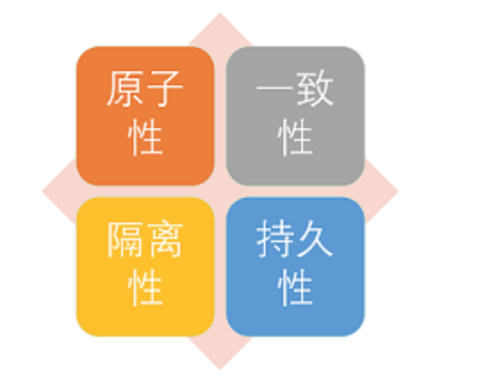

# 事务

## 1. 什么是事务

**事务就是逻辑上的一组操作，要么都执行，要么都不执行**

### 1.1 案例

事务最经典例子转账：假设小明要给小红转账1000元，这个转账会涉及到两个关键操作

- 将小明的余额减少1000元
- 将小红的余额增加1000元

万一在这两个操作之间突然出现错误比如银行系统奔溃，导致小明余额减少而小红的余额没有增加，这就不对了。
事务就是保证这两个关键操作要么都成功，要么都失败

## 2. 事务的四大特性（ACID）



1. **原子性（Atomicity）**:

   事务是**最小的执行单位，不予许分割**，事务的原子性保证动作么全部完成，要么完全不起作用

2. **一致性（Consistency）**:

   执行事务前后，数据保持一致，**多个事务对同一个数据读取结果是相同的**

3. **隔离性（Isolation）**：

   并发访问数据库时，一个用户的事务不被其他事务所干扰，**各并发事务之间数据库是独立的**

4. **持久性（Durability）**

   一个事务被提交之后，它**对数据库中数据的改变是持久的**，即使数据库发生故障也不应该对其有任何影响

### 2.1 数据库是如何保证ACID的

- 四个特性，最重要的就是一致性。而**一致性**由原子性、隔离性、持久性来保证

- 原子性由Undo log保证：

  Undo Log 会保存每次变更之前的记录，从而在发生错误时进行回滚

- 隔离性由MVVC和Lock保证

- 持久性有Redo Log保证

  每次真正修改数据之前，都会将记录写到Redo Log中，只有redo log 写入成功，才会真正写入到B+tree中。如果提交之前断电，就可以通过Redo log恢复记录

## 3. 并发事务带来哪些问题

在典型的应用程序中，多个事务并发运行，经常会操作相同的数据来完成各自的任务（**多个用户对同一数据进行操作**）。

并发虽然是必须的，但是可能会导致以下问题

- **脏读（Dirty read）**

  - 当一个事务正在访问数据并且对数据进行了修改，**这种修改还没有提交到数据库中**
  - 这时另外一个事务也访问了这个数据，然后**使用了这个数据**
  - 因为这个数据是还没有提交的数据，那么另外一个事务读到这个数据是“脏数据”，**依据“脏数据”**所做的**操作可能是不正确的**

- **丢失修改（Lost to modify）**

  - 在**一个事务读取**一个数据时，另外一个事务**也访问了该数据**

  - 那么在**第一个事务中修改**了数据数据后，**第二个事务也修改**了这个数据

  - 这样**第一个事务内的修改就被丢失**，因此称为丢失修改

    例如：事务1 读取某表中的数据A=20，事务2也读取了A=20，事务1修改A=A-1,事务2也修改了A-1，最终结果A=19，事务1的修改被丢失

- **不可重复读（Unrepeatableread）**

  - 指在一个事务内**多次读同一数据**，在这个事务还没有结束时，**另一个事务也访问该数据**
  - 那么，在第一个事务中的两次读数据之间，**由于第二个事务的修改**导致**第一个事务两次读取**的数据可能不太一样

    这样就发生了在一个事务内两次读到的数据是不一样的情况，因此称为不可重读读

- **幻读（Phantom read）**

  - 幻读与不可重复读类似。
  - 他发生在**一个事务（T1）读取了几行数据**，接着另一个并发**事务（T2）插入了一些数据**时
  - 在随后的查询中，第一个事务（T1）就会发现**多了一些根本不存在的记录**

  就好像发生了幻觉一样，所以称为幻读

### 3.1 不可重复读和幻读区别

- 不可重复读的**重点是修改**

  比如：多次读取一条记录，发现其中某些列的值被修改

- 幻读的**重点在与新增或者删除**

  比如：多次读取一条记录，发现记录增多或减少了

## 4. 事务隔离级别有哪些

SQL 标准定义了四个隔离级别

- **READ-UNCOMMITTED(读取未提交)：**

  最低的隔离级别，允许读取尚未提交的数据变更，**可能会导致脏读，幻读，或不可重复读**

- **READ-COMMITTED(读取已提交)：**

  允许读取并发事务已经提交的数据，**可以阻止脏读，但是幻读或者不可重复读仍然有可能发生**

- **REPEATABLE-READ(可重复读)：**

  对同一个字段的多次读取结果结果都是一致的，除非数据是被本身事务自己所修改，**可以阻止脏读和不可重复读，但幻读仍有可能发生**

- **SERIALIZABLE(可串行化)：**

  最高的隔离级别，完全服从ACID的隔离级别。**所有的事务依次逐个执行**，这样事务之间不可能产生干扰，也就是说，**该级别可以防止脏读，不可重复读以及幻读**

​    

| 隔离级别         | 脏读 | 不可重复读 | 幻影读 |
| ---------------- | ---- | ---------- | ------ |
| READ-UNCOMMITTED | √    | √          | √      |
| READ-COMMITTED   | ×    | √          | √      |
| REPEATABLE-READ  | ×    | ×          | √      |
| SERIALIZABLE     | ×    | ×          | ×      |

## 5. MySQL innoDB 的隔离级别

MySQL innoDB 存储引擎的默认支持的隔离级别是**REPEATABLE-READ（可重复读）**

可以通过`SELECT @@tx_isolation;`命令来查看

```
mysql> SELECT @@tx_isolation;
+-----------------+
| @@tx_isolation  |
+-----------------+
| REPEATABLE-READ |
+-----------------+
1 row in set, 1 warning (0.00 sec)
```

### 5.1 InnoDB 的 REPEATABLE-READ为什么可以避免幻读

- **Next-key Lock锁算法**。因此可以避免幻读的产生
  - 与SQL 标准不同的地方在于InnoDB 存储在 **REPEATABLE-READ（可重读）**事务隔离界别下使用的是**Next-key Lock锁算法**。因此可以**避免幻读的产生**
  - 这与其他数据库系统（如：SQL Server）是不同的，所以说InnoDB 存在引擎的默认支持的隔离级别是REPEATABLE-READ（可重读），已经可以完全保证事务的隔离性要求，既达到了SQL 标准的**SERIALIZABLE(可串行化)** 隔离级别
  -  因为隔离级别越低，事务请求的锁越少，但是大部分数据库的隔离级别都是**READ-COMMITTED(读取提交内容)** ，但是你要知道的是InnoDB 存储引擎默认使用 **REPEAaTABLE-READ（可重读）** 并不会有任何性能损失。

- InnoDB 存储引擎在 **分布式事务** 的情况下一般会用到 **SERIALIZABLE(可串行化)** 隔离级别。