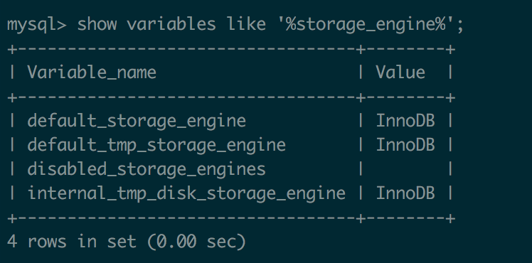

# 存储引擎

## 1. MyISAM 和InnoDB 区别

- MyISAM （MySQL 5.5 之前的默认数据库引擎）
  - 性能极佳，并且提供了大量特性，包括全文索引、压缩、空间函数等
  - **不支持事务和行级锁**
  - 最大缺陷**崩溃后无法安全恢复**
- InnoDB(MySQL 5.5 之后的默认存储引擎)：
  - 事务性数据库引擎

### 1.1 适合场景

- InnoDB存储引擎

  大多数场景，但是某些情况下使用 也是适合的如

- MyISAM 存储引擎

  读密集的情况下（不介意MyISAM 崩溃恢复问题）

### 1.2 两者对比

|                  | MyISAM                            | InnoDB                                              |
| ---------------- | --------------------------------- | --------------------------------------------------- |
| 是否支持行级锁   | 只有表级锁（table-level locking） | 支持行级锁（row-level locking）和表级锁，默认行级锁 |
| 是否支持事务     | 不支持                            | 支持                                                |
| 崩溃后的安全恢复 | 不支持                            | 支持                                                |
| 支持外键         | 不支持                            | 支持                                                |
| 支持MVCC         | 不支持                            | 支持                                                |

### 1.3 MVCC

- 在应对高并发事务，MVCC 比单纯的加锁更高效，
- MVCC 只在READ COMMITED 和 REPEATABLE READ 两个隔离级别下工作。

- MVCC 可以使用乐观（optimistic）锁和 悲观（pessimistic）锁来实现

## 2. 查看存储引擎

### 2.1 查看MySQL提供的所有存储引擎

```
mysql> show engines;
```


从上图我们可以出Mysql 当前的默认存储引擎是InnoDB,也提示了innoDB 支持事务，行级锁等特性

### 2.2 查看MySQL 当前默认的存储引擎

```
show variables like '%storage_engine%';
```



### 2.3 查看表的存储引擎

```
show table status like "t_user";
```

