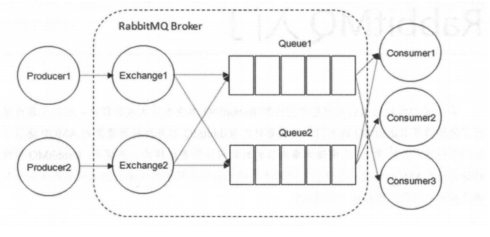
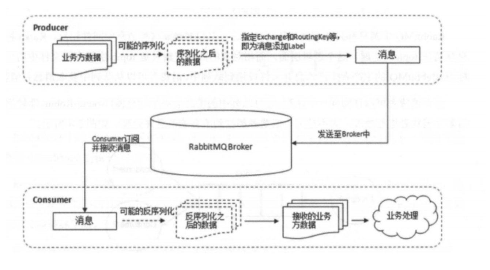
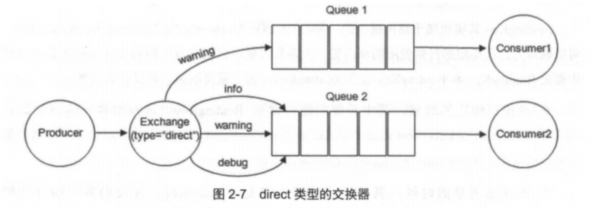
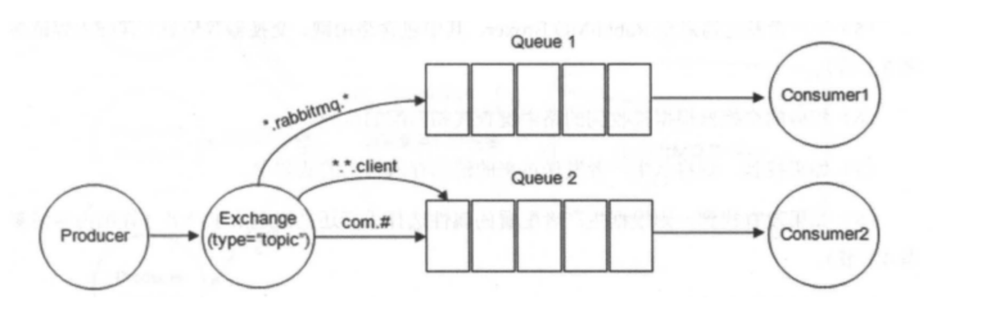

# RabbitMQ基础

## 1. 简介

RabbitMQ 是采用Erlang 语言实现 AMQP(Advanced Message Queuing Protocol，高级消息队列协议) 的消息中间件，最初起源于金融系统，用于在分布式系统中存储转发消息。

**具有如下特点**

- **可靠性**：RabbitMQ 使用一些机制来保证消息的可靠性，如持久化、传输确认及发布确认等
- **灵活的路由**：在消息进入队列之前，通过交换器来路由消息。对于典型的路由功能，RabbitMQ 已经提供了一些内置的交换器来实现。针对更复杂的路由功能，可以将多个交换器绑定在一起，也可以通过插件机制来实现自己的交换器。
- **扩展性**：多个RabbitMQ 节点可以组成一个集群，也可以根据实际业务情况动态地扩展集群中的节点
- **高可用性**：队列可以在集群中的机器上设置镜像，使得在部分节点出现问题的情况下队列仍然可用
- **支持多种协议**：RabbitMQ 除了原生支持 AMQP 协议，还支持 STOMP、MQTT等多种消息中间件协议
- **多语言客户端**：RabbitMQ 几乎支持所有常用语言，比如Java、Python、Ruby、PHP等
- **易用的管理界面**：RabbitMQ提供了一个易用的用户界面，使得用户可以监控和管理消息、集群中的节点等。
- **插件机制**：RabbitMQ 提供了许多插件，以实现从多个方面进行扩展，当然也可以编写自己的插件

## 2. 核心概念

RabbitMQ 整体上是一个生产者与消费者模型，主要负责接收、存储和转发消息。

> 可以把消息传递的过程想象成：当你将一个包裹送到邮局，邮局会暂存并最终将邮件通过邮递员送到收件人的手上，RabbitMQ 就好比邮局、邮箱和邮递员组成的一个系统（从计算机术语层面来说，RabbitMQ 模型更像是一种交换机模型）

### 2.1 整体架构

### 

#### 2.1 Producer(生成者)和 Consumer(消费者)

- **Producer(生产者)**：生产消息的一方（邮件投递者）
- **Consumer(消费者)**：消费消息的一方（邮件收件人）

消息一般由2部分组成：消息头（或者说是标签Label）和消息体。

- 消息体:

  消息体也可以称为payLoad，消息体是不透明的,

- 消息头则由一系列可选属性组成，这些属性包括routing-key（路由键）、priority（相对于其他消息的优先权）、delivery-mode（指出该消息可能需要持久性存储）等。

生产者把消息交由RabbitMQ后，RabbitMQ会**根据消息头把消息发送给感兴趣的Consumer(消费者)**。

#### 2.2 Exchange(交换器)

在RabbitMQ 中，消息并不是直接被投递到 Queue（消息队列）中的，中间还需要**经过 Exchange(交换器)这一层**。Exchange(交换器)会把我们的消息分配到对应的Queue（消息队列）中

**Exchange(交换器)用来接收生产者发送的消息并将这些消息路由给服务器中队列中**，如果路由不到，或者会返回给Producer（生产者），或许会被直接丢弃掉。（这里可以将RabbitMQ）中的交换器看做一个简单的实体。

##### 2.2.1 Exchange 的四种策略

**RabbitMQ 的Exchange（交换器）有四种类型，不同的类型对应着不同的路由策略**

- direct（默认的）
- fanout
- topic
- headers

不同类型的Exchange转发消息的策略有所区别。

##### 2.2.2 Exchange(交换器)示意图

### 2.3 Banding 绑定

生产者将消息发给交换器的时候，一般会指定一个 RoutingKey(路由键)，用来指定这个消息的路由规则，而这个RoutingKey需要与交换器类型和绑定键（Bindingkey）联合使用才能最终生效

RabbitMQ 中通过 Binding(绑定) 将 Exchange(交换器)与 Queue（消息队列）关联起来，在绑定的时候，一般会指定一个BindingKey(绑定键)，这样RabbitMQ 就知道如何正确的将消息路由到队列了

如下图所示，一个绑定就是基于路由键将交换器和消息队列连接起来的路由规则，所以可以将交换器理解成一个由绑定构成的路由表。Exchange和 Queue 的绑定可以是多对多的关系

##### 2.3.1 Binding（绑定）示意图

生产者将消息发送给交换器时，需要一个RoutingKey，当BindingKey 和 RoutingKey 相匹配时，消息会被路由到对应的队列中。在绑定多个队列到同一个交换器的时候，这些绑定允许使用相同的BindKey。BindKey并不是在所有的情况下都生效，它依赖于交换器类型，比如fanout 类型的交换器就会无视，而是将消息路由到所有绑定到该交换器的队列中

## 2.4 Queue（消息队列）

**Queue(消息队列)用来保存消息直到发送给消费者。他是消息的容器，也是消息的终点**。一个消息可投入一个或多个队列。消息一直在队列里面，等待消费者连接到这个队列将其取走

RabbitMQ 中消息只能存储在 **队列** 中，这一点和kafka 这种中间件相反。**kafka 将消息存储在topic（主题）**这个逻辑层面，而相对应的队列逻辑知识topic实际存储文件中的位移标识。RabbitMQ 的生产者生产消息并最终投递到队列中，消费者可以从队列中获取消息并消费。

**多个消费者可以订阅同一个队列**，这时队列中的消息会被平均分摊（Round-Robin，即轮询）给多个消费者进行处理，而不是每个消费者都收到所有的消息并处理，这样避免的消息被重复消费

RabbitMQ 不支持队列层面的广播消费，如果有广播消费的需求，需要在其上进行二次开发，这样会很麻烦，不建议这样做

### 2.5 Broker（消息中间件的服务节点）

对于 RabbitMQ 来说，一个RabbitMQ Broker 可以简单地看作是一个RabbitMQ 服务节点，或者RabbitMQ服务实例。大多数情况下也可以讲一个RabbitMQ Broker 看作一台 RabbitMQ 服务器。

下图展示了生成者将消息存入 RabbitMQ Broker,以及消费者从Broker 中消费数据的整个流程

## 3. Exchange Types(交换器类型)

RabbitMQ常用的 Exchange Type 有 fanout、direct、topic、headers 这四种（AMQP规范里还提到两种 Exchange Type，分别为 system 与 自定义，这里不予以描述）

- fanout

  fanout 类型的Exchange 路由规则非常简单，他会把所有发送到该Exchange的消息路由到所有与他绑定的Queue 中，不需要做任何判断操作，所以fanout 类型是所有的交换机类型里面速度最快的，fanout 类型常用来广播消息

- direct

  direct类型的Exchange 路由规则也很简单，他会把消息路由到那些Bindingkey 与 RoutingKey 完全匹配的 Queue中。

  

  以上图呀为例，如果发送消息的时候设置路由键为“wraning”，那么消息会路由到Queue1 和 Queue2 。如果在发送消息的时候，设置路由键为info或者“debug”，那么消息只会路由到Queue2.如果以其他的路由键发送消息，则消息不会路由到这两个队列中。
  direct 类型常用在处理有优先级的任务，根据任务的优先级吧消息发送到对应的队列，这样可以指派更多的资源去处理高优先级的队列

- topic

  前面讲到direct类型的交换器路由规则是完全匹配 BindingKey 和 RoutingKey ，但是这种严格的匹配方式在很多情况下不能满足实际业务的需求。topic类型的交换器在匹配规则上进行了扩展，它与 direct 类型的交换器相似，也是将消息路由到 BindingKey 和 RoutingKey 相匹配的队列中，但这里的匹配规则有些不同，它约定：

  - RoutingKey 为一个点号“．”分隔的字符串（被点号“．”分隔开的每一段独立的字符串称为一个单词），如 “com.rabbitmq.client”、“java.util.concurrent”、“com.hidden.client”;
  - BindingKey 和 RoutingKey 一样也是点号“．”分隔的字符串；
  - BindingKey 中可以存在两种特殊字符串“*”和“#”，用于做模糊匹配，其中“*”用于匹配一个单词，“#”用于匹配多个单词(可以是零个)。

​	以上图为例：

- 路由键为 “com.rabbitmq.client” 的消息会同时路由到 Queuel 和 Queue2;
- 路由键为 “com.hidden.client” 的消息只会路由到 Queue2 中；
- 路由键为 “com.hidden.demo” 的消息只会路由到 Queue2 中；
- 路由键为 “java.rabbitmq.demo” 的消息只会路由到Queuel中；
- 路由键为 “java.util.concurrent” 的消息将会被丢弃或者返回给生产者（需要设置 mandatory 参数），因为它没有匹配任何路由键。

- headers（不推荐）

  headers 类型的交换器不依赖于路由键的匹配规则来路由消息，而是根据发送的消息内容中的 headers 属性进行匹配。在绑定队列和交换器时制定一组键值对，当发送消息到交换器时，RabbitMQ会获取到该消息的 headers（也是一个键值对的形式)'对比其中的键值对是否完全匹配队列和交换器绑定时指定的键值对，如果完全匹配则消息会路由到该队列，否则不会路由到该队列。headers 类型的交换器性能会很差，而且也不实用，基本上不会看到它的存在。

