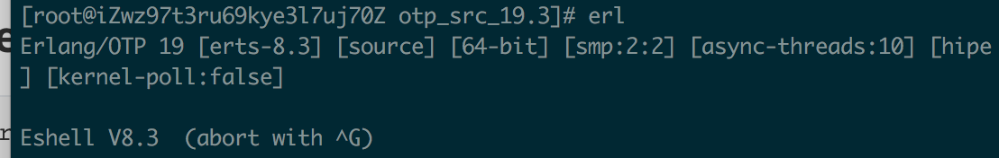
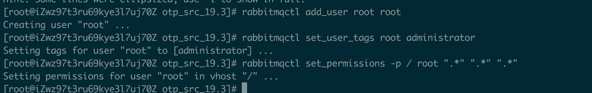
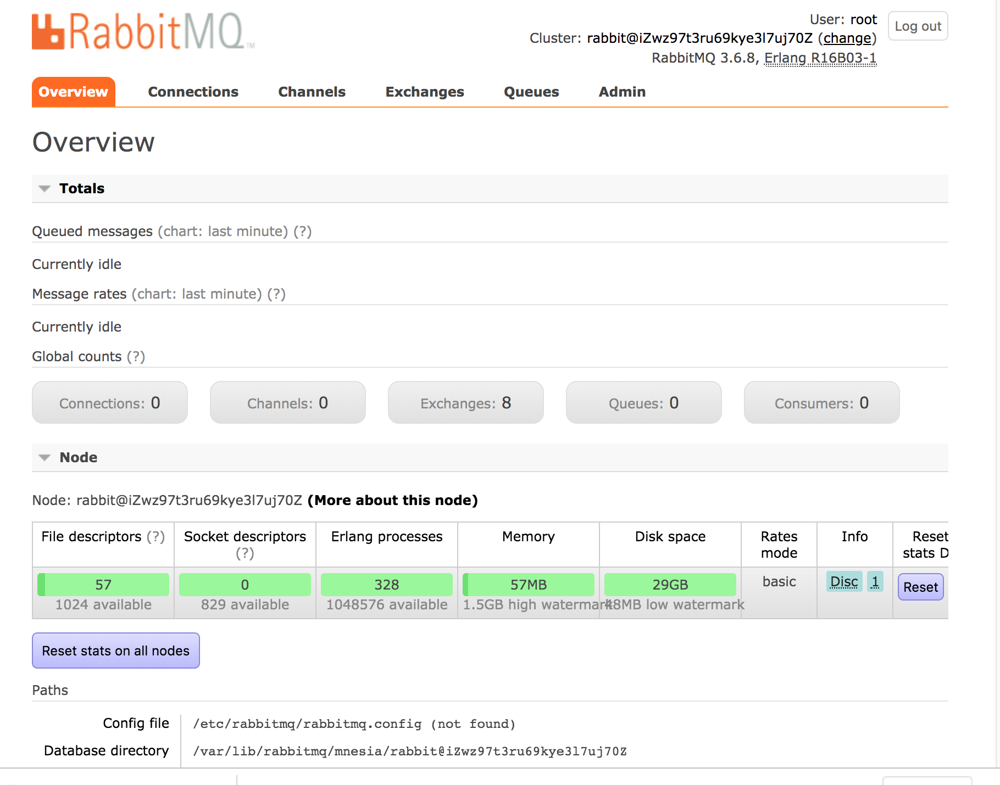

# RabbitMQ安装

## 1. 安装erlang

### 1.1 下载erlang 安装包

在官网下载然后上传到 Linux 上或者直接使用下面的命令下载对应的版本。

```
wget http://erlang.org/download/otp_src_19.3.tar.gz
```

### 1.2 解压erlang 安装包

```
tar -xvzf otp_src_19.3.tar.gz
```

### 1.3 删除erlang 安装包

```
rm -rf otp_src_19.3.tar.gz
```

### 1.4 安装erlang 的依赖工具

```
yum -y install make gcc gcc-c++ kernel-devel m4 ncurses-devel openssl-devel unixODBC-devel
```

### 1.5 进入 erlang 安装包解压文件对erlang 进行安装环境的配置

在/usr/local新建一个文件夹

```
mkdir erlang
```

对erlang 进行安装环境配置

```
./configure --prefix=/usr/local/erlang --without-javac
```

### 1.6 编译安装

```
make && make install
```

### 1.7 验证erlang 是否安装成功

```
./bin/erl
```

运行下面的语句输出“hello world”

```
io:format("hello world~n", []).
```


到此就安装完毕

### 1.8 配置 erlang 环境变量

```
vim /etc/profile
```

追加下列环境变量到文件末尾

```
#erlang
ERL_HOME=/usr/local/erlang
PATH=$ERL_HOME/bin:$PATH
export ERL_HOME PATH
```

运行下列命令使配置文件`profile`生效

```
source /etc/profile
```

输入 erl 查看 erlang 环境变量是否配置正确

## 2. 安装 RabbitMQ

### 2.1 下载 rpm

```
wget https://www.rabbitmq.com/releases/rabbitmq-server/v3.6.8/rabbitmq-server-3.6.8-1.el7.noarch.rpm
```

### 2.2 安装rpm

```
rpm --import https://www.rabbitmq.com/rabbitmq-release-signing-key.asc
```

紧接着执行

```
yum install rabbitmq-server-3.6.8-1.el7.noarch.rpm
```

### 2.3 开启 web 管理插件

```
rabbitmq-plugins enable rabbitmq_management
```

### 2.4 设置开机启动

```
chkconfig rabbitmq-server on
```

### 2.5 启动服务

```
service rabbitmq-server start
```

### 2.6 查看服务状态

```
service rabbitmq-server status
```

### 2.7 访问RabbitMQ 控制台

浏览器访问：[http://你的ip地址:15672/](http://xn--ip-0p3ck01akcu41v:15672/)

默认用户名和密码： guest/guest;但是需要注意的是：guestuest用户只是被容许从localhost访问。官网文档描述如下：

```
“guest” user can only connect via localhost
```

**解决远程访问 RabbitMQ 远程访问密码错误**

新建用户并授权

```
rabbitmqctl add_user root root
rabbitmqctl set_user_tags root administrator
rabbitmqctl set_permissions -p / root ".*" ".*" ".*"
```



再次访问:[http://你的ip地址:15672/](http://xn--ip-0p3ck01akcu41v:15672/) ,输入用户名和密码：root root

