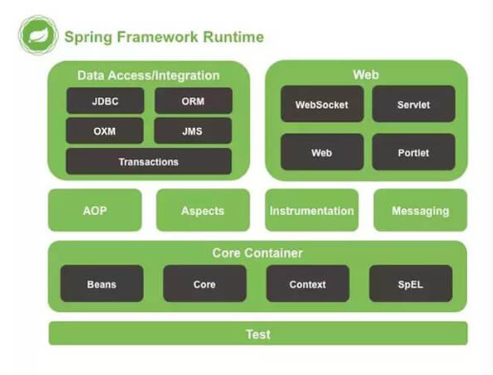

# Spring整体架构

# 1. 什么是 Spring Framework？

Spring 是一个开源应用框架，旨在降低应用程序开发的复杂度

- 它是轻量级、松散耦合的

  轻量级相对于EJB，随着Spring 的体系越来越庞大，大家被Spring 的配置搞懵了，所以后来出了Spring Boot

- 它具有分层体系架构，允许用户选择组件，同时还为J2EE 应用程序开发提供了一个有凝聚力的框架

- 他可以集成其他框架，如Spring MVC,Hibernate,MyBatis等，所以又称为框架的框架（粘合剂，脚手架）

## 2. Spring Framework 中有多少个模块，他们分别是什么？

Spring Framework 的模块图

- **Spring 核心容器**（图中的Core Container）

  该层基本上是Spring Framework 的核心(其实就是 Spring IOC)。它包含以下模块：

  - Spring Core

  - Spring Bean

    核心容器提供 Spring 框架的基本功能。核心容器的主要组件是BeanFactory，它是工厂模式的实现，BeanFactory 使用控制反转（IOC）模式将应用程序的配置和依赖性规范与实际的应用程序代码分开。

  - Spring Context

    Spring 上下文是一个配置文件，向Spring 框架提供上下文信息。Spring 上下文包括企业服务，例如JNDO,EJB、电子邮件，国际化、事件机制、校验的调度功能

  - SpEL(Spring Expression Language)

- **数据访问**（图中的Data Access）

  该层提供与数据库交互的支持。它包含以下模块：

  - JDBC(Java DataBase Connectivity)

    Spring 对 JDBC 的封装模块，提供了对关系数据库的访问

  - ORM(Object Relational Mapping)

    Spring ORM 模块，提供了对hibernate5 和 JPA 的集成

    - hibernate5 是一个 ORM 框架
    - JPA 是一个 Java 持久化 API

  - OXM(Object XML Mappers)

    Spring 提供了一套类似 ORM 的映射机制，用来将 Java 对象和 XML 文件进行映射。

  - Transaction

    Spring 简单而强大的事务管理功能，包含申明式事务和编程式事务

- **Web**

  该层提供了创建Web 应用程序的支持。他包含以下模块

  - WebMVC 

    >MVC 框架 死一个全功能的构建Web 应用程序的MVC 实现。通过策略接口，MVC框架变成为高度可配置的，MVC 容纳了大量的视图技术，其中包括 JSP、Velocity、Tiles、iText 和 POI

  - WebFlux

    >基于 Reactive 库的响应式的Web 开发框架
  
  - WebSocket
  
    >Spring 4.0 的一个最大更新是增加了对Websocket 的支持。Websocket 提供了一个在Web 应用中实现高效、双向通讯、需考虑客户端（浏览器）和服务端之间高频和低延时消息交换的机制。一般的应用场景有：在线交易，网页聊天，游戏、协作、数据可视化等
  
- AOP

  该层支持面向切面编程，包含以下模块

  - AOP

    >通过配置管理特性、Spring AOP 模块直接将面向切面的编程功能集成到了Spring 框架中，所以，可以很容易地使Spring 框架管理的任何对象支持AOP
    >
    >Spring AOP 模块为基于Spring 的应用程序中的对象提供了事务管理服务。通过使用Spring AOP，不用依赖EJB组件们就可以将声明式事务集成到应用程序中

  - Aspects

    该模块为与AspectJ 的继承提供支持

  - Instrumentation

    >该层为类检测和类加载器实现提供支持。（PS: 用得比较少）

**其他**

- JMS(Java Message Service)

  >提供了一个JMS 集成框架，简化了 JMS API 的使用。

- Test

  >该模块为使用JUnit 和TestNG 进行测试提供支持

- Messaging

  >该模块为STOMP 提供支持。他还支持注解编程模型，该模型用于从WebSocket 客户端路由和处理 STOMP消息

## 3. 使用 Spring 框架能带来哪些好处？

- **DI**: Dependency Injection(DI) 方法，使得构造器和JavaBean、properties 文件中的依赖关系一目了然
- **轻量级**：与EJB 容器相比较，IoC容器更加倾向于**轻量级**。这样一来 IoC 容器在有限的内存和 CPU 资源的情况下，进行应用程序的开发和发布就变得十分有利
- **面向切面编程（AOP）**: Spring 支持**面向切面编程**，同时把应用的业务逻辑与系统的服务分离开来
- **集成主流框架**：Spring 并没有闭门造车，Spring 集成了已有的技术栈，比如ORM 框架、Logging 日期框架、J2EE、Quartz 和 JDK Timer，以及其他视图技术
- 模块化：Spring 框架是按照**模块**的形式来组织的。由包和类的命名，就可以看出其所属的模块，开发者仅仅需要选用他们需要的模块即可。
- **便捷的测试**：
- **Web 框架：**Spring 的Web 框架亦是一个精心设计的Web MVC 框架，为开发者们在 Web 框架的选择上提供了一个除了主流框架比如 Struts 、过度设计的、不流行 Web 框架的以外的有力选项。
- **事务管理：**Spring 提供了一个便捷的**事务管理**接口，适用于小型的本地事务处理（比如在单DB 的环境下）和复杂的共同事务处理（比如利用JTA 的复杂DB环境）
- **异常处理**：Spring 提供一个方便的API,将特定技术的异常（由JDBC，Hibernate，或JDO抛出）转化为一致的、Unchecked异常。

### 3.1 Spring 框架带来的缺点

- 每个框架都有可能存在问题，调试阶段不直观，后期的bug 对应阶段、不容易判断问题所在。要花一定时间去理解他

- 把很多JavaEE 的东西封装了，在满足快速开发高质量程序的同时，隐藏了实现细节

  > 离开Spring 之后，就不知道怎么工作。从 Java 工程师，变成了Spring 工程师

## 4. Spring 框架中都用到了哪些设计模式？

Spring 框架中使用到了大量的设计模式，下面列举了一些比较有代表性的

- 代理模式： 在AOP 和 remoting 中被用的比较多
- 单例模式：在Spring 配置文件中定义的Bean 默认为单例模式
- 模板方法：用来解决代码重复的问题。比如 RestTemplate、JdbcTemplate
- 工厂模式：BeanFactory 用来创建对象的实例
- 前端控制器：Spring 提供了 DispatcherServlet 来对请求进行分发
- 依赖注入：贯穿于BeanFactory/ApplicationContext 接口的核心理解