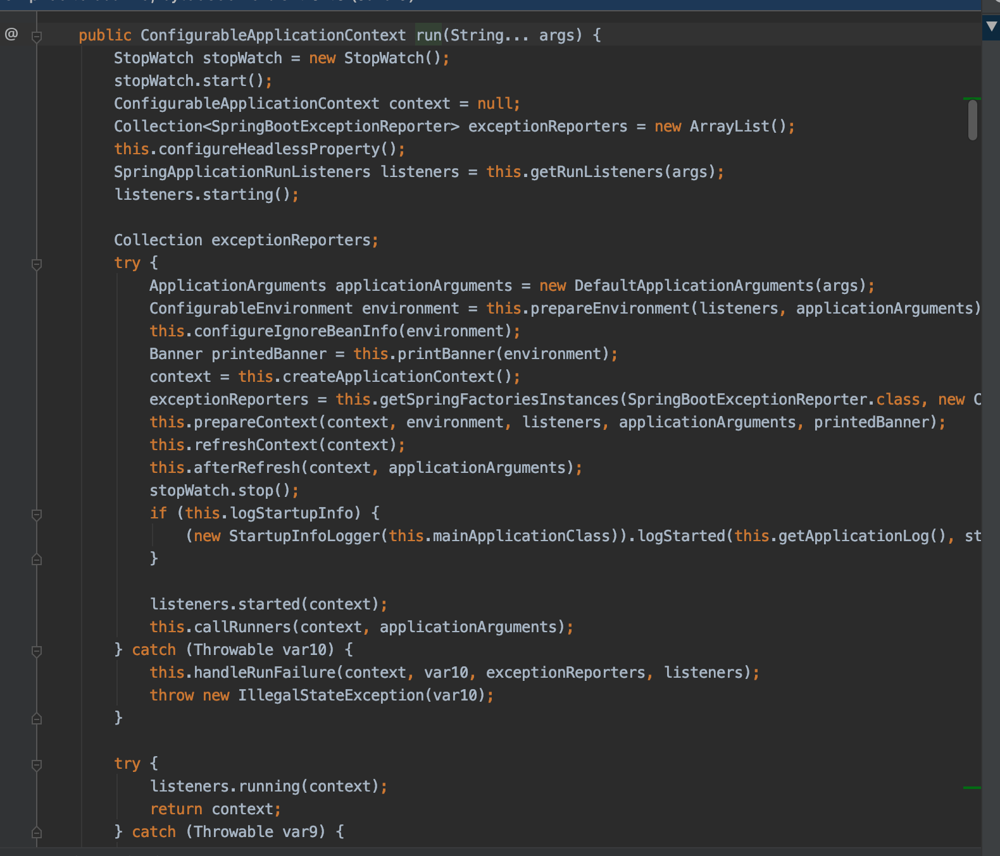
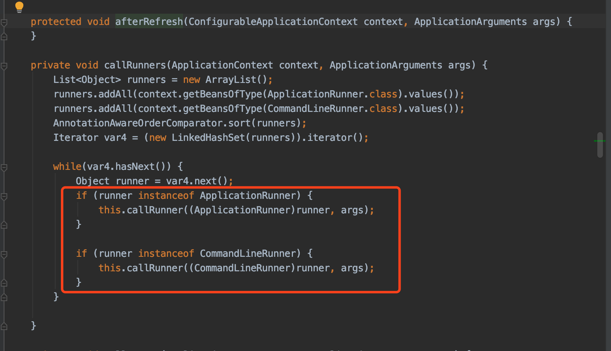

# SpringBoot启动过程

### 1. 概述

SpringBoot 的启动很简单，代码如下：

```java
@SpringBootApplication
public class MyApplication {
    public static void main(String[] args) {
        SpringApplication.run(MyApplication.class, args);
    }
}
```

从代码上可以看出，调用了SpringApplication的静态方法run。这个run 方法会**构造一个SpringApplication的实例**，然后再调用这里实例的**run方法就表示启动SpringBoot**。

1. 构造一个SpringApplication的实例
2. run方法就表示启动SpringBoot


## 2. 总结

SpringBoot启动的时候，不论调用什么方法，都会构造一个SpringApplication的实例，然后调用这个实例的run方法，这样就表示启动SpringBoot。

### 2.1 构造一个SpringApplication的实例

在run方法调用之前，也就是**构造SpringApplication的时候会进行初始化的工作**，初始化的时候会做以下几件事：

1. 把参数sources设置到SpringApplication属性中，这个sources可以是任何类型的参数。本文的例子中这个sources就是MyApplication的class对象
2. 判断是否是web程序，并设置到webEnvironment这个boolean属性中
3. 找出所有的初始化器，默认有5个，设置到initializers属性中
4. 找出所有的应用程序监听器，默认有9个，设置到listeners属性中
5. 找出运行的主类(main class)


## 2.2 run方法

SpringApplication构造完成之后调用run方法，启动SpringApplication，run方法执行的时候会做以下几件事：

1. 构造一个StopWatch，观察SpringApplication的执行
2. 找出所有的SpringApplicationRunListener并封装到SpringApplicationRunListeners中，用于监听run方法的执行。监听的过程中会封装成事件并广播出去让初始化过程中产生的应用程序监听器进行监听
3. 构造Spring容器(ApplicationContext)，并返回
   3.1 创建Spring容器的判断是否是web环境，是的话构造AnnotationConfigEmbeddedWebApplicationContext，否则构造AnnotationConfigApplicationContext
   3.2 初始化过程中产生的初始化器在这个时候开始工作
   3.3 Spring容器的刷新(完成bean的解析、各种processor接口的执行、条件注解的解析等等)
4. 从Spring容器中找出ApplicationRunner和CommandLineRunner接口的实现类并排序后依次执行



run方法的第4步



## 面试真题

你能讲一下SpringBootApplication的启动过程是怎么样子？

>SpringBoot启动的时候，会构造一个SpringApplication的实例，然后调用这个实例的run方法。这就表示启动了SpringBoot
>
>构造SpringApplication实例的时候
>
>1. 把参数设置到SpringApplication属性
>2. 判断是否是web程序
>3. 找出所有的初始化器
>4. 找出所有的应用程序监听器
>5. 找出运行的主类
>
>运行run方法
>
>1. 构造一个StopWatch，观察SpringApplication的执行
>2. SpringApplicationRunListener 监听run方法的执行
>3. 构造Spring容器(ApplicationContext)，并返回
>4. 从Spring容器中找出ApplicationRunner和CommandLineRunner接口的实现类并排序后依次执行

## 参考文章

[SpringBoot源码分析之SpringBoot的启动过程](https://fangjian0423.github.io/2017/04/30/springboot-startup-analysis/)

