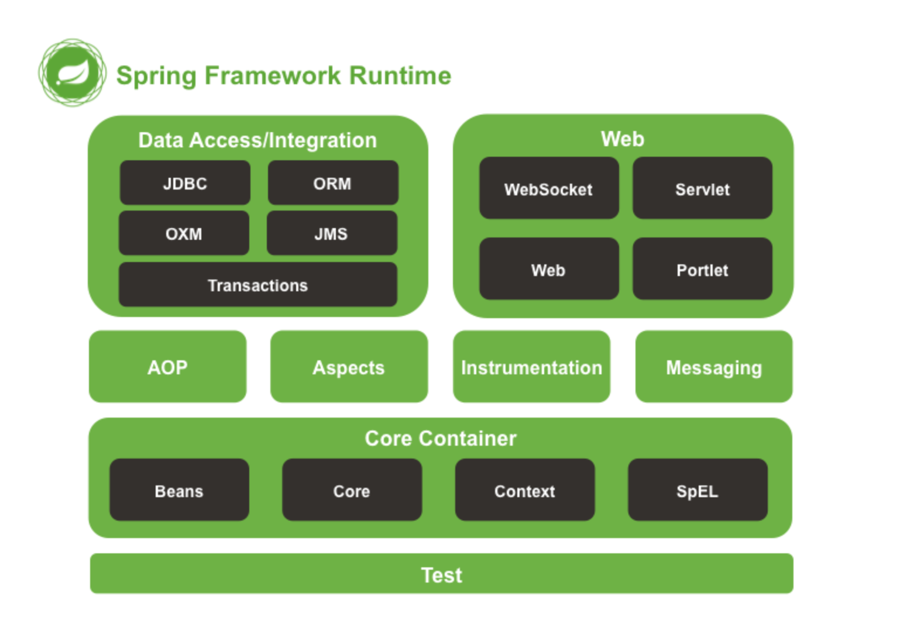
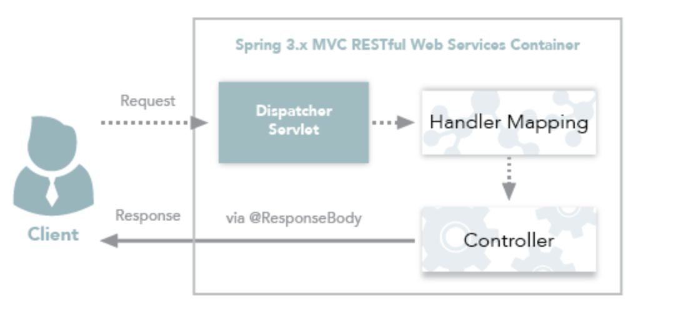
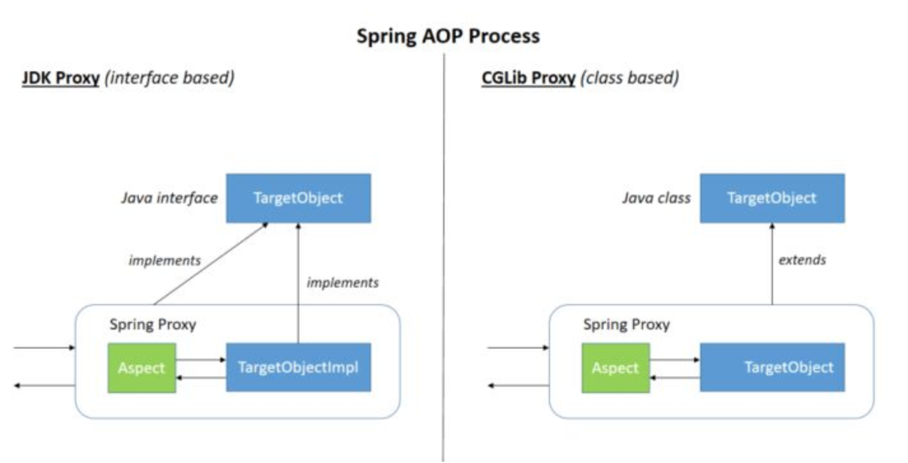
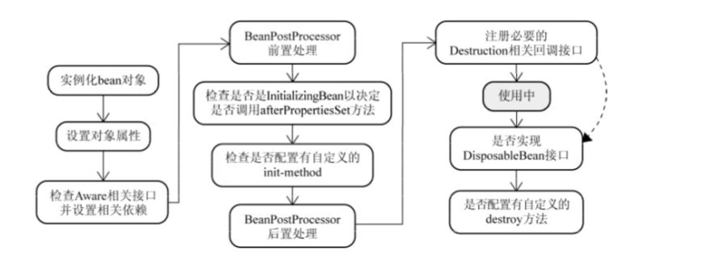
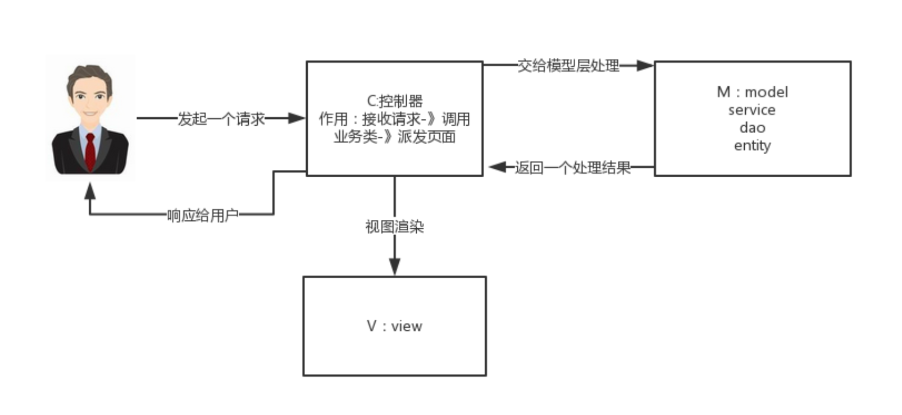
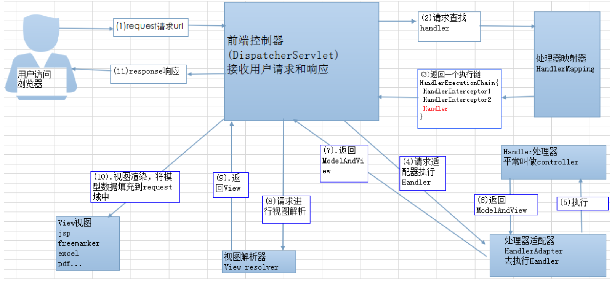

# Spring常见知识点

## 1. 什么是Spring框架

Spring 是一种轻量级开发框架，旨在提高开发人员的开发效率以及系统的可维护性

我们一般说的Spring框架指的都是Spring Framwork，他是很多模块的集合，使用这些模块可以很方便地协助我们进行开发：

主要涉及的模块：

- 核心容器
- 数据访问/集成
- Web
- AOP(面向切面编程)
- 工具
- 消息
- 测试模块

Spring官网列出的Spring的6个特性

- **核心技术**：依赖注入（DI）,AOP, 事件（events）,资源，i18n,验证，数据绑定，类型转换，SpEL
- **测试** ：模拟对象，TestContext框架，Spring MVC 测试，WebTestClient。
- **数据访问** ：事务，DAO支持，JDBC，ORM，编组XML。
- **Web支持** : Spring MVC和Spring WebFlux Web框架。
- **集成** ：远程处理，JMS，JCA，JMX，电子邮件，任务，调度，缓存。
- **语言** ：Kotlin，Groovy，动态语言。

## 2. 列举一些重要的Spring模块？

下图对应的是Spring4.X 版本，目前最新的5.X版本中Web模块的Portlet组件已经被废弃掉，同时增加了用于异步响应式处理的WebFlux 组件



- **Spring Core**: 基础，可以说 Spring 其他所有的功能都需要依赖于该类库，主要提供Ioc 依赖注入功能
- **Spring Aspects**: 该模块为与AspectJ 的集成提供支持
- **Spring AOP**: 提供了面向切面的编程实现
- **Spring JDBC**: java数据库连接
- **Spring JMS**: java消息服务
- **Spring ORM**: 用于支持Hibernate 等ORM工具
- **Spring Web**:为创建Web应用程序提供支持
- **Spring Test**: 提供了对Junit 和TestNG 测试的支持

## 3. @RestController 和@Controller

### 3.1 Controller 返回一个页面

单独使用@Controller 不加@ResponseBody 的话一般使用在要返回一个视图的情况，这种情况属于比较传统的Spring MVC 的应用，对应于前后端不分离的情况


### 3.2 @RestController 返回JSON 或XML 形式数据

@RestController 只返回对象，对象数据直接以 JSON 或 XML 形式写入HTTP 响应（Response）中，这种情况属于RESTful Web服务，这也是目前开发所接触的最常用的情况（前后端分离）


### 3.3 @Controller+@Responsebody 返回Json或xml形式数据

如果你需要在Spring4之前开发 RESTful Web服务的话，你需要使用`@Controller` 并结合`@ResponseBody`注解，也就是说`@Controller` +`@ResponseBody`= `@RestController`（Spring 4 之后新加的注解）。

> `@ResponseBody` 注解的作用是将 `Controller` 的方法返回的对象通过适当的转换器转换为指定的格式之后，写入到HTTP 响应(Response)对象的 body 中，通常用来返回 JSON 或者 XML 数据，返回 JSON 数据的情况比较多。



## 4. Spring IOC 

### 4.1 谈谈自己对Spring IoC 的理解

Ioc（Inverse of Control:控制反转）是一种**设计思想**，就是**将原本在程序中手动创建对象的控制权，交由Spring框架来管理**。Ioc 在其他语言中也有应用，并非Spring特有。**IoC 容器是Spring 用来实现 Ioc的载体，IoC 容器实际上就是个Map<key,value>,Map中存放的是各种对象**

> 将对象之间的相互依赖关系交给IoC容器来管理，并由 IoC 容器完成对象的注入。这样可以很大程度简化应用的开发，把应用从复杂的依赖关系中解放出来。IoC 容器就想一个工厂一样，当我们需要创建一个对象的时候，**只需要配置好配置文件/注解即可，完全不用考虑对象如何被创建出来**。在实际项目中一个Service 类可能有几百甚至上千个类作为他的底层，加入我们需要实例化这个Service。你可能每次都要搞清这个Service 所有底层类构造函数，这可能会把人逼疯。如果我们利用IoC的话，你只需要配置好，然后在需要的地方引用就行了，这大大增加了项目的可维护性且降低了开发难度
>
> Spring 时代我们一般通过 XML 文件来配置 Bean，后来开发人员觉得 XML 文件来配置不太好，于是 SpringBoot 注解配置就慢慢开始流行起来。

### 4.2 Spring IoC的初始化过程


### 4.3 IoC容器有几种类型

- BeanFactory
- ApplicationContext

### 4.4 BeanFactory和ApplicationContext有什么区别？

beanfactory是基本容器，而applicationcontext是高级容器。Applicationcontext是扩展了beanfactory的接口。Applicationcontext比beanfactory提供了更多东西，比如跟aop的集成, 消息资源处理等等。


## 5. AOP

### 5.1 谈谈自己对Spring AOP 的理解

AOP(Aspect-Oriented Programming: 面向切面编程)：**能够分离系统的业务逻辑和系统服务**（例如，事务处理，日志管理，权限管理），便于**减少系统的重复代码，降低模块间的耦合度，并有利于未来的可扩展性和可维护性**

Spring AOP 就是基于动态代理的，如果要代理的对象，实现了某个接口，那么Spring AOP 会使用 **JDK Proxy**, 去创建代理对象，而对于没有实现接口的对象，就无法使用 JDK Proxy 去进行代理了，**这时候 Spring AOP 会使用 Cglib 生成一个被代理对象的子类来作为代理**



> 当然你也可以使用AspectJ ，Spring AOP 已经集成了AspectJ,AspectJ 应该算的上是 Java 生态系统中最完整的 AOP 框架了。

> 使用 AOP 之后我们可以把一些通用功能抽象出来，在需要用到的地方直接使用即可，这样大大简化了代码量。我们需要增加新功能时也方便，这样也提高了系统扩展性。日志功能、事务管理等等场景都用到了 AOP 。

### 5.2 Spring AOP 和 AspectJ AOP 有什么区别

- **Spring AOP 属于运行时增强，而AspectJ 是编译时增强。**
- Spring AOP基于代理（Proxying），而AspectJ 基于字节码操作（Bytecode Manipulation）

- Spring AOP 已经集成了 AspectJ ，AspectJ 应该算的上是 Java 生态系统中最完整的 AOP 框架了。AspectJ 相比于 Spring AOP 功能更加强大，但是 Spring AOP 相对来说更简单
- 如果切面比较少，两者性能差异不大。但是，当切面太多的话，最好选择AspectJ ,他比Spring AOP 快很多

## 6. Spring Bean

### 6.1 Spring 中 bean 的作用域有哪些？

- singleton: 唯一 bean 实例，Spring 中 bean 默认都是单例的

- prototype: 每次请求都会创建一个新的 bean 实例

- request：每一次HTTP请求都会产生一个新的bean，该bean仅在当前的Http request 内有效

- session：每一次Http请求都会产生一个新的bean，该bean 仅在当前 HTTP session 内有效

- global-session：全局session作用域，仅仅在基于portlet的web应用中才有意义，Spring5已经没有了。

  Portlet是能够生成语义代码(例如：HTML)片段的小型Java Web插件。它们基于portlet容器，可以像servlet一样处理HTTP请求。但是，与 servlet 不同，每个 portlet 都有不同的会话

### 6.2 Spring 中的单例 bean 的线程安全问题

单例bean 存在线程安全问题，主要是因为当多个线程操作同一个对象的时候，对这个对象的非静态成员变量的写操作可存在线程安全问题

常见的两种解决办法：

1. 在Bean 对象中尽量避免定义可变的成员变量（不太现实）
2. 在类中定义一个ThreadLocal 成员变量，将需要的可变成员变量保存在 ThreadLocal 中（推荐的一种方式）

### 6.3 @Component 和 @Bean 的区别是什么

1. 作用对象不同：`@Component`注解作用于类，而`@Bean`注解作用于方法
2. `@Component` 通常是通过类路径扫描来自动侦测以及自动装配到Spring 容器中（我们可以使用@ComponentScan 注解定义要扫描的路径从中找出标识了需要装配的类自动装配到Spring 的 bean 容器中）。@Bean 注解通常是我们在标有该注解的方法中定义产生这个bean。@Bean告诉Spring 这是某个类的示例，当我们需要用它的时候还给我
3. @Bean 注解比@Component 注解的自定义性更强，而且很多地方我们只能通过@Bean注解来注册bean，比如当我们引用第三方库中的类需要装配到`Spring` 容器时，则只能通过 @Bean 来实现

@Bean 注解使用实例

```java
@Configuration
public class AppConfig {
    @Bean
    public TransferService transferService() {
        return new TransferServiceImpl();
    }

}
```

上面的代码相当于下面的 xml 配置

```xml
<beans>
    <bean id="transferService" class="com.acme.TransferServiceImpl"/>
</beans>
```

下面这个例子是通过@Component 无法实现的

```java
@Bean
public OneService getService(status) {
    case (status)  {
        when 1:
                return new serviceImpl1();
        when 2:
                return new serviceImpl2();
        when 3:
                return new serviceImpl3();
    }
}
```


### 6.4 将一个类声明为Spring 的bean的注解有哪些

我们一般使用 `@Autowired` 注解自动装配 bean，要想把类标识成可用于 `@Autowired` 注解自动装配的 bean 的类,采用以下注解可实现：

- `@Component` ：通用的注解，可标注任意类为 `Spring` 组件。如果一个Bean不知道属于哪个层，可以使用`@Component` 注解标注。
- `@Repository` : 对应持久层即 Dao 层，主要用于数据库相关操作。
- `@Service` : 对应服务层，主要涉及一些复杂的逻辑，需要用到 Dao层。
- `@Controller` : 对应 Spring MVC 控制层，主要接收用户请求并调用 Service 层返回数据给前端页面。

### 6.5 Spring 中的bean 生命周期？

生命周期大体就是

1. 初始化构造函数
2. 设置对应属性
3. 判断是否实现了各个接口
   1. 若实现BeanNameAware接口，则调用setBeanName（）方法
   2. 若实现BeanFactoryAware接口，则调用setBeanFactory()方法
   3. 若实现ApplicationContextAware接口，则调用setApplicationContext()方法
   4. 若实现BeanPostProcessor接口，则调用postProcessBeforeInitialization()
   5. 初始化接口方法
      1. 若实现InitializingBean接口，则调用afterPropertiesSet()方法
      2. init-method 声明了初始化方法，该方法也会被调用
   6. 若实现BeanpostProcessor接口，则调用postProcessorAfterInitialization()方法
4. bean准备就绪，一直驻留在应用上下文，直到上下文销毁
5. 上下文销毁，额外处理
   1. 若实现DisposableBean接口，调用destory方法
   2. 若 destroy-method 申明了销毁方法，调用销毁方法

图示


对应的中文版



## 7. Spring MVC

### 7.1 说说自己对于Spring MVC 了解

MVC 是一种设计模式，Spring MVC 是一款很优秀的MVC 框架，Spring MVC 可以帮助我们进行更简洁的Web 层的开发，并且他天生与Spring 框架集成。

Spring MVC 下我们一般把后端项目分为 

- Controller 层（控制层，返回数据给前台页面）

- Service 层（处理业务）、
- Dao 层(数据库操作)
- Entity层（实体类）

**Spring MVC的简单原理**



### 7.2 SpringMVC 工作原理了解吗



Spring MVC 的入口函数也就是前端控制器 `DispatcherServlet` 的作用是接收请求，响应结果。

**流程说明（重要）**

1. 客户端（浏览器）发送请求，直接请求到DispatcherServlet
2. DispatcherServlet 根据请求信息调用 HandlerMapping，解析请求对应的 Handler
3. 解析到对应的 Handler（也就是Controller控制器）后，开始由HandlerAdapter 适配器处理
4. HandlerAdapter会根据 Hander 来调用真正的处理器处理请求，并处理相应的业务逻辑
5. 处理器处理完业务后，会返回一个ModelAndView对象，Model 是返回的数据对象，View 是个逻辑上的View
6. ViewResolver 会根据逻辑View 查找实际的View
7. DispaterServlet 把返回的 model 传给View （视图渲染）
8. 把view 返回给请求者（浏览器）

## 8. Spring 框架中用到哪些设计模式

- 工厂设计模式：Spring 使用工厂模式通过 BeanFactory、ApplicationContext 创建bean 对象
- 代理设计模式：Spring AOP 功能的实现
- 单例设计模式：Spring 中的Bean 默认都是单例的
- 模板方法模式：Spring 中的jdbcTemplate、hibernateTemplate等以template 结尾的对数据库操作的类，他们都使用到了模板模式
- 包装器设计模式：我们需要连接多个数据库，而且不同的客户在每次访问中根据需要会去访问不同的数据库，这种模式让我们可以根据客户的需求能够动态切换不同的数据源
- 观察者模式：Spring 事件驱动模型就是观察者模式很经典的一个应用
- 适配器模式：Spring AOP 的增强或通知（Advice）使用到了适配器模式、Spring MVC 中也是用到了适配器 模式适配controller
- …...

## 9. Spring 事务

### 9.1 Spring 管理事务的方式几种？

1. 编程式事务，在代码中硬编码（不推荐使用）
2. 声明式事务，在配置文件中配置（推荐使用）

**声明式事务又分为两种**

1. 基于XML 的声明式事务
2. 基于注解的声明式事务

### 9.2 Spring 事务中的隔离级别有哪几种

**TransactionDefinition 接口中定义了五个表示隔离级别的常量**

- **TransactionDefinition.ISOLATION_DEFAULT**: 使用后端数据库默认的隔离级别，Mysql 默认采用REPEATABLE_READ 隔离级别，Oracle默认采用READ_COMMITTED 隔离级别
- **TransactionDefintion**.**ISOLATION_READ_UNCOMMITTED:** 最低的隔离级别，允许读取尚未提交的数据变更，**可能会导致脏读、幻读或不可重复读**

- **TransactionDefinition.ISOLATION_READ_COMMITTED:** 允许读取并发事务已经提交的数据，**可以阻止脏读，但是幻读或不可重复读仍有可能发生**

- **TransactionDefinition.ISOLATION_REPEATABLE_READ:** 对同一字段的多次读取结果都是一致的，除非数据是被本身事务自己所修改，**可以阻止脏读和不可重复读，但幻读仍有可能发生。**
- **TransactionDefinition.ISOLATION_SERIALIZABLE:** 最高的隔离级别，完全服从ACID的隔离级别。所有的事务依次逐个执行，这样事务之间就完全不可能产生干扰，也就是说，**该级别可以防止脏读、不可重复读以及幻读**。但是这将严重影响程序的性能。通常情况下也不会用到该级别。

### 8.3 Spring 事务中哪几种事务传播行为?

**支持当前事务的情况**

- **TransactionDefinition.PROPAGATION_REQUIRED：** 如果当前存在事务，则加入该事务；如果当前没有事务，则创建一个新的事务。

- **TransactionDefinition.PROPAGATION_SUPPORTS：** 如果当前存在事务，则加入该事务；如果当前没有事务，则以非事务的方式继续运行。

- **TransactionDefinition.PROPAGATION_MANDATORY：** 如果当前存在事务，则加入该事务；如果当前没有事务，则抛出异常。（mandatory：强制性）

**不支持当前事务的情况**

- **TransactionDefinition.PROPAGATION_REQUIRES_NEW：** 创建一个新的事务，如果当前存在事务，则把当前事务挂起。
- **TransactionDefinition.PROPAGATION_NOT_SUPPORTED：** 以非事务方式运行，如果当前存在事务，则把当前事务挂起。
- **TransactionDefinition.PROPAGATION_NEVER：** 以非事务方式运行，如果当前存在事务，则抛出异常。

**其他情况：**

- **TransactionDefinition.PROPAGATION_NESTED：** 如果当前存在事务，则创建一个事务作为当前事务的嵌套事务来运行；如果当前没有事务，则该取值等价于TransactionDefinition.PROPAGATION_REQUIRED。

### 9.4 @Transactional( rollbackFor = Exception.class) 注解

我们知道：Exception 分为运行时异常RuntimeException和非运行时异常。事务管理对于企业应用来说是至关重要的，即使出现异常情况，他也可以保证数据的一致性

当@Transactional 注解作用于类上时，该类的所有public 方法将都具有该类型的事务属性，同时，我们也可以在方法级别使用该标注来覆盖类级别的定义，如果类或者方法加了这个注解，那么这个类里面的方法抛出异常，就会回滚，数据库里面的数据也会滚回

在@Transactional 注解中如果不配置rollbackFor 属性，那么事务只会在遇到 RuntimeException 的时候才会回滚，加上rollbackFor=Exception.class,可以让事务在遇到非运行时异常时也回滚

## 10. JPA

### 9.1 如何使用JPA 在数据库中非持久化一个字段

假如我们有下面一个类：

```java
Entity(name="USER")
public class User {
    
    @Id
    @GeneratedValue(strategy = GenerationType.AUTO)
    @Column(name = "ID")
    private Long id;
    
    @Column(name="USER_NAME")
    private String userName;
    
    @Column(name="PASSWORD")
    private String password;
  
    private String secrect;
  
}
```

如果我们想让`secrect` 这个字段不被持久化，也就是不被数据库存储怎么办？我们可以采用下面几种方法：

```java
static String transient1; // not persistent because of static
final String transient2 = “Satish”; // not persistent because of final
transient String transient3; // not persistent because of transient
@Transient
String transient4; // not persistent because of @Transient
```

一般使用后面两种方式比较多，我个人使用注解的方式比较多。