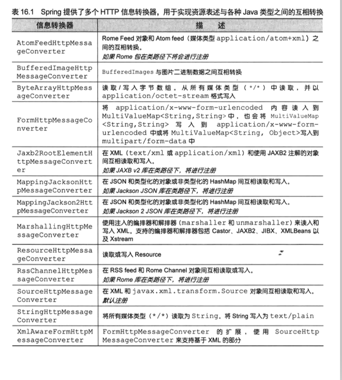

# 表达性

## 1.定义

表达性（Representational）：REST 资源实际上可以用各种形式来进行表达，包括XML，JSON,甚至HTML

**自己的理解**

同一资源。你可以使用JSON表达，也可以使用XML，如果你在浏览器中也可以使用HTML。

这个资源时没有变化的，只是他的表达形式变了。这就是REST 的表达性

## 2.将资源转换为客户端的表述形式

- 内容协商（Content  negotiation）：

  选择一个视图，他能够将模型渲染为呈现给客户端的表达形式

- 消息转换器（Message conversion）：

  通过一个消息转换器将控制器所返回的对象转换为呈现给客户端的表达形式

###2.1 内容协商（Content  negotiation）

TODO

### 2.2 消息转换器（Message conversion）

更推荐使用此方式

当使用消息转换功能时，DispatcherServlet补在需要那么麻烦地将模型数据传递到视图中，实际上根本**没有模型和视图**，只有**控制器产生的数据**，以及消息转换器（message conversion）转换数据之后所产生的资源表达

### 2.2.1 Spring 自带的各种转换器

- 假如客户端请求的**Accept头信息**表明他能接受”**application/json**“并且 **Jackson JSON 在类路径**下，那么处理方法返回的对象将交给 MappingJacksonHttpMessageConverter,并由他转换为返回客户端的JSON表达形式

- 如果请求头信息表明客户端想要”text/xml“格式，那么Jaxb2RootElementHttpMessageConverter 将会为客户端产生xml响应

## 3.适配REST API 的调整

### 3.1在响应体返回资源状态

- 正常情况

  返回java对象会放在模型中并在视图中渲染使用

- 使用了消息转换功能后

  需要告诉Spring 跳过正常的模型/视图流程，并使用消息转换

  最简单的方式使用@ResponseBody注解

#### 3.1.1 @ResponseBody注解

会告诉Spring，我们将要返回的对象作为资源返回给客户端，并将其转换为客户端可接受的表述形式

- DispatcherServlet 将会考虑请求中Accept 头部信息
- 并查找能为客户端提供所需表述形式的消息转换器

### 3.2 在请求体重接收资源状态

如何让控制器将客户端发送的JSON和XML 转换为他所使用的Java 对象？

答案是：@RequestBody 他能告诉Spring 查找一个消息转换器，将来自客户端的资源表述转换为对象

- Spring会查看请求中的Content-Type 头部信息
- 并查找能够将请求体转换为java 对象的消息转换器

### 3.2.1 @RequestMapping的consumes属性

我们将其设置为”application/json“,他会告诉Spring 这个方法方法只处理ContentType头部信息为”application/json“的请求，无法满足条件的话，将由其他方法来处理请求

### 3.3 控制器设置默认转换

- @RestController

  不必为每个方法添加@ResponseBody.