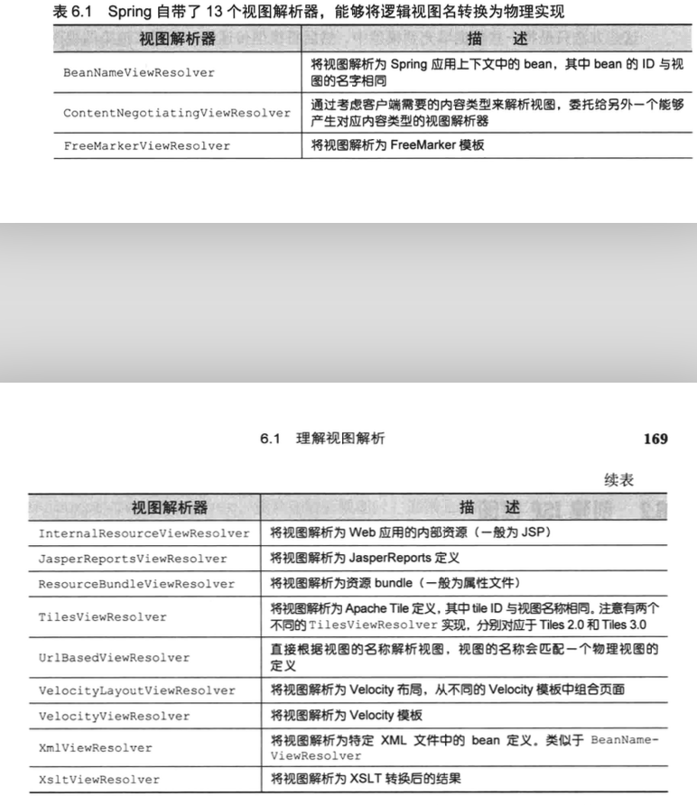

# 渲染Web视图

控制器方法**并没有直接产生**浏览器中渲染**所需的HTML**

controller 做的

1. 将一些数据填充到模型中
2. 然后将模型传递给一个用来渲染的视图

## Spring 是如何确定使用哪个视图实现渲染模型

这就是视图解析器的作用

例如：InternalResureViewResolver视图解析器

​	使用"WEB-INF/views/"前缀和”jsp“后缀来确定渲染模型的JSP物理文件位置

## Spring MVC的ViewResolver解析流程

Spring MVC定义了一个名为ViewResolver的接口

```
public interface ViewResolver {
    View resolveViewName(String var1, Locale var2) throws Exception;
}
```

当给resolveViewName()方法传入一个视图名和Locale对象是，他会返回一个View 实例

```
public interface View {
    String getContentType();

    void render(Map<String, ?> map, HttpServletRequest request, HttpServletResponse response) throws Exception;
}
```

View 接口的任务就是接受模型以及Servlet的request 和response对象，并将输出结果渲染到response中

**如果我们要自定义ViewResolver**

编写ViewResolver 和view 的实现，将要渲染的结果放到response中，进而展现到用户的浏览器中

###Spring 自带的13个视图解析器

