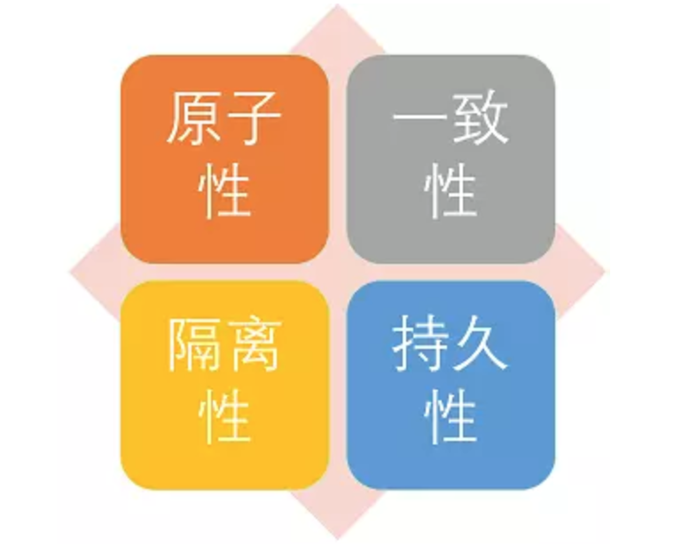
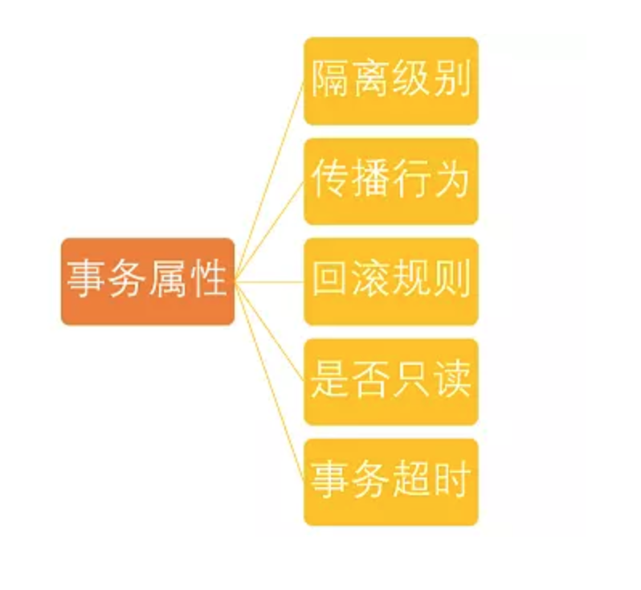

# Spring事务

## 1. 事务概念

### 1.1 什么是事务

事务是逻辑上的一组操作，要么都执行，要么都不执行

### 1.2 事务的特性



1. 原子性：事务是最小的执行单位，不予许分割。事务的原子性确保动作要么全部完成，要么完全不起作用
2. 一致性：执行事务前后，数据保持一致
3. 隔离性：并发访问数据库时，一个用户的事务不被其他事务所干扰，个并发事务之间的数据库是独立的
4. 持久性：一个事务被提交之后，他对数据库中数据的改变是持久的，即使数据库发生故障也不应该对其有任何影响

## 2. Spring事务管理接口

- **PlatformTransactionManager**: （平台）事务管理器
- **TransactionDefinition：** 事务定义信息(事务隔离级别、传播行为、超时、只读、回滚规则)
- **TransactionStatus：** 事务运行状态

### 2.1 PlatformTransactionManager接口介绍

**所谓事务管理，其实就是“按照给定的事务规则来执行提交或者回滚操作”。**

**Spring并不直接管理事务，而是提供了多种事务管理器** ，他们将事务管理的职责委托给Hibernate或者JTA等持久化机制所提供的相关平台框架的事务来实现。 Spring事务管理器的接口是： **org.springframework.transaction.PlatformTransactionManager** ，通过这个接口，Spring为各个平台如JDBC、Hibernate等都提供了对应的事务管理器，但是具体的实现就是各个平台自己的事情了。

#### 2.1.1PlatformTransactionManager接口代码如下：

PlatformTransactionManager接口中定义了三个方法：

```java
Public interface PlatformTransactionManager()...{  
    // Return a currently active transaction or create a new one, according to the specified propagation behavior（根据指定的传播行为，返回当前活动的事务或创建一个新事务。）
    TransactionStatus getTransaction(TransactionDefinition definition) throws TransactionException; 
    // Commit the given transaction, with regard to its status（使用事务目前的状态提交事务）
    Void commit(TransactionStatus status) throws TransactionException;  
    // Perform a rollback of the given transaction（对执行的事务进行回滚）
    Void rollback(TransactionStatus status) throws TransactionException;  
    } 
```

### 2.2 TransactionDefinition接口介绍

事务管理器接口 **PlatformTransactionManager** 通过 **getTransaction(TransactionDefinition definition)** 方法来得到一个事务，这个方法里面的参数是 **TransactionDefinition类** ，这个类就定义了一些基本的事务属性。

**那么什么是事务属性呢？**

事务属性可以理解成事务的一些基本配置，描述了事务策略如何应用到方法上。事务属性包含了5个方面。 



#### 2.2.1 TransactionDefinition接口中的方法如下：

TransactionDefinition接口中定义了5个方法以及一些表示事务属性的常量比如隔离级别、传播行为等等的常量。

我下面只是列出了TransactionDefinition接口中的方法而没有给出接口中定义的常量，该接口中的常量信息会在后面依次介绍到。

```java
public interface TransactionDefinition {
    // 返回事务的传播行为
    int getPropagationBehavior(); 
    // 返回事务的隔离级别，事务管理器根据它来控制另外一个事务可以看到本事务内的哪些数据
    int getIsolationLevel(); 
    // 返回事务必须在多少秒内完成
    //返回事务的名字
    String getName()；
    int getTimeout();  
    // 返回是否优化为只读事务。
    boolean isReadOnly();
} 
```

##### 2.2.1.1 隔离级别

TransactionDefinition 接口中定义了五个表示隔离级别的常量：

- **TransactionDefinition.ISOLATION_DEFAULT:**	使用后端数据库默认的隔离级别，Mysql 默认采用的 REPEATABLE_READ隔离级别 Oracle 默认采用的 READ_COMMITTED隔离级别.
- **TransactionDefinition.ISOLATION_READ_UNCOMMITTED:** 最低的隔离级别，允许读取尚未提交的数据变更，**可能会导致脏读、幻读或不可重复读**
- **TransactionDefinition.ISOLATION_READ_COMMITTED:** 	允许读取并发事务已经提交的数据，**可以阻止脏读，但是幻读或不可重复读仍有可能发生**
- **TransactionDefinition.ISOLATION_REPEATABLE_READ:** 	对同一字段的多次读取结果都是一致的，除非数据是被本身事务自己所修改，**可以阻止脏读和不可重复读，但幻读仍有可能发生。**
- **TransactionDefinition.ISOLATION_SERIALIZABLE:** 	最高的隔离级别，完全服从ACID的隔离级别。所有的事务依次逐个执行，这样事务之间就完全不可能产生干扰，也就是说，**该级别可以防止脏读、不可重复读以及幻读**。但是这将严重影响程序的性能。通常情况下也不会用到该级别。

##### 2.2.1.2 事务传播行为（为了解决业务层方法之间互相调用的事务问题）

当事务方法被另一个事务方法调用时，必须指定事务应该如何传播。例如：方法可能继续在现有事务中运行，也可能开启一个新事务，并在自己的事务中运行。在TransactionDefinition定义中包括了如下几个表示传播行为的常量：

**支持当前事务的情况：**

- **TransactionDefinition.PROPAGATION_REQUIRED：** 如果当前存在事务，则加入该事务；如果当前没有事务，则创建一个新的事务。
- **TransactionDefinition.PROPAGATION_SUPPORTS：** 如果当前存在事务，则加入该事务；如果当前没有事务，则以非事务的方式继续运行。
- **TransactionDefinition.PROPAGATION_MANDATORY：** 如果当前存在事务，则加入该事务；如果当前没有事务，则抛出异常。（mandatory：强制性）

**不支持当前事务的情况：**

- **TransactionDefinition.PROPAGATION_REQUIRES_NEW：** 创建一个新的事务，如果当前存在事务，则把当前事务挂起。
- **TransactionDefinition.PROPAGATION_NOT_SUPPORTED：** 以非事务方式运行，如果当前存在事务，则把当前事务挂起。
- **TransactionDefinition.PROPAGATION_NEVER：** 以非事务方式运行，如果当前存在事务，则抛出异常。

**其他情况：**

- **TransactionDefinition.PROPAGATION_NESTED：** 如果当前存在事务，则创建一个事务作为当前事务的嵌套事务来运行；如果当前没有事务，则该取值等价于TransactionDefinition.PROPAGATION_REQUIRED。

这里需要指出的是，前面的六种事务传播行为是 Spring 从 EJB 中引入的，他们共享相同的概念。而 **PROPAGATION_NESTED** 是 Spring 所特有的。以 PROPAGATION_NESTED 启动的事务内嵌于外部事务中（如果存在外部事务的话），此时，内嵌事务并不是一个独立的事务，它依赖于外部事务的存在，只有通过外部的事务提交，才能引起内部事务的提交，嵌套的子事务不能单独提交。如果熟悉 JDBC 中的保存点（SavePoint）的概念，那嵌套事务就很容易理解了，其实嵌套的子事务就是保存点的一个应用，一个事务中可以包括多个保存点，每一个嵌套子事务。另外，外部事务的回滚也会导致嵌套子事务的回滚。

##### 2.2.1.3 事务超时属性(一个事务允许执行的最长时间)

所谓事务超时，就是指一个事务所允许执行的最长时间，如果超过该时间限制但事务还没有完成，则自动回滚事务。在 TransactionDefinition 中以 int 的值来表示超时时间，其单位是秒。

##### 2.2.1.4 事务只读属性（对事物资源是否执行只读操作）

事务的只读属性是指，对事务性资源进行只读操作或者是读写操作。所谓事务性资源就是指那些被事务管理的资源，比如数据源、 JMS 资源，以及自定义的事务性资源等等。如果确定只对事务性资源进行只读操作，那么我们可以将事务标志为只读的，以提高事务处理的性能。在 TransactionDefinition 中以 boolean 类型来表示该事务是否只读。

##### 2.2.1.5 回滚规则（定义事务回滚规则）

这些规则定义了哪些异常会导致事务回滚而哪些不会。默认情况下，事务只有遇到运行期异常时才会回滚，而在遇到检查型异常时不会回滚（这一行为与EJB的回滚行为是一致的）。 但是你可以声明事务在遇到特定的检查型异常时像遇到运行期异常那样回滚。同样，你还可以声明事务遇到特定的异常不回滚，即使这些异常是运行期异常。

### 2.3 TransactionStatus接口介绍

TransactionStatus接口用来记录事务的状态 该接口定义了一组方法,用来获取或判断事务的相应状态信息.

PlatformTransactionManager.getTransaction(…) 方法返回一个 TransactionStatus 对象。返回的TransactionStatus 对象可能代表一个新的或已经存在的事务（如果在当前调用堆栈有一个符合条件的事务）。

**TransactionStatus接口接口内容如下：**

```java
public interface TransactionStatus{
    boolean isNewTransaction(); // 是否是新的事物
    boolean hasSavepoint(); // 是否有恢复点
    void setRollbackOnly();  // 设置为只回滚
    boolean isRollbackOnly(); // 是否为只回滚
    boolean isCompleted; // 是否已完成
} 

```


### 参考文章

[可能是最漂亮的Spring事务管理详解](<https://juejin.im/post/5b00c52ef265da0b95276091>)