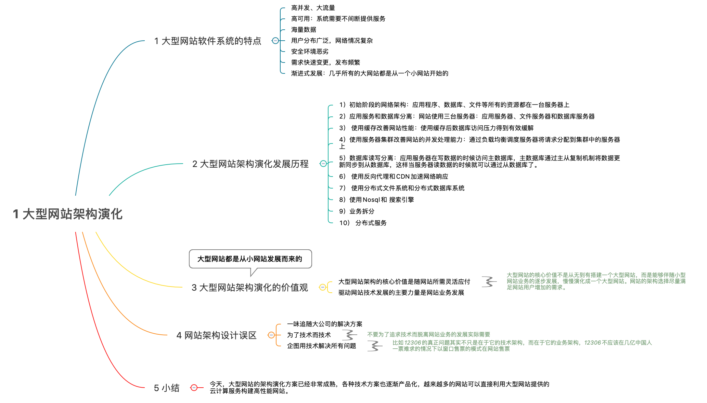
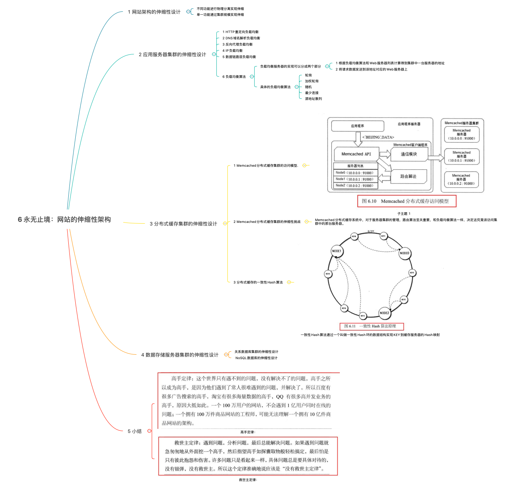
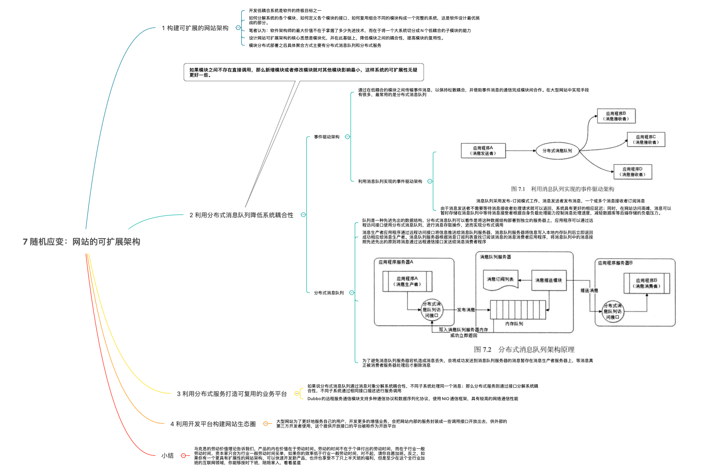
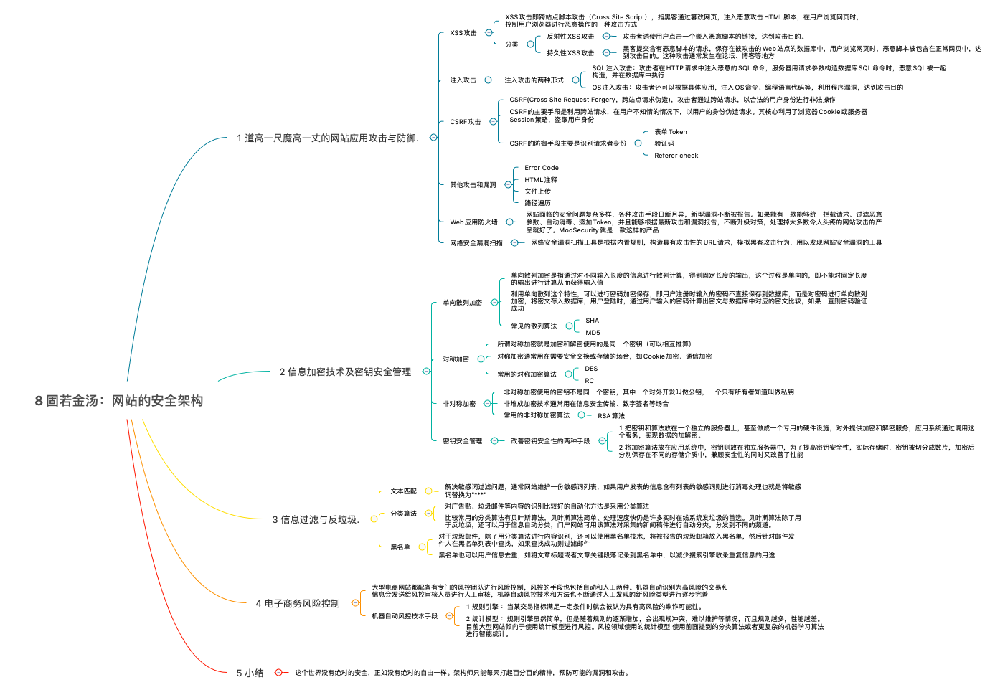

# 《大型网站技术架构》思维导图

- [1. 大型网站架构演化](#1大型网站架构演化)
- [2. 大型架构模式](#2 大型架构模式)
- [3. 大型网站核心架构要素](#3 大型网站核心架构要素)
- [4. 瞬时响应:网站的高性能架构](#4 瞬时响应网站的高性能架构)
- [5. 万无一失:网站的高可用架构](#5.万无一失网站的高可用架构)
- [6. 永无止境:网站的伸缩性架构](#6 永无止境网站的伸缩性架构)
- [7. 随机应变:网站的可扩展性架构](#7 随机应变网站的可扩展性架构)
- [8. 固若金汤:网站的安全机构](#8 固若金汤网站的安全机构)

## 1. 大型网站架构演化

## 2. 大型架构模式

## 3. 大型网站核心架构要素

## 4. 瞬时响应：网站的高性能架构

## 5.万无一失:网站的高可用架构

## 6.永无止境:网站的伸缩性架构

## 7. 随机应变:网站的可扩展性架构

## 8. 固若金汤:网站的安全机构

## 参考文章

[8 张图读懂大型网站技术架构.md]([https://github.com/Snailclimb/JavaGuide/blob/master/docs/system-design/website-architecture/8%20%E5%BC%A0%E5%9B%BE%E8%AF%BB%E6%87%82%E5%A4%A7%E5%9E%8B%E7%BD%91%E7%AB%99%E6%8A%80%E6%9C%AF%E6%9E%B6%E6%9E%84.md#1-%E5%A4%A7%E5%9E%8B%E7%BD%91%E7%AB%99%E6%9E%B6%E6%9E%84%E6%BC%94%E5%8C%96](https://github.com/Snailclimb/JavaGuide/blob/master/docs/system-design/website-architecture/8 张图读懂大型网站技术架构.md#1-大型网站架构演化))