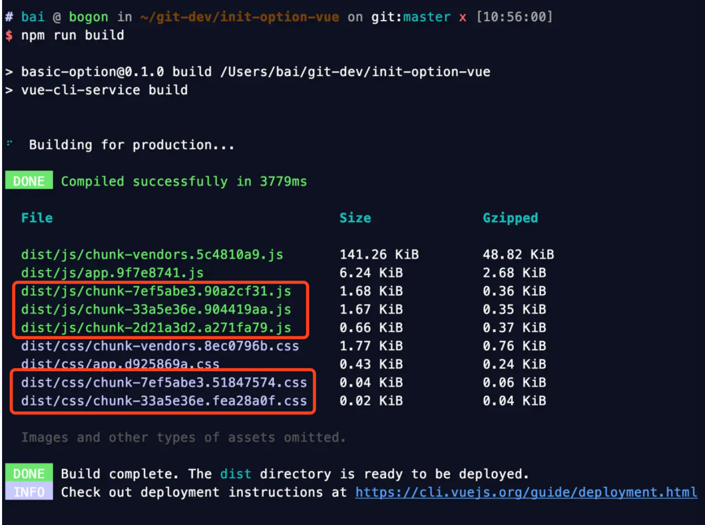
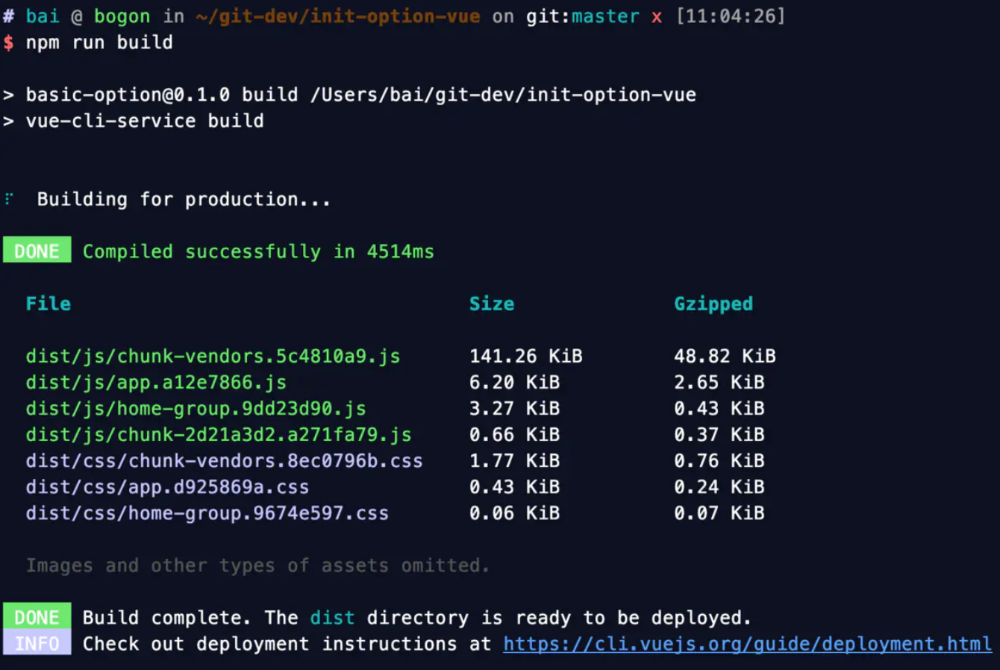
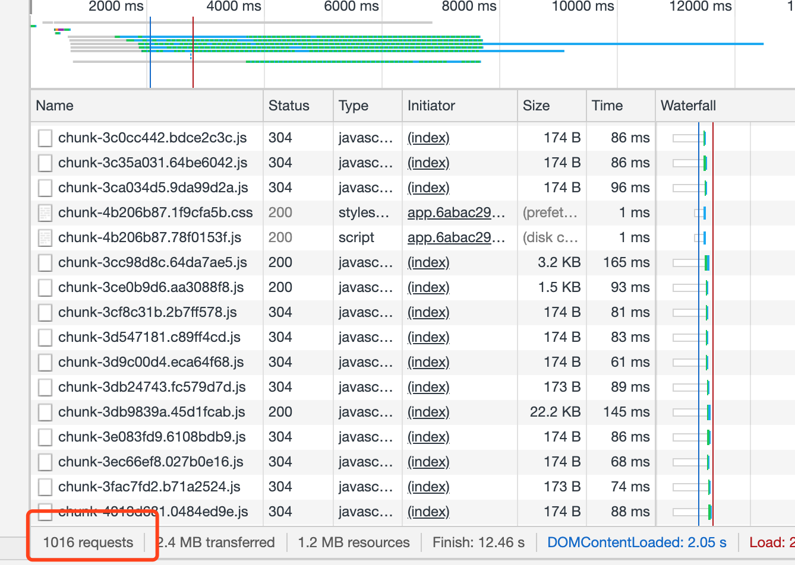

# 首屏优化之-vue路由懒加载和使用懒加载prefetch问题

## 1. 背景

使用路由懒加载以后 webpack 打包可以根据页面划分来生成文件，根据路由的不同来加载文件，解决了首页一次性加载文件过大导致打开过慢的问题。

## 2. 优化操作

### 2.1 常规引入页面

```js
//常规引入页面
import Home from './views/Home.vue';
const routes = [
    { path: '/', name: 'home', component: Home, meta: { title: 'Home' } },
];
```

### 2.2 具体优化：实现懒加载

```jsx
const Home = () => import('./views/home.vue');
const pageA = () => import('./views/homeA.vue');
const pageB = () => import('./views/homeB.vue');
const routes = [
    { path: '/', name: 'home', component: Home, meta: { title: 'Home' } },
    { path: '/a', name: 'pageA', component: pageA, meta: { title: 'APage' } },
    { path: '/b', name: 'pageB', component: pageB, meta: { title: 'BPage' } }
];
```

看一下打包之后的效果，会看到打包出了多个chunk异步块。



### 2.3 将chunk打包组

不指定分组，chunk name会随机生成，我们可以将它指定成chunk name打包到一起

```js
//引入页面
const Home = () => import('./views/Home.vue');
//把页面进行分组 home-group
const pageA = () => import(/* webpackChunkName: "home-group" */ './views/homeA.vue');
const pageB = () => import(/* webpackChunkName: "home-group" */ './views/homeB.vue');
const routes = [
    { path: '/', name: 'home', component: Home, meta: { title: 'Home' } },
    { path: '/a', name: 'pageA', component: pageA, meta: { title: 'APage' } },
    { path: '/b', name: 'pageB', component: pageB, meta: { title: 'BPage' } }
];
```



## 3. 解决prefetch提前加载导致问题

实际在浏览器里访问首页的时候也加载了其他chunk的块，是prefetch 提前加载的原因。理论上这个是不影响加载速度的，但是我实际测试还是会影响。



这里请求了1016个请求

### 3.1 通过在vue.config.js里添加以下配置Prefetch

```jsx
// vue.config.js
module.exports = {
  chainWebpack: config => {
    // 移除 prefetch 插件
    config.plugins.delete('prefetch')

    // 或者
    // 修改它的选项：
    config.plugin('prefetch').tap(options => {
      options[0].fileBlacklist = options[0].fileBlacklist || []
      options[0].fileBlacklist.push(/myasyncRoute(.)+?\.js$/)
      return options
    })
  }
}
```

## 参考文章

[vue路由懒加载，vue首屏加载慢和使用懒加载prefetch问题，新增组件懒加载](https://www.jianshu.com/p/45fe75d059e2)

