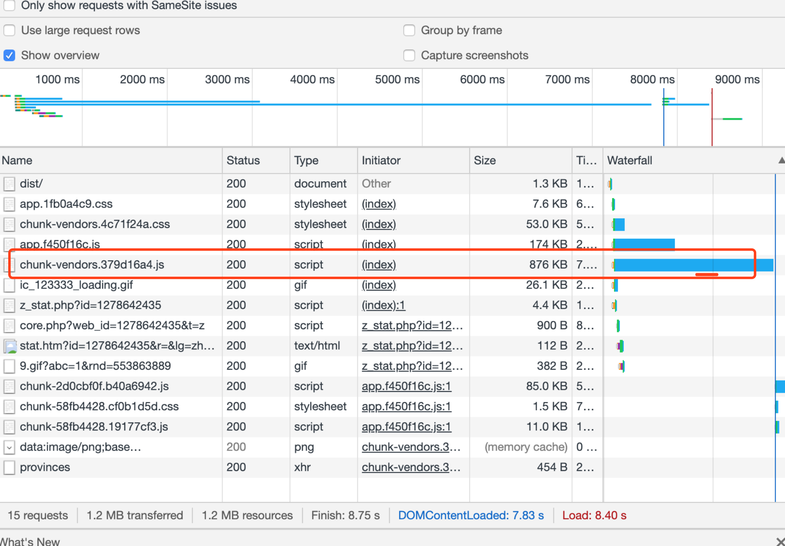
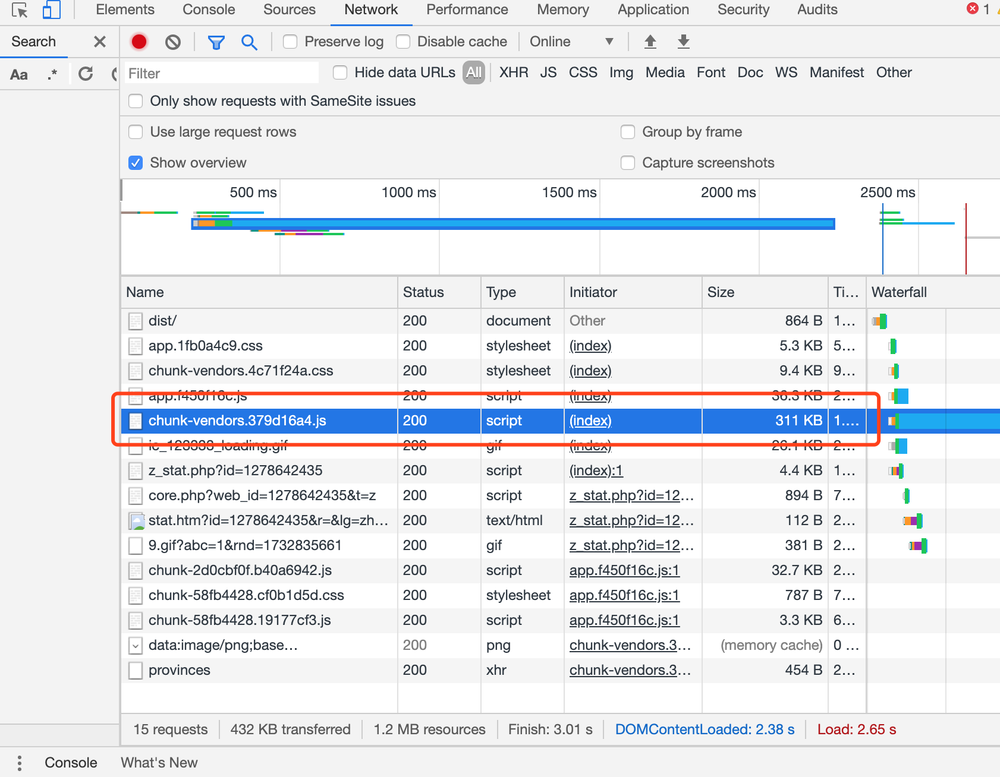

# 首页优化之-gzip压缩

当前打包出来的dist 是13.6M

使用gzip压缩之后变成15.8M,在原有的基础上加上了gzip

## 1. 简介

gzip 压缩是一种http请求优化方式，通过减少文件体积来提高加载速度。html、js、css文件甚至json数据都可以用它来压缩，可以减少60%以上的体积

## 2. 压缩配置

### 2.1 安装 compression webpack plugin 插件

```
npm install --save-dev compression-webpack-plugin
```

### 2.2 在vue cli3.0 生成的项目里，可在vue.config.js 中按照如下方式配置

```

const CompressionWebpackPlugin = require("compression-webpack-plugin");
const productionGzipExtensions = /\.(js|css|json|txt|html|ico|svg)(\?.*)?$/i;

module.exports = {
 	...
  configureWebpack: config => {
    const plugins = [];

    // Begin 生成 gzip 压缩文件
    plugins.push(
        new CompressionWebpackPlugin({
            filename: "[path].gz[query]",
            algorithm: "gzip",
            test: productionGzipExtensions,
            threshold: 10240,
            minRatio: 0.8
        })
    );
    // End 生成 gzip 压缩文件
    
    config.plugins = [...config.plugins, ...plugins];
	},
	...
}
```

### 2.3 nginx 配置

在nginx.conf 的 在http 中添加

    gzip                on;
    #gzip_static         on;
    gzip_min_length     1k;
    gzip_comp_level     5;
    gzip_http_version   1.0;
    gzip_types          text/plain application/javascript application/x-javascript text/javascript text/xml text/css;
使用 gzip_static  需要nginx 支持，可选择性开启

- 使用前876KB

  

- 使用后311KB

  