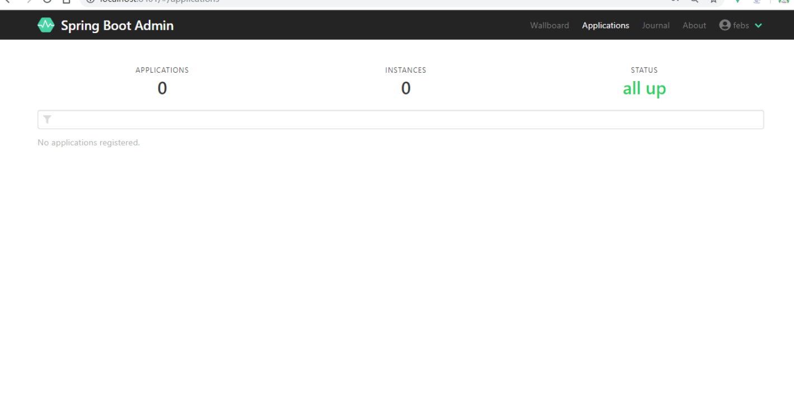

# 整合Spring Boot Admin

## 1. 简称

Spring Boot Admin 通过 `Spring-boot-starter-actuator` 提供的REST接口实现了图形化的监控界面，包括应用的配置信息，Beans信息、环境属性、线程信息、JVM 状态等。

Spring Boot Admin 分为服务端和客户端。客户端通过HTTP向服务端提供自身信息，服务端收集这些信息并以图形化界面的方式呈现。（Spring Boot Admin客户端简称为SBA客户端，Spring Boot Admin 服务端简称为SBA服务端）

## 2. SBA服务端

### 2.1 添加pom依赖

```xml
        <dependency>
            <groupId>de.codecentric</groupId>
            <artifactId>spring-boot-admin-server</artifactId>
            <version>2.1.6</version>
        </dependency>
        <dependency>
            <groupId>de.codecentric</groupId>
            <artifactId>spring-boot-admin-server-ui</artifactId>
            <version>2.1.6</version>
        </dependency>
```

`spring-boot-admin-server-ui`依赖，该依赖用于图形化展示监控数据。

### 2.2 添加`@EnableAdminServer`注解

```java
@EnableAdminServer
@SpringBootApplication
public class FebsMonitorAdminApplication {

    public static void main(String[] args) {
        SpringApplication.run(FebsMonitorAdminApplication.class, args);
    }
}
```

### 2.3 编写配置文件application.yml：

```yml
spring:
  application:
    name: Monitor-Admin
  boot:
    admin:
      ui:
        title: ${spring.application.name}
```

应用名称为FEBS-Monitor-Admin，`spring.boot.admin.ui.title`配置了Web页面的title为Monitor-Admin。

### 2.4 浏览器访问

使用浏览器访问 [http://localhost:8080：


因为没有登录，页面直接被重定向到登录页，输入用户名和密码后：



因为还没有搭建SBA客户端，所以监控信息都是空的

## 3. SBA客户端

被SBA服务端监控的微服务就是SBA 客户端

### 3.1 添加POM依赖

```xml
<dependency>
    <groupId>de.codecentric</groupId>
    <artifactId>spring-boot-admin-starter-client</artifactId>
    <version>2.1.6</version>
</dependency>
```

### 3.2 添加配置信息

```yml
spring:
  boot:
    admin:
      client:
        url: http://localhost:8401
        username: zsz
        password: 123456

info:
  app:
    name: ${spring.application.name}
    description: "@project.description@"
    version: "@project.version@"

management:
  endpoints:
    web:
      exposure:
        include: '*'
  endpoint:
    health:
      show-details: ALWAYS
```

这些配置的含义如下：

- `spring.boot.admin.client.url`指定了SBA服务端地址；
- `spring.boot.admin.client.username`对应SBA服务端的用户名；
- `spring.boot.admin.client.password`对应SBA服务端的密码；
- `info.**`配置了SBA客户端的名称，描述和版本信息；
- `management.endpoints.web.exposure.include='*'`表示将SBA客户端的所有监控端点都暴露给SBA服务端；
- `management.endpoint.health.show-details`表示总是展示详细的健康信息。

### 3.3 浏览器访问


