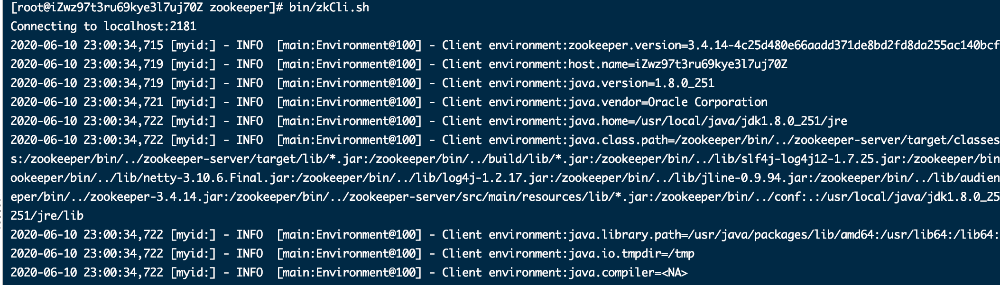

# linux安装zookeeper

从[官网](http://www.apache.org/dyn/closer.cgi/zookeeper/)直接下载Zookeeper最新版本(Zookeeper支持Windows和Linux)

> [root@localhost app]# ll
>
> -rw-------. 1 root root 22724574 Sep 6 23:02 zookeeper-3.4.9.tar.gz

一、Linux安装Zookeeper

> [root@localhost app]# tar xf zookeeper-3.4.9.tar.gz
>
> [root@localhost app]# ln -s zookeeper-3.4.9 zookeeper
>
> [root@localhost app]# cd zookeeper
>
> 提供配置文件
>
> [root@localhost zookeeper]# cp conf/zoo_sample.cfg conf/zoo.cfg

启动Zookeeper服务

>[root@iZwz97t3ru69kye3l7uj70Z zookeeper]# bin/zkServer.sh start
>ZooKeeper JMX enabled by default
>Using config: /zookeeper/bin/../conf/zoo.cfg
>Starting zookeeper ... STARTED

查看端口监听

>[root@iZwz97t3ru69kye3l7uj70Z zookeeper]# netstat -tplan | grep 2181
>tcp        0      0 0.0.0.0:2181            0.0.0.0:*               LISTEN      7929/java  

使用Zookeeper的客户端测试

```
bin/zkCli.sh
```





