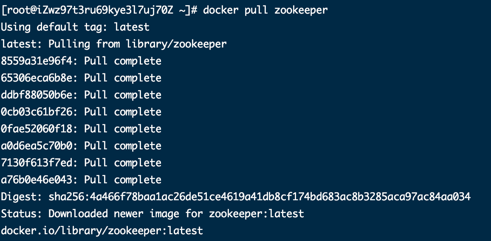

# 通过docker安装zookeeper

## 1. 安装步骤

### 1.1 查询zookeeper镜像

```
docker search zookeeper 
```


### 1.2 拉取zookeeper镜像

语法：

```
docker pull zookeeper
```


这是拉取的最新版本的官方镜像，也可以选择其它版本的镜像



### 1.3 启动zookeeper容器实例

```sh
docker run --name zookeeper --restart always -d zookeeper
```

`--restart always`：始终重新启动zookeeper

## 2. 相关操作

- 停止zookeeper实例进程

  ```
  docker stop zookeeper
  ```

- 启动语法

  ```
  docker start zookeeper
  ```

- 重启语法

  ```
  docker restart zookeeper
  ```

## 3. 查看zookeeper进程日志

```
docker logs -f zookeeper
```


## 参考文章

[基于Docker安装zookeeper](https://blog.csdn.net/myNameIssls/article/details/81561975)