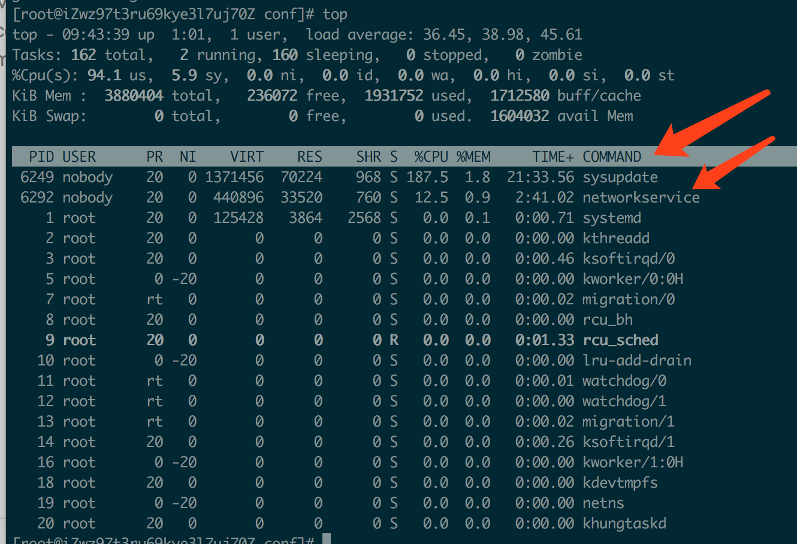
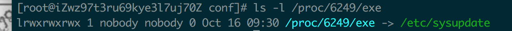

# 清除挖矿程序（sysupdate, networkservice进程）

## 1. top查看cpu使用状态

我们发现有两个进程cpu占用都超过100%了，而且我们也并不知道他是干嘛的。



## 2.通过进程号查询位置

```
ls -l proc/{进程号}/exe
```



## 2.干掉挖矿进程

```
kill -9 6249
kill -9 6292
```

### 3. 删除挖矿程序

- 主要包括networkservice、sysguard、update.sh、config.json,sysupdate
- 直接删除可能无法删除，需要先执行 chattr -i

```
chattr -i networkservice
rm -f networkservice
chattr -i sysguard
rm -f sysguard
chattr -i sysguard
rm -f sysguard
chattr -i config.json
rm -f config.json
chattr -i sysupdate
rm -f sysupdate

```

## 4. 删除定时任务

```
cd /var/spool/cron/
# 看是否有定时任务，有则删除
rm -rf nobody
```


### 参考文章

[记录一次清除Linux挖矿病毒的经历(sysupdate, networkservice进程)](<https://blog.csdn.net/daiyuhe/article/details/95683393>)