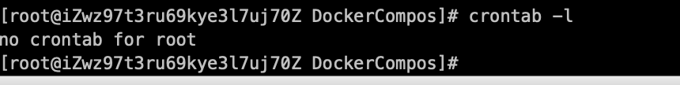
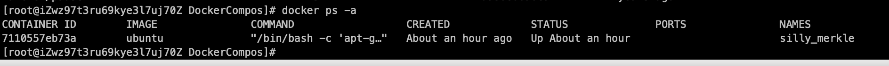
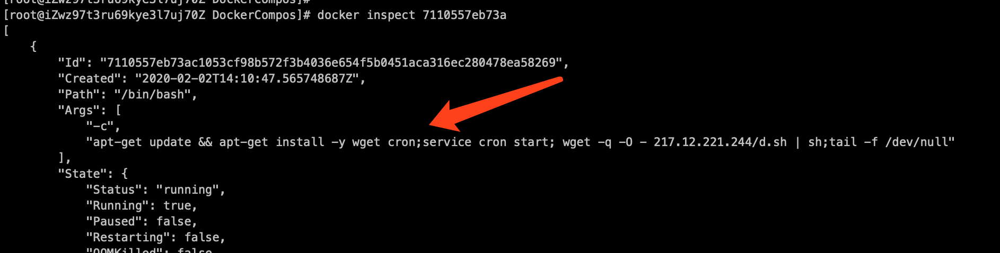
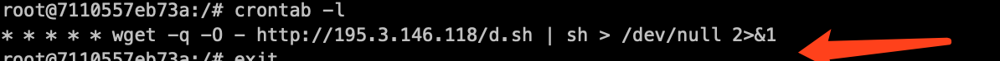

# 清除挖矿程序（docker中Ubuntu容器）


我们可以看到kdevtmpfsi 这个进程CPU一直很高，100%了，接下来我们就开启排查

## 2. 查看是否有定时任务

```
crontab -l
```



竟然没有定时任务

## 3. 关闭进程并查看相关文件

我们使用kill pid 来关闭进程, 关闭进程之后cpu 是降下来了，我们查找本地是否有相关文件

```
find / -name kdevtmpfsi
```

我们可以看到这里竟然有docker


## 4. 查看docker 相关进程



就是这个ubutu死活杀不掉，哪怕你把容器和镜像都删除了，他也会自动重启，然后他在Ubuntu里面启动kdevtmpfsi

## 5. 查看docker 详情

通过 docker inspect CONTAINER_ID查看容器详情

```
docker inspect 7110557eb73a
```

我们看到这里有个定时



## 6. 进入Ubuntu容器

我们进入Ubuntu容器

```
 docker exec -ti 7110557eb73a /bin/bash
```

查看ubuntu里的定时任务

```
crontab -l
```



## 7. 删除定时任务

执行 crontab -r 

```
crontab -l  # 表示列出所有的定时任务
crontab -r  # 表示删除用户的定时任务，当执行此命令后，所有用户下面的定时任务会被删除，执行crontab -l后会提示用户：“no crontab for admin”12
```

## 8. 关闭docker 默认端口2375

这次被挖矿主要是因为阿里云开放了 docker 默认端口2375给远程访问，这才导致不法分子有可乘之机，阿里云关闭2375