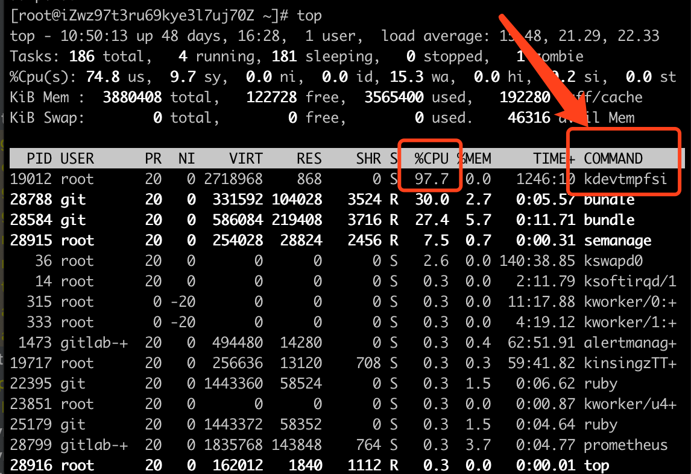

# 清除挖矿程序（kdevtmpfsi进程）

1. top查看当前进程

   

   可以看到该进程就占了97%的cpu

2. kill该进程

   ```
   kill -9 19012
   ```

3. 删除tmp/kdevtmpfsi文件

   ```
   rm -rf /tmp/kdevtmpfsi
   ```

4. 关闭远程访问端口或增加访问密码

   - redis的 6379 端口
   - docker远程访问2375端口

   这些常见的端口很容易被不法分子利用，我们可以关闭远程访问或增加访问密码

   

## 参考文章

[处理kdevtmpfsi挖矿病毒](https://blog.csdn.net/u014589116/article/details/103705690)