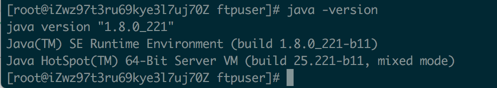

# Java安装

## 1. 具体步骤

### 1.1 下载jdk

[Oracle官网](<https://www.oracle.com/java/technologies/jdk8-downloads.html>)找到合适的版本下载

centos：下载Linux x64 的tar.gz 版本


### 1.2 安装

创建安装目录

```
mkdir /usr/local/java
```

解压至安装目录

```
tar -zxvf jdk-8u221-linux-x64.tar.gz -C /usr/local/java/
```

### 1.3 设置环境变量

开打文件

```
vim /etc/profile
```

在末尾添加

```
export JAVA_HOME=/usr/local/java/jdk1.8.0_221
export JRE_HOME=${JAVA_HOME}/jre
export CLASSPATH=.:${JAVA_HOME}/lib:${JRE_HOME}/lib
export PATH=${JAVA_HOME}/bin:$PATH
```

使环境变量生效

```
source /etc/profile
```

添加软连接

```
ln -s /usr/local/java/jdk1.8.0_221/bin/java /usr/bin/java
```

检查

```
java -version
```

