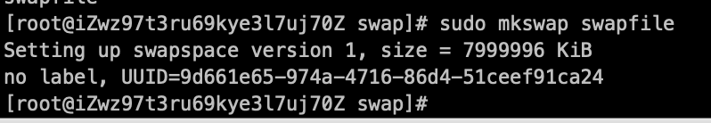
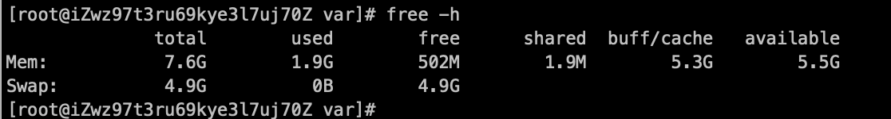

### Linux Swap交换分区

## 1. Swap交换分区概念

Linux内核为了提高读写效率与速度，会将文件在内存中进行缓存，这部分内存就是Cache Memory(缓存内存)。**即使你的程序运行结束后，Cache Memory也不会自动释放。**这就会导致你再Linux系统中**程序频繁读写文件**后，你会发现**可用内存变少**。当系统的无力内存不够用的时候，就需要将无力内存的一部分释放出来，以供当前运行的程序使用。

那些被释放的空间可能来自一些很长时间没有什么操作的程序，这些**被释放的空间被临时保存到Swap空间中，**等到那些程序要运行时，再从Swap分区中恢复保存的数据到内存中。这样，系统总是在物理内存不够时，才进行Swap交换。

## 2. 查看Swap分区大小

查看Swap分区的大小以及使用情况，一般使用free命令。当前我们并没设置swap分区


我们可以使用swapon命令查看当前swap相关信息：例如swap空间是swap partition，Swap size，使用情况等详细信息

```
swapon -s
```


## 3. 创建swap区分

### 3.1 创建swap文件

```swift
cd /var
sudo mkdir swap
sudo dd if=/dev/zero of=swapfile bs=1024 count=2000000
```

count代表的是大小，我这里是2G。

### 3.2 把文件转换为swap文件

```csharp
 sudo mkswap swapfile
```



### 3.3 激活swap文件

这里可以直接用命令挂载上一个swap分区，但是重启后要重新挂载：

```csharp
挂载： sudo swapon /var/swapfile
如果不需要了，可以也可以卸载：
卸载：sudo swapoff /var/swapfile
```

### 3.4 开机启动后自动挂载

如果需要开机启动后自动挂载的话，可以把它添加到/etc/fstab文件中。

开机自动挂载SWAP分区，

```
vim /etc/fstab
```

在文件末尾添加

```
/var/swapfile   swap  swap  defaults  0  0
```

### 3.5 查看使用成功



## 4. swappiness属性

### 4.1 swappiness属性介绍

swappiness的值得大小对如何使用swap分区是有很大联系的。Linux下设置swappiness**参数来配置内存使用到多少才开始使用swap分区**

- swappiness=0:表示最大限度使用物理内存，然后才是swap空间
- swappiness＝100:表示积极的使用swap分区，并且把内存上的数据及时的搬运到swap空间里面

### 4.2 永久更改方法

修改 /etc/sysctl.conf

```
sudo vim /etc/sysctl.conf
```

在末尾加上

```
vm.swappiness = 10
```

生效

```
sudo sysctl -p
```

## 参考文章

[Linux 开启 Swap分区 教程](https://www.jianshu.com/p/04c7a9ab438c)